# Agent Wallet Core — Architecture Design Document

Status: Draft  
Version: 1.0.0  
Date: 2026-02-13

## Table of Contents

- [1. Introduction](#1-introduction)
- [2. Problem Statement](#2-problem-statement)
- [3. Design Philosophy](#3-design-philosophy)
- [4. Standards Foundation](#4-standards-foundation)
- [5. High-Level Architecture](#5-high-level-architecture)
- [6. Account Layer](#6-account-layer)
- [7. Modular Validation Framework](#7-modular-validation-framework)
- [8. Execution Framework](#8-execution-framework)
- [9. Session Delegation and HTTP Authentication](#9-session-delegation-and-http-authentication)
- [10. Agent Identity](#10-agent-identity)
- [11. Deployment Architecture](#11-deployment-architecture)
- [12. Security Architecture](#12-security-architecture)
- [13. Contract Inventory](#13-contract-inventory)
- [14. Data Flow Reference](#14-data-flow-reference)
- [15. Testing Architecture](#15-testing-architecture)
- [16. Build and Toolchain](#16-build-and-toolchain)
- [17. Future Considerations](#17-future-considerations)

---

## 1. Introduction

Agent Wallet Core is a protocol-agnostic smart account framework that unifies NFT-bound identity (ERC-6551), modular validation and execution (ERC-6900), account abstraction (ERC-4337), trustless agents (ERC-8004) and HTTP-level authentication (ERC-8128) into a single composable system. It provides the onchain infrastructure for autonomous agents and delegated signers to operate Ethereum accounts with fine-grained, revocable authorization.

Every account in the system is a token-bound account: its address is deterministically derived from an NFT binding, its ownership is dynamically resolved from that binding, and its entire authorization surface is delegated to pluggable modules. This design makes account identity transferable (by transferring the bound NFT), account behavior extensible (by installing modules), and account security layered (through validation hooks, execution hooks, and policy registries).

### Intended Audience

This document is intended for:

- Protocol integrators building on top of Agent Wallet Core
- Security auditors reviewing the system's trust boundaries
- Frontend and SDK developers constructing transactions and UserOperations
- Infrastructure operators deploying and managing account instances

### Relationship to ERC-Specific Design Documents

This document describes the overall architecture and how the standards compose together. Each integrated ERC has its own detailed design document covering implementation specifics:

| Standard | Design Document |
|---|---|
| ERC-6551 (Token Bound Accounts) | [ERC6551-Token-Bound-Account-Integration-Design.md](./ERC6551-Token-Bound-Account-Integration-Design.md) |
| ERC-6900 (Modular Smart Contract Accounts) | [ERC6900-Modular-Account-Integration-Design.md](./ERC6900-Modular-Account-Integration-Design.md) |
| ERC-4337 (Account Abstraction) | [ERC4337-Account-Abstraction-Integration-Design.md](./ERC4337-Account-Abstraction-Integration-Design.md) |
| ERC-8128 (Signed HTTP Requests) | [ERC8128-SIWA-Spec.md](./ERC8128-SIWA-Spec.md) |
| ERC-8004 (Agent Identity) | [ERC8004-Identity-Integration-Design.md](./ERC8004-Identity-Integration-Design.md) |
| ERC-6492 (Counterfactual Signatures) | [ERC6492-Counterfactual-Signature-Integration-Design.md](./ERC6492-Counterfactual-Signature-Integration-Design.md) |

---

## 2. Problem Statement

Autonomous agents operating onchain face a set of compounding challenges:

1. **Identity**: agents need stable, transferable onchain identities that are not tied to a single private key.
2. **Authorization**: agents need to delegate signing authority to session keys, API gateways, and automated systems — with bounded scope and revocable permissions.
3. **Execution**: agents need smart accounts that can execute arbitrary onchain operations, install and remove capabilities at runtime, and participate in the ERC-4337 bundler ecosystem.
4. **Authentication**: agents need to authenticate HTTP API requests using their onchain identity, bridging the gap between web2 API infrastructure and web3 account ownership.
5. **Composability**: all of the above must compose cleanly — a single account should be able to use its NFT-bound identity to authenticate an HTTP request, delegate a session key for onchain execution, and manage its own module configuration, all through a unified authorization model.

Agent Wallet Core addresses these challenges by layering five Ethereum standards into a cohesive account architecture.

---

## 3. Design Philosophy

### Core Principles

1. **NFT-native identity**: account identity and ownership are derived from an NFT binding. No stored owner state, no admin keys. Ownership is always resolved live from the bound token.
2. **Minimal trust surface**: the account trusts only the ERC-4337 EntryPoint and installed modules. There are no privileged admin roles in the core account contract.
3. **Modular everything**: all validation logic lives in modules. The account itself contains no authorization policy beyond a bootstrap escape hatch for initial setup.
4. **Explicit over implicit**: security-sensitive behavior is always explicit. Module capabilities are declared via flags. Selector permissions are enumerated. Hook budgets are enforced.
5. **Composable layers**: each standard handles one concern. ERC-6551 handles identity. ERC-6900 handles modularity. ERC-4337 handles abstraction. ERC-8128 handles HTTP auth. They compose without coupling.

### What This Is Not

- Not a wallet UI or SDK. This is the onchain smart contract layer.
- Not an ERC-4337 bundler or paymaster. Those are external infrastructure.
- Not an ERC-8128 HTTP gateway. The gateway is an offchain component that calls into these contracts for SCA verification.
- Not an ERC-6551 registry. The project uses the canonical registry for account creation.

---

## 4. Standards Foundation

Agent Wallet Core integrates six Ethereum standards, each contributing a distinct capability layer:

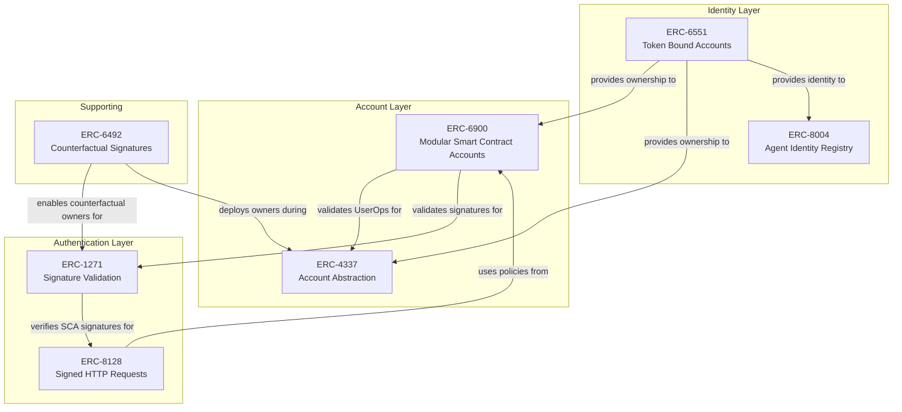

| Standard | Role in Agent Wallet Core |
|---|---|
| **ERC-6551** | Foundation. Every account is a token-bound account. Identity, ownership, and the base execution surface come from here. |
| **ERC-6900** | Modularity. All validation and execution logic is encapsulated in installable modules with hook support. |
| **ERC-4337** | Abstraction. Smart accounts participate in the UserOperation mempool via bundlers, with modular validation. |
| **ERC-1271** | Signature validation. Smart contract accounts validate arbitrary message signatures, enabling ERC-8128 gateway flows. |
| **ERC-8128** | HTTP authentication. Agents authenticate API requests using their onchain identity, with session delegation. |
| **ERC-8004** | Agent identity. Optional onchain identity registration linking accounts to agent IDs. |

### Supporting Standards

| Standard | Usage |
|---|---|
| **EIP-712** | Typed structured data signing for all validation modules (owner, session key, ERC-8128). |
| **ERC-191** | Signed data standard used by session key module and ERC-8128 outer HTTP signatures. |
| **ERC-6492** | Counterfactual signature support for undeployed smart contract owners. See [ERC6492-Counterfactual-Signature-Integration-Design.md](./ERC6492-Counterfactual-Signature-Integration-Design.md). |
| **ERC-165** | Interface introspection with reference-counted module support. |
| **ERC-7201** | Namespaced storage for safe module coexistence via `delegatecall`. |

---

## 5. High-Level Architecture

### System Context

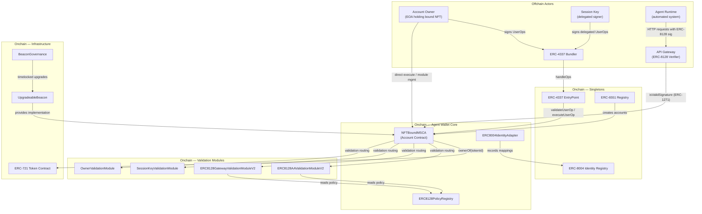

### Layered Architecture

The system is organized into four distinct layers, each with clear responsibilities and trust boundaries:

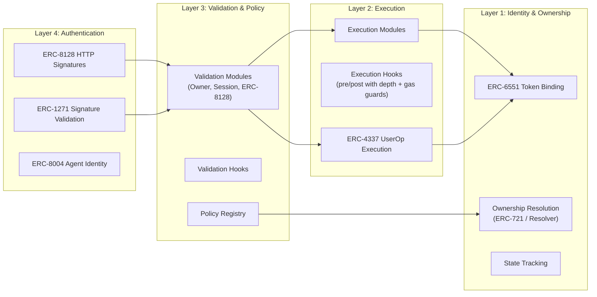

### Contract Dependency Graph

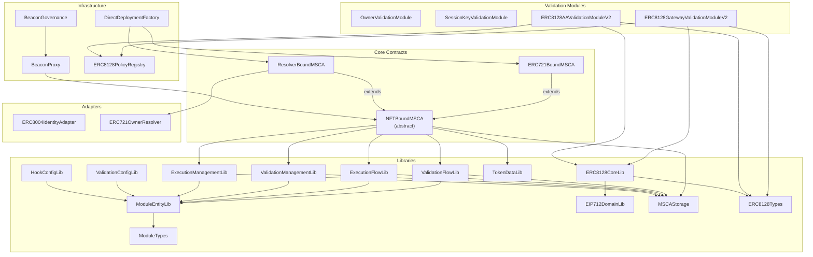

---

## 6. Account Layer

The account layer is the foundation of Agent Wallet Core. Every account is an `NFTBoundMSCA` — a smart contract account whose identity is derived from an NFT binding and whose behavior is extended through installable modules.

### Contract Hierarchy

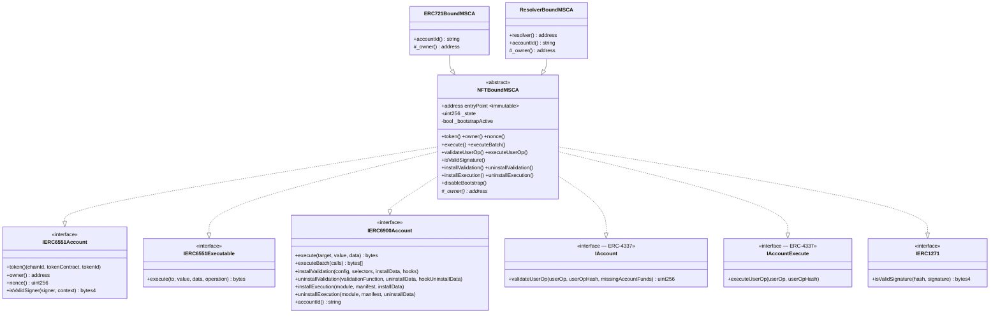

### Ownership Resolution

Ownership is the root of trust for the entire system. The abstract `_owner()` function is the single point of ownership resolution — every authorization check flows through it.

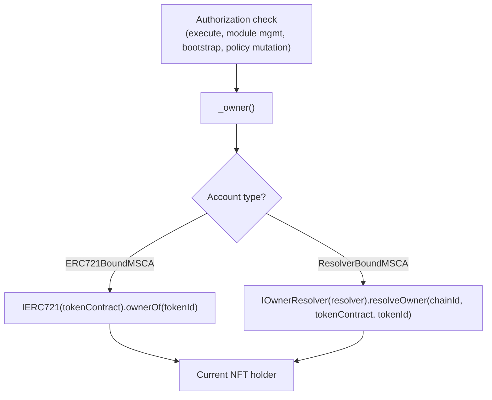

| Account Type | Account ID | Ownership Source | Key Property |
|---|---|---|---|
| `ERC721BoundMSCA` | `agent.wallet.erc721-bound-msca.1.0.0` | `IERC721.ownerOf(tokenId)` | Same-chain only. Zero storage cost. Ownership transfers with NFT. |
| `ResolverBoundMSCA` | `agent.wallet.resolver-bound-msca.1.0.0` | `IOwnerResolver.resolveOwner(...)` | Pluggable resolution. Supports custom logic (multi-sig, DAO, cross-protocol). |

Ownership is never cached or stored. It is resolved live on every call. This means transferring the bound NFT immediately transfers control of the account.

### Token Binding

Every account's identity is encoded in the last 128 bytes of its deployed runtime bytecode, following the ERC-6551 pattern:

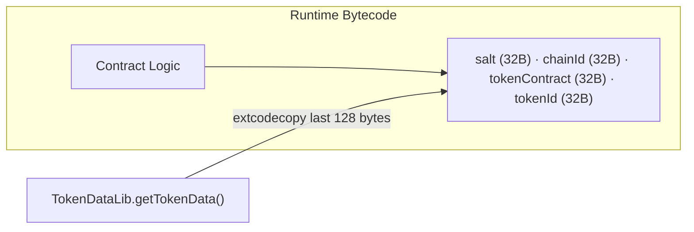

`TokenDataLib` extracts this data at runtime. The binding is immutable — it cannot be changed after deployment.

### Bootstrap Lifecycle

Newly deployed accounts have no validation modules installed. Bootstrap mode provides a minimal ECDSA validation path so the owner can submit initial operations (like installing modules) without a chicken-and-egg problem.

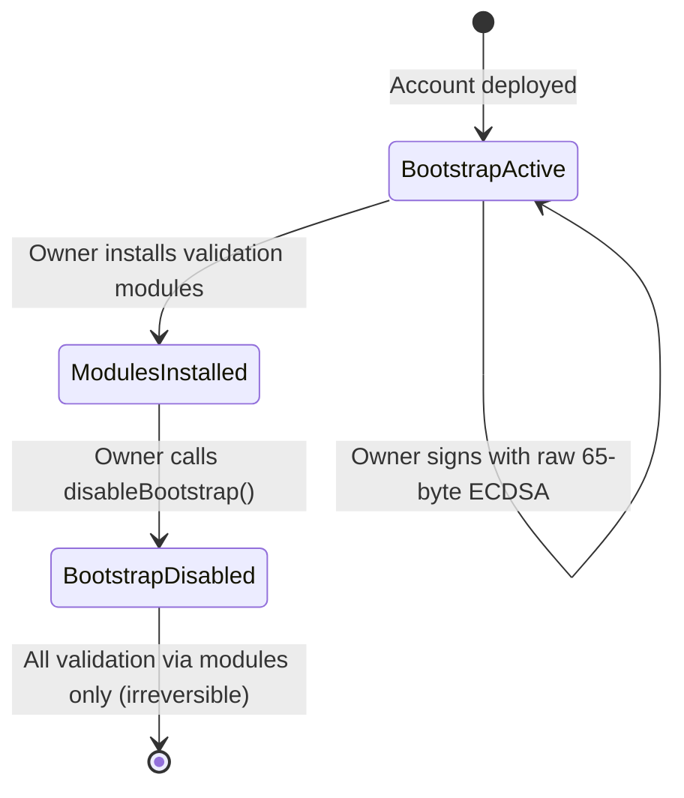

Bootstrap mode accepts raw 65-byte ECDSA signatures over the `userOpHash` (for ERC-4337) or message hash (for ERC-1271). Once `disableBootstrap()` is called, this path is permanently closed.

### State Tracking

The `_state` counter (exposed as `nonce()` via ERC-6551) increments on every state-changing operation:

- `execute()` / `executeBatch()` calls
- Module installation and uninstallation
- Runtime-validated execution
- Module execution with hooks

This provides a monotonically increasing activity signal independent of the ERC-4337 nonce managed by the EntryPoint.

For full details on the account layer, see [ERC6551-Token-Bound-Account-Integration-Design.md](./ERC6551-Token-Bound-Account-Integration-Design.md).

---

## 7. Modular Validation Framework

The validation framework is the authorization backbone of Agent Wallet Core. The account itself contains no validation logic beyond bootstrap mode — all authorization decisions are delegated to installed ERC-6900 validation modules.

### Three Validation Paths

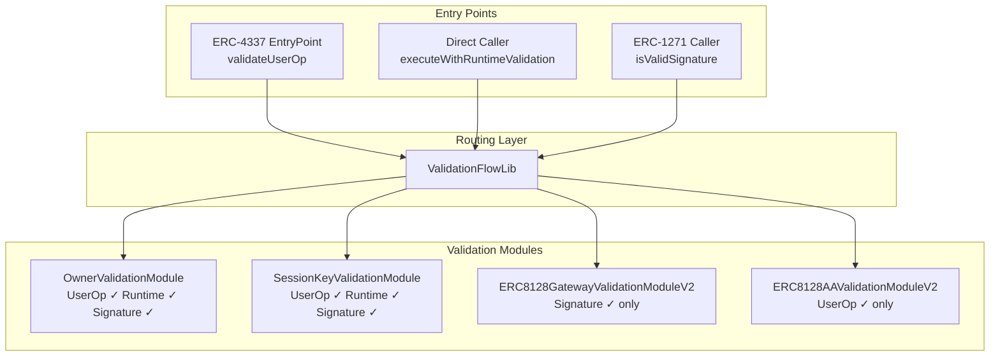

| Path | Trigger | Module Method | Returns |
|---|---|---|---|
| UserOp | EntryPoint calls `validateUserOp` | `validateUserOp(entityId, userOp, userOpHash)` | Packed `uint256` validation data |
| Runtime | Direct call via `executeWithRuntimeValidation` | `validateRuntime(account, entityId, sender, value, data, auth)` | Reverts on failure |
| Signature | ERC-1271 `isValidSignature` | `validateSignature(account, entityId, sender, hash, sig)` | `bytes4` magic value |

### Validation Routing Flow

Every validation request passes through the same routing pipeline in `ValidationFlowLib`:

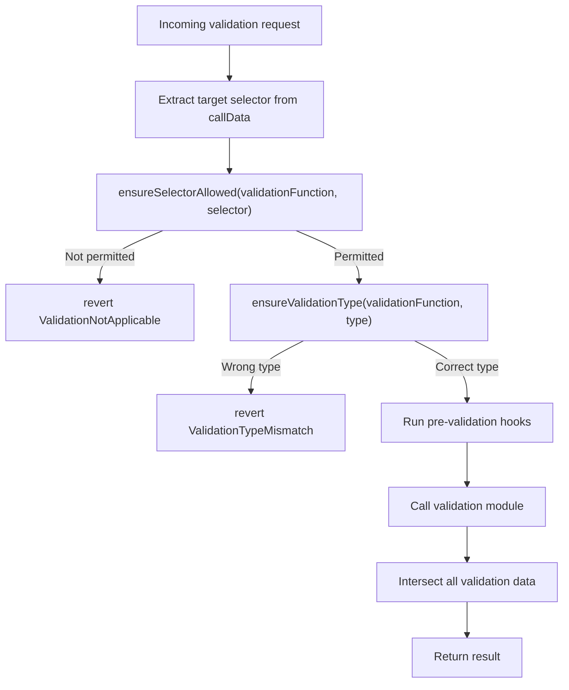

### Validation Data Intersection

When multiple hooks and the module each return validation data, results are intersected to produce the most restrictive time window:

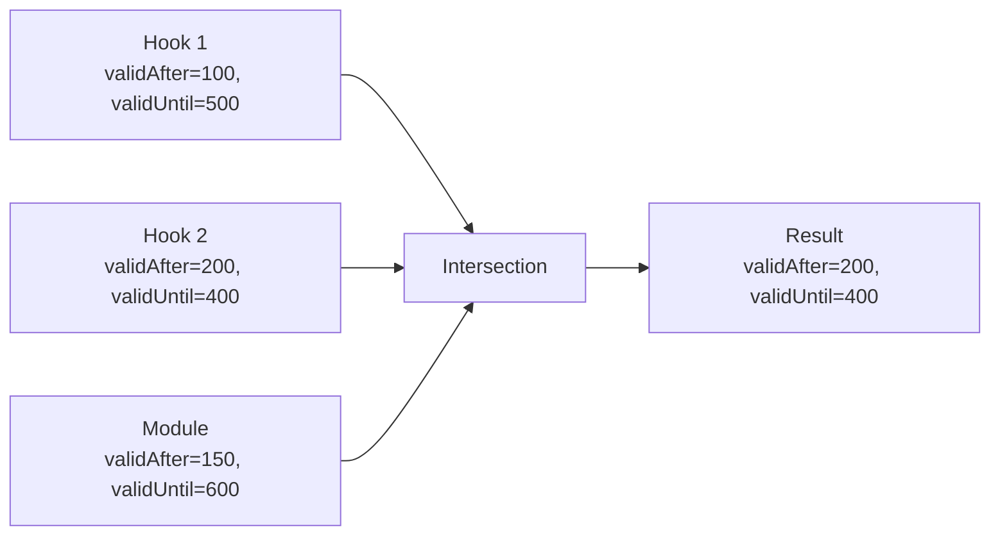

Rules: `validAfter = max(all)`, `validUntil = min(all)`. If any component signals failure (`authorizer = address(1)`), the entire validation fails.

### Packed Type System

ERC-6900 uses tightly packed types for gas efficiency:

| Type | Size | Layout | Purpose |
|---|---|---|---|
| `ModuleEntity` | 24 bytes | `module(20) + entityId(4)` | Reference to a specific function within a module |
| `ValidationConfig` | 25 bytes | `module(20) + entityId(4) + flags(1)` | Module reference + capability flags |
| `HookConfig` | 25 bytes | `module(20) + entityId(4) + flags(1)` | Hook reference + type flags |

Validation flags:

| Bit | Flag | Meaning |
|---|---|---|
| 0 | `isUserOpValidation` | Can handle `validateUserOp` |
| 1 | `isSignatureValidation` | Can handle `validateSignature` |
| 2 | `isGlobal` | Can validate any selector without an allowlist |

### Installed Validation Modules

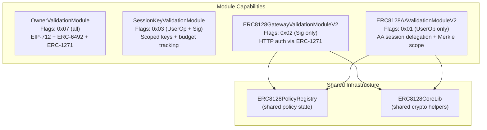

| Module | Signature Scheme | Policy Storage | Key Feature |
|---|---|---|---|
| `OwnerValidationModule` | EIP-712 typed data (account as verifyingContract) | Stateless — resolves owner from ERC-6551 | EOA, SCA, and ERC-6492 counterfactual owner support |
| `SessionKeyValidationModule` | ERC-191 tagged hash (chain + module + account + entity) | Module-internal mappings with epoch/nonce revocation | Target/selector allowlists, value limits, cumulative budget |
| `ERC8128GatewayValidationModuleV2` | EIP-712 typed data (module as verifyingContract) | External `ERC8128PolicyRegistry` | Merkle-proven HTTP scope, replay/class-bound controls |
| `ERC8128AAValidationModuleV2` | EIP-712 typed data (module as verifyingContract) | External `ERC8128PolicyRegistry` | Merkle multiproof for batch, install presets, delegatecall control |

### Module Lifecycle

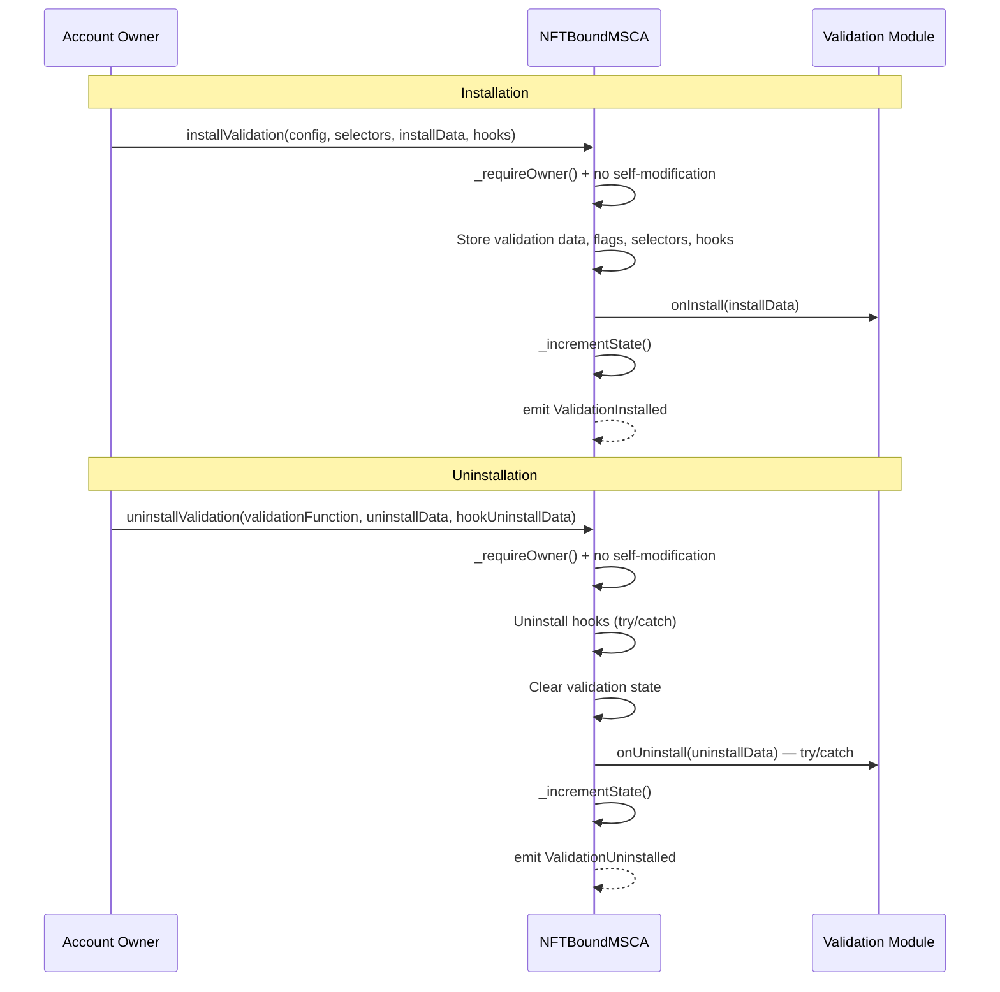

Module uninstallation is resilient: if `onUninstall` reverts, the module is still removed from account state. This prevents a buggy module from blocking its own removal.

For full details, see [ERC6900-Modular-Account-Integration-Design.md](./ERC6900-Modular-Account-Integration-Design.md).

---

## 8. Execution Framework

### Execution Paths

The account supports multiple execution entry points, all ultimately gated by ownership or module-mediated validation:

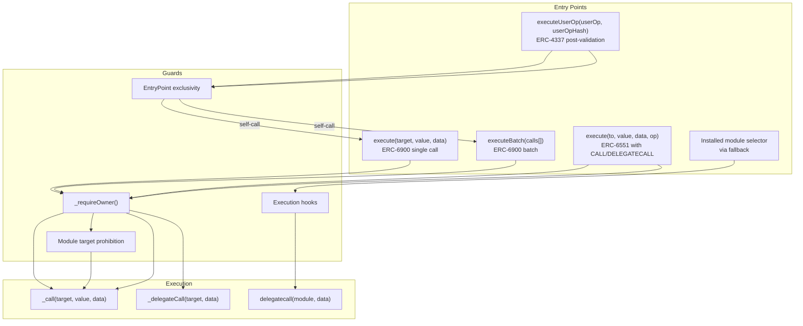

### ERC-4337 UserOp Lifecycle

The complete lifecycle of a UserOperation through the system:

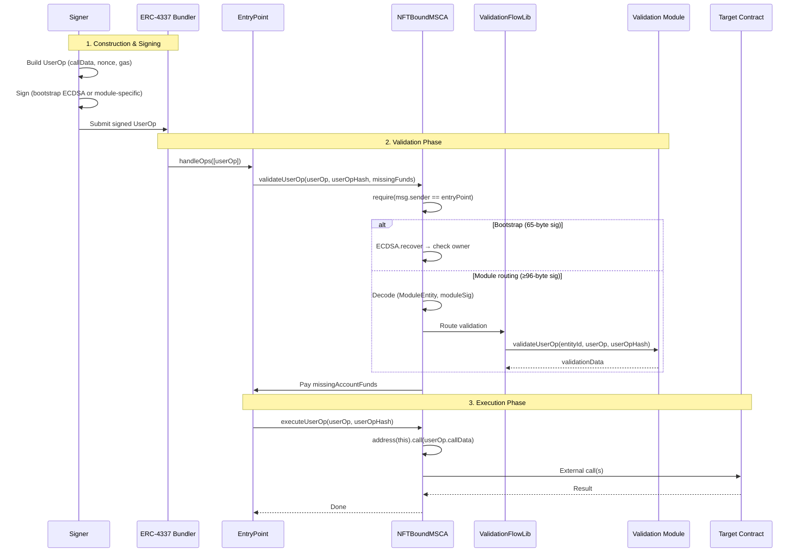

### Execution Hook System

Execution modules run via `delegatecall` in the account's context, wrapped by pre/post hooks managed by `ExecutionFlowLib`:

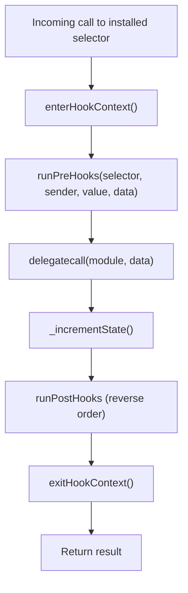

### Execution Safety Guards

| Guard | Limit | Purpose |
|---|---|---|
| Hook depth | Max 8 levels | Prevents unbounded recursive hook nesting |
| Hook gas budget | 13,000,000 gas | Caps total gas consumed by all hooks per execution |
| Recursive hook detection | Boolean flag | Prevents reentrancy during hook execution |
| Module target prohibition | Batch only | `executeBatch` cannot target installed modules |
| Module self-modification | Install/uninstall | Modules cannot install or uninstall themselves |
| Native selector protection | Install time | Execution modules cannot register native account selectors |
| Delegatecall value guard | Execute time | `DELEGATECALL` with `value > 0` reverts |

For full details, see [ERC4337-Account-Abstraction-Integration-Design.md](./ERC4337-Account-Abstraction-Integration-Design.md) and [ERC6900-Modular-Account-Integration-Design.md](./ERC6900-Modular-Account-Integration-Design.md).

---

## 9. Session Delegation and HTTP Authentication

The ERC-8128 integration provides session-based delegation for both HTTP API authentication (gateway path) and onchain execution (AA path). A unified policy registry and shared cryptographic library ensure consistent behavior across both paths.

### Two-Layer Signature Model

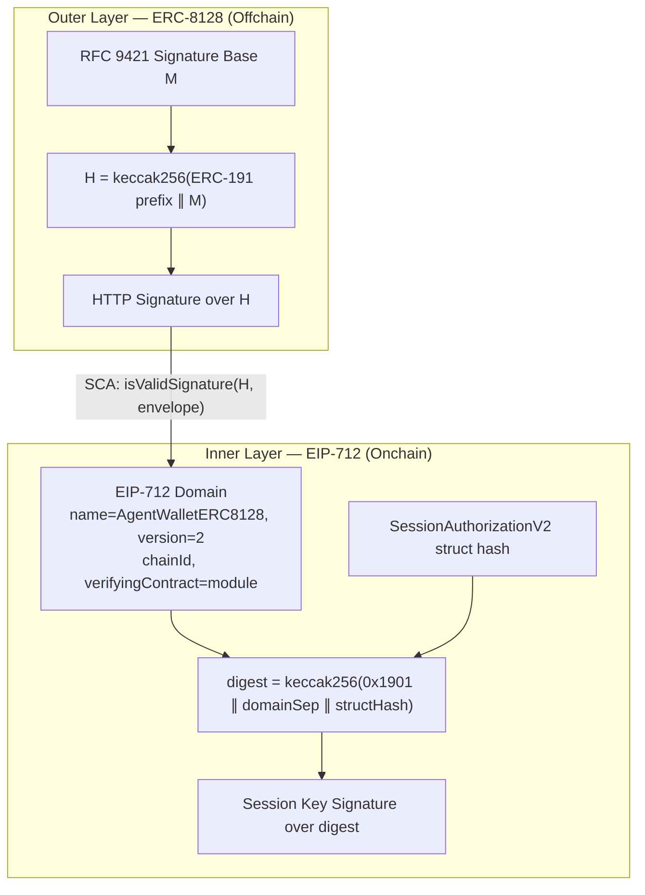

The outer layer is standard ERC-8128 HTTP signature verification. The inner layer is the session delegation envelope validated onchain by the installed modules.

### Unified Policy Architecture

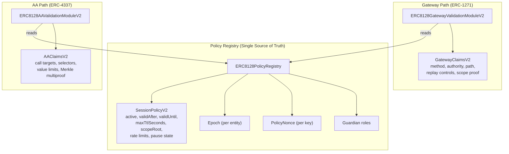

Both modules read from the same `ERC8128PolicyRegistry`. This means:
- Revoking a session key invalidates it for both HTTP and onchain use
- Epoch rotation invalidates all session keys across both paths
- Guardian emergency pauses affect both paths simultaneously

### Revocation Model

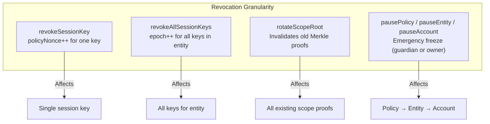

### Replay Prevention

The inner session signature is bound to seven dimensions, preventing replay across any axis:

| Binding | Field | Prevents |
|---|---|---|
| Module | EIP-712 `verifyingContract` | Cross-module replay |
| Mode | `mode` (0=gateway, 1=AA) | Cross-path replay |
| Chain | EIP-712 `chainId` | Cross-chain replay |
| Account | `account` in struct hash | Cross-account replay |
| Entity | `entityId` in struct hash | Cross-entity replay |
| Request | `requestHash` (H or userOpHash) | Cross-request replay |
| Claims | `claimsHash` commitment | Claims tampering |

### AA Scope Verification

For onchain execution, the AA module verifies that each call in a UserOp is authorized by the session's scope tree:

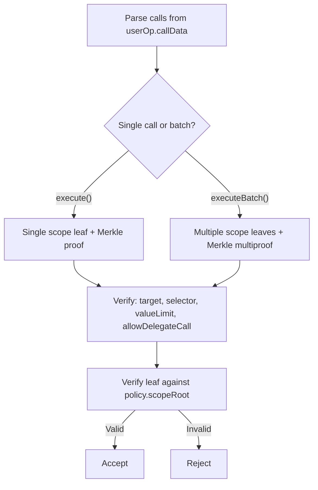

For full details, see [ERC8128-SIWA-Spec.md](./ERC8128-SIWA-Spec.md).

---

## 10. Agent Identity

The `ERC8004IdentityAdapter` provides an optional bridge between ERC-6551 token-bound accounts and the ERC-8004 Agent Identity Registry. It is intentionally not an ERC-6900 module — identity registration is a lifecycle operation, not a validation concern.

### Registration Flow

```mermaid
sequenceDiagram
    participant Owner as Account Owner
    participant Adapter as ERC8004IdentityAdapter
    participant TBA as NFTBoundMSCA
    participant Registry as ERC-8004 Registry

    Owner->>Adapter: encodeRegisterWithURI("ipfs://agent-meta")
    Adapter-->>Owner: calldata
    Owner->>TBA: execute(registry, 0, calldata, 0)
    TBA->>Registry: register("ipfs://agent-meta")
    Registry-->>TBA: agentId
    Owner->>Adapter: recordAgentRegistration(TBA, agentId)
    Adapter->>Registry: ownerOf(agentId) == TBA? ✓
    Adapter->>Adapter: Store bidirectional mapping
```

### Integration with ERC-8128

Agent identity and HTTP authentication are complementary. An API gateway can resolve which agent is making a request after verifying the ERC-8128 signature:

```mermaid
sequenceDiagram
    participant Agent as Agent Runtime
    participant Gateway as API Gateway
    participant SCA as Account
    participant Adapter as ERC8004IdentityAdapter

    Agent->>Gateway: HTTP request + ERC-8128 signature
    Gateway->>SCA: isValidSignature(H, envelope)
    SCA-->>Gateway: Valid ✓
    Gateway->>Adapter: getAgentId(account)
    Adapter-->>Gateway: agentId
    Gateway->>Gateway: Apply agent-specific API policies
    Gateway-->>Agent: Response
```

For full details, see [ERC8004-Identity-Integration-Design.md](./ERC8004-Identity-Integration-Design.md).

---

## 11. Deployment Architecture

Agent Wallet Core supports two deployment modes, each with different tradeoffs for upgradeability, gas cost, and governance requirements.

### Deployment Mode Comparison

| Property | Direct Deployment | Beacon Proxy |
|---|---|---|
| Upgradeability | None | Via beacon + governance timelock |
| Gas cost (deploy) | Higher (full bytecode) | Lower (minimal proxy) |
| Gas cost (call) | Direct | +1 SLOAD for beacon lookup |
| Address determinism | Factory-dependent | ERC-6551 registry `create2` |
| Implementation sharing | Each account is independent | All proxies share one implementation |
| Governance | None needed | `BeaconGovernance` with `minDelay` |

### Direct Deployment

```mermaid
sequenceDiagram
    participant Deployer
    participant Factory as DirectDeploymentFactory
    participant Account as ERC721BoundMSCA

    Deployer->>Factory: deployERC721BoundAccount(entryPoint)
    Factory->>Account: new ERC721BoundMSCA(entryPoint)
    Factory-->>Deployer: account address
    Factory-->>Factory: emit ERC721BoundAccountDeployed
```

### Beacon Proxy Deployment

```mermaid
sequenceDiagram
    participant Registry as ERC-6551 Registry
    participant Proxy as BeaconProxy
    participant Beacon as UpgradeableBeacon
    participant Impl as NFTBoundMSCA Implementation

    Registry->>Proxy: createAccount(beaconProxy, salt, chainId, token, tokenId)
    Note over Proxy: Runtime bytecode = proxy logic + token data footer

    Note over Proxy: Every call delegates through beacon
    Proxy->>Beacon: implementation()
    Beacon-->>Proxy: current implementation address
    Proxy->>Impl: delegatecall(calldata)
    Impl-->>Proxy: result
```

### Timelocked Upgrades

```mermaid
sequenceDiagram
    participant Admin
    participant Gov as BeaconGovernance
    participant Beacon as UpgradeableBeacon

    Admin->>Gov: queueBeaconUpgrade(beacon, newImpl, salt)
    Gov-->>Gov: Store operation, executeAfter = now + minDelay
    Note over Admin,Gov: Wait for timelock to expire
    Admin->>Gov: execute(opId)
    Gov->>Beacon: upgradeTo(newImpl)
    Note over Beacon: All proxies now use new implementation
```

### Full Deployment Sequence

```mermaid
flowchart TD
    A["Deploy EntryPoint<br/>(or use canonical singleton)"] --> B["Deploy account implementations<br/>ERC721BoundMSCA / ResolverBoundMSCA"]
    B --> C{"Deployment mode?"}
    C -->|Direct| D["Deploy DirectDeploymentFactory"]
    C -->|Beacon| E["Deploy BeaconProxy +<br/>BeaconGovernance"]
    D --> F["Deploy validation modules<br/>OwnerValidation, SessionKey,<br/>ERC8128PolicyRegistry,<br/>ERC8128Gateway, ERC8128AA"]
    E --> F
    F --> G["Create account instances"]
    G --> H["Install validation modules<br/>(via bootstrap UserOps<br/>or direct owner calls)"]
    H --> I["disableBootstrap()"]
    I --> J["Set session policies +<br/>ERC-8128 policies"]
    J --> K["(Optional) Deploy<br/>ERC8004IdentityAdapter +<br/>register agent identity"]
```

---

## 12. Security Architecture

### Trust Model

```mermaid
graph TB
    subgraph "Trusted Components"
        EP["ERC-4337 EntryPoint<br/>(immutable binding)"]
        Owner["Account Owner<br/>(NFT-bound, live resolution)"]
        Modules["Installed Modules<br/>(owner-managed lifecycle)"]
        NFT["Bound ERC-721 Contract<br/>(ownership source)"]
    end

    subgraph "Partially Trusted"
        Resolver["IOwnerResolver<br/>(ResolverBoundMSCA only)"]
        Registry["ERC8128PolicyRegistry<br/>(shared policy state)"]
    end

    subgraph "Untrusted"
        Callers["External Callers"]
        Targets["Execution Targets"]
        Bundlers["ERC-4337 Bundlers"]
    end

    subgraph "Account"
        SCA["NFTBoundMSCA"]
    end

    EP -->|"validates + executes"| SCA
    Owner -->|"manages modules + executes"| SCA
    Modules -->|"validation decisions"| SCA
    NFT -->|"ownership resolution"| SCA
    Resolver -->|"ownership resolution"| SCA
    Registry -->|"policy reads"| Modules
    Callers -->|"rejected unless authorized"| SCA
    SCA -->|"external calls"| Targets
```

### Defense in Depth

The system implements multiple layers of protection:

```mermaid
graph TB
    subgraph "Layer 1: Entry Gating"
        G1["EntryPoint exclusivity for UserOp methods"]
        G2["Owner-only for direct execution"]
        G3["Module-mediated for runtime validation"]
    end

    subgraph "Layer 2: Validation"
        V1["Selector permission checks"]
        V2["Validation type enforcement"]
        V3["Pre-validation hook intersection"]
        V4["Module-specific policy checks"]
    end

    subgraph "Layer 3: Execution Safety"
        E1["Hook depth limit (8)"]
        E2["Hook gas budget (13M)"]
        E3["Recursive hook detection"]
        E4["Module target prohibition in batch"]
        E5["Native selector protection"]
        E6["Module self-modification prevention"]
    end

    subgraph "Layer 4: Cryptographic"
        C1["EIP-712 domain separation"]
        C2["Cross-module replay prevention"]
        C3["Cross-chain replay prevention"]
        C4["Claims hash binding"]
        C5["Request hash binding"]
        C6["ERC-6492 factory → ERC-1271 verification chain"]
    end

    G1 --> V1
    G2 --> V1
    G3 --> V1
    V1 --> E1
    V4 --> C1
```

### Attack Surface Summary

| Vector | Mitigation | Severity |
|---|---|---|
| Non-EntryPoint calling validateUserOp | `msg.sender == entryPoint` check | Critical — blocked |
| Unauthorized module installation | `_requireOwner()` on all install/uninstall | Critical — blocked |
| Module self-install/uninstall | `ModuleSelfModification` revert | High — blocked |
| Execution module selector squatting | `NativeSelectorConflict` + `SelectorAlreadyInstalled` | High — blocked |
| Batch call targeting installed module | `ModuleTargetNotAllowed` revert | High — blocked |
| Execution hook reentrancy | `RecursiveHookDetected` revert | High — blocked |
| Execution hook gas exhaustion | `HookGasBudgetExceeded` at 13M cap | Medium — bounded |
| Session key compromise | `revokeSessionKey` + guardian `pausePolicy` | Medium — recoverable |
| Cross-module signature replay | EIP-712 `verifyingContract` binding | High — blocked |
| Bootstrap mode after module install | `disableBootstrap()` (irreversible) | Medium — owner action required |
| ERC-6492 factory gas griefing | ERC-4337 gas accounting; factory gas covered by verification gas limit | Medium — bounded |
| ERC-6492 malicious factory | Factory must deploy at `owner()` address; ERC-1271 check targets owner, not factory output | High — blocked |
| NFT transfer → ownership change | By design. Whoever holds the NFT controls the account. | Informational |
| Stale owner after NFT transfer | `_owner()` resolves live on every call | N/A — by design |

### Immutability Properties

| Component | Mutability | Governance |
|---|---|---|
| Token binding (salt, chainId, tokenContract, tokenId) | Immutable (bytecode) | None |
| EntryPoint address | Immutable (constructor) | None |
| Bootstrap mode | One-way: `true` → `false` | Owner only, irreversible |
| Installed modules | Mutable | Owner only |
| Resolver address (ResolverBoundMSCA) | Mutable via storage | BeaconGovernance timelock |
| Beacon implementation | Mutable via beacon | BeaconGovernance timelock |
| Policy registry state | Mutable | Account owner + guardians |

---

## 13. Contract Inventory

### Source Layout

```
src/
├── core/                              # Account contracts and infrastructure
│   ├── NFTBoundMSCA.sol               # Abstract modular account (ERC-6551 + ERC-6900 + ERC-4337)
│   ├── ERC721BoundMSCA.sol            # Concrete account: owner from IERC721.ownerOf
│   ├── ResolverBoundMSCA.sol          # Concrete account: owner from IOwnerResolver
│   ├── ERC8128PolicyRegistry.sol      # Shared session policy state for ERC-8128 modules
│   ├── BeaconProxy.sol                # Optional beacon-mode account proxy
│   ├── BeaconGovernance.sol           # Timelocked upgrade governance
│   └── DirectDeploymentFactory.sol    # Non-beacon deployment helper
│
├── modules/
│   ├── validation/
│   │   ├── OwnerValidationModule.sol              # Owner auth (EIP-712 + ERC-6492 + ERC-1271)
│   │   ├── SessionKeyValidationModule.sol         # Scoped session keys with budget tracking
│   │   ├── ERC8128GatewayValidationModuleV2.sol   # ERC-1271 path for HTTP auth
│   │   └── ERC8128AAValidationModuleV2.sol        # ERC-4337 path for AA session delegation
│   └── execution/                                 # (extensible — no built-in execution modules)
│
├── libraries/
│   ├── MSCAStorage.sol                # ERC-7201 namespaced diamond storage
│   ├── ValidationFlowLib.sol          # Validation routing + hook intersection
│   ├── ExecutionFlowLib.sol           # Execution hooks with depth/gas/recursion guards
│   ├── ValidationManagementLib.sol    # Validation module lifecycle
│   ├── ExecutionManagementLib.sol     # Execution module lifecycle
│   ├── ModuleEntityLib.sol            # ModuleEntity packing/unpacking
│   ├── ValidationConfigLib.sol        # ValidationConfig packing/unpacking
│   ├── HookConfigLib.sol              # HookConfig packing/unpacking
│   ├── ModuleTypes.sol                # Core type definitions
│   ├── TokenDataLib.sol               # ERC-6551 bytecode footer extraction
│   ├── ERC8128CoreLib.sol             # Shared ERC-8128 crypto helpers
│   ├── ERC8128Types.sol               # ERC-8128 struct definitions
│   └── EIP712DomainLib.sol            # EIP-712 domain serialize/parse
│
├── adapters/
│   ├── ERC8004IdentityAdapter.sol     # Optional identity registration helper
│   ├── IOwnerResolver.sol             # Pluggable ownership resolution interface
│   └── ERC721OwnerResolver.sol        # Reference resolver (mirrors ERC-721 ownerOf)
│
└── interfaces/
    ├── IERC165.sol
    ├── IERC6551Account.sol
    ├── IERC6551Executable.sol
    ├── IERC6551Registry.sol
    ├── IERC6900Account.sol
    ├── IERC6900Module.sol
    ├── IERC6900ValidationModule.sol
    ├── IERC6900ExecutionModule.sol
    ├── IERC6900ValidationHookModule.sol
    └── IERC6900ExecutionHookModule.sol
```

### Contract Summary Table

| Contract | Type | Key Interfaces | Storage |
|---|---|---|---|
| `NFTBoundMSCA` | Abstract account | IERC6551Account, IERC6551Executable, IERC6900Account, IAccount, IAccountExecute, IERC1271 | ERC-7201 namespaced (`MSCAStorage`) |
| `ERC721BoundMSCA` | Concrete account | accountId() | Inherits NFTBoundMSCA |
| `ResolverBoundMSCA` | Concrete account | resolver(), accountId() | Inherits NFTBoundMSCA + resolver slot |
| `ERC8128PolicyRegistry` | Singleton registry | setPolicy, revokeSessionKey, revokeAllSessionKeys, pausePolicy, setGuardian | Policy mappings keyed by (account, entityId, sessionKey, epoch, nonce) |
| `OwnerValidationModule` | Validation module | IERC6900ValidationModule | Stateless |
| `SessionKeyValidationModule` | Validation module | IERC6900ValidationModule | Internal policy + budget mappings |
| `ERC8128GatewayValidationModuleV2` | Validation module | IERC6900ValidationModule | Reads from PolicyRegistry |
| `ERC8128AAValidationModuleV2` | Validation module | IERC6900ValidationModule | Install presets + reads from PolicyRegistry |
| `BeaconProxy` | Proxy | IBeacon delegation | Immutable beacon address |
| `BeaconGovernance` | Governance | queue, execute, cancel | Timelocked operation queue |
| `DirectDeploymentFactory` | Factory | deploy helpers | None |
| `ERC8004IdentityAdapter` | Adapter | encode, record, query | Bidirectional account↔agentId mapping |
| `ERC721OwnerResolver` | Adapter | IOwnerResolver | Stateless |

---

## 14. Data Flow Reference

### End-to-End: Owner Executes via ERC-4337

```mermaid
sequenceDiagram
    participant Owner as Account Owner (EOA)
    participant Bundler as Bundler
    participant EP as EntryPoint
    participant SCA as NFTBoundMSCA
    participant NFT as ERC-721 Contract
    participant OwnerMod as OwnerValidationModule
    participant Target as Target Contract

    Owner->>Owner: Build UserOp targeting execute(target, value, data)
    Owner->>Owner: Sign with EIP-712 via OwnerValidationModule scheme
    Owner->>Owner: Encode sig as abi.encode(ModuleEntity, moduleSig)
    Owner->>Bundler: Submit UserOp

    Bundler->>EP: handleOps([userOp])
    EP->>SCA: validateUserOp(userOp, userOpHash, missingFunds)
    SCA->>SCA: Decode (ModuleEntity, moduleSig)
    SCA->>SCA: ensureSelectorAllowed + ensureUserOpValidation
    SCA->>OwnerMod: validateUserOp(entityId, userOp, userOpHash)
    OwnerMod->>SCA: owner()
    SCA->>NFT: ownerOf(tokenId)
    NFT-->>SCA: owner address
    SCA-->>OwnerMod: owner address
    OwnerMod->>OwnerMod: Verify EIP-712 signature
    OwnerMod-->>SCA: 0 (valid)
    SCA->>EP: Pay missingFunds

    EP->>SCA: executeUserOp(userOp, userOpHash)
    SCA->>SCA: address(this).call(userOp.callData)
    SCA->>Target: call(target, value, data)
    Target-->>SCA: result
```

### End-to-End: Agent Authenticates HTTP Request via ERC-8128

```mermaid
sequenceDiagram
    participant Agent as Agent Runtime
    participant Gateway as API Gateway
    participant SCA as NFTBoundMSCA
    participant GWMod as GatewayValidationModuleV2
    participant Registry as ERC8128PolicyRegistry

    Agent->>Agent: Construct HTTP request
    Agent->>Agent: Build RFC 9421 signature base M
    Agent->>Agent: Compute H = keccak256(ERC-191 ∥ M)
    Agent->>Agent: Build SessionAuthV2 envelope (mode=0, requestHash=H)
    Agent->>Agent: Session key signs EIP-712 digest
    Agent->>Gateway: HTTP request + Signature headers

    Gateway->>Gateway: Parse Signature-Input, reconstruct M, compute H
    Gateway->>SCA: isValidSignature(H, sessionAuthEnvelope)
    SCA->>SCA: Decode (ModuleEntity, moduleSig)
    SCA->>GWMod: validateSignature(account, entityId, caller, H, envelope)
    GWMod->>GWMod: Decode SessionAuthV2, verify mode=0, requestHash=H
    GWMod->>Registry: getPolicy + isPolicyActive
    Registry-->>GWMod: policy data
    GWMod->>GWMod: Verify time windows, claims, scope proof
    GWMod->>GWMod: Verify EIP-712 session signature
    GWMod-->>SCA: ERC1271_MAGICVALUE
    SCA-->>Gateway: Valid ✓
    Gateway-->>Agent: HTTP response
```

### End-to-End: Session Key Executes Scoped Onchain Operation

```mermaid
sequenceDiagram
    participant SessionKey as Session Key Holder
    participant Bundler as Bundler
    participant EP as EntryPoint
    participant SCA as NFTBoundMSCA
    participant AAMod as ERC8128AAValidationModuleV2
    participant Registry as ERC8128PolicyRegistry
    participant Target as Allowed Target

    SessionKey->>SessionKey: Build UserOp (execute to allowed target)
    SessionKey->>SessionKey: Build SessionAuthV2 (mode=1, requestHash=userOpHash)
    SessionKey->>SessionKey: Build AAClaimsV2 with scope proof
    SessionKey->>SessionKey: Sign EIP-712 digest
    SessionKey->>Bundler: Submit UserOp

    Bundler->>EP: handleOps([userOp])
    EP->>SCA: validateUserOp(userOp, userOpHash, missingFunds)
    SCA->>AAMod: validateUserOp(entityId, userOp, userOpHash)
    AAMod->>AAMod: Verify mode=1, requestHash=userOpHash
    AAMod->>AAMod: Parse calls from callData
    AAMod->>Registry: getPolicy + isPolicyActive
    AAMod->>AAMod: Verify scope (target, selector, value) via Merkle proof
    AAMod->>AAMod: Verify EIP-712 session signature
    AAMod-->>SCA: Packed validationData (validAfter, validUntil)
    SCA->>EP: Pay missingFunds

    EP->>SCA: executeUserOp(userOp, userOpHash)
    SCA->>Target: call(target, value, data)
    Target-->>SCA: result
```

### End-to-End: Counterfactual SCA Owner Validates via ERC-6492

When the account owner is itself a smart contract account that has not yet been deployed, `OwnerValidationModule` uses ERC-6492 to deploy the owner on-the-fly during UserOp validation and then verify via ERC-1271.

```mermaid
sequenceDiagram
    participant Owner as SCA Owner (undeployed)
    participant Bundler as Bundler
    participant EP as EntryPoint
    participant SCA as NFTBoundMSCA
    participant NFT as ERC-721 Contract
    participant OwnerMod as OwnerValidationModule
    participant Factory as Factory Contract
    participant OwnerSCA as Owner SCA (deployed)

    Owner->>Owner: Build UserOp targeting execute(target, value, data)
    Owner->>Owner: Sign EIP-712 digest with inner key
    Owner->>Owner: Wrap as ERC-6492: abi.encode(factory, factoryCalldata, innerSig) ++ magic suffix
    Owner->>Owner: Encode sig as abi.encode(ModuleEntity, wrappedSig)
    Owner->>Bundler: Submit UserOp

    Bundler->>EP: handleOps([userOp])
    EP->>SCA: validateUserOp(userOp, userOpHash, missingFunds)
    SCA->>SCA: Decode (ModuleEntity, moduleSig)
    SCA->>OwnerMod: validateUserOp(entityId, userOp, userOpHash)
    OwnerMod->>SCA: owner()
    SCA->>NFT: ownerOf(tokenId)
    NFT-->>SCA: counterfactual owner address
    SCA-->>OwnerMod: owner address (no code yet)

    OwnerMod->>OwnerMod: Compute EIP-712 digest
    OwnerMod->>OwnerMod: Detect ERC-6492 magic suffix
    OwnerMod->>OwnerMod: Decode (factory, factoryCalldata, innerSig)
    OwnerMod->>OwnerMod: owner.code.length == 0 → deploy needed

    OwnerMod->>Factory: call(factoryCalldata)
    Factory->>OwnerSCA: CREATE2 deploy at predicted address
    Factory-->>OwnerMod: success

    OwnerMod->>OwnerSCA: isValidSignature(digest, innerSig)
    OwnerSCA-->>OwnerMod: ERC-1271 magic value ✓
    OwnerMod-->>SCA: 0 (valid)
    SCA->>EP: Pay missingFunds

    EP->>SCA: executeUserOp(userOp, userOpHash)
    SCA->>SCA: address(this).call(userOp.callData)
```

This flow only applies to the `validateUserOp` path (state-changing). In the `validateSignature` (ERC-1271/view) path, the module cannot deploy the factory — it can only verify ERC-6492 signatures when the owner is already deployed. See [ERC6492-Counterfactual-Signature-Integration-Design.md](./ERC6492-Counterfactual-Signature-Integration-Design.md) for full details.

---

## 15. Testing Architecture

### Test Organization

```
test/
├── core/                                          # Account-level integration tests
│   ├── ERC721BoundMSCA.t.sol                      # ERC-6551 + ERC-6900 + ERC-4337 integration
│   ├── ResolverBoundMSCA.t.sol                    # Resolver-based ownership
│   ├── ERC8128PolicyRegistry.t.sol                # Policy storage, auth, revocation, guardians
│   ├── BeaconProxy.t.sol                          # Beacon proxy delegation
│   ├── BeaconGovernance.t.sol                     # Timelocked governance
│   └── DirectDeploymentFactory.t.sol              # Factory deployment
│
├── modules/                                       # Module-specific tests
│   ├── OwnerValidationModule.t.sol                # EIP-712, EOA/SCA/ERC-6492 paths
│   ├── SessionKeyValidationModule.t.sol           # Policy, budget, epoch revocation
│   ├── ERC8128GatewayValidationModuleV2.t.sol     # Gateway validation + tamper rejection
│   ├── ERC8128AAValidationModuleV2.t.sol          # AA validation, Merkle proofs, presets
│   ├── ERC8128V2CrossCutting.t.sol                # Cross-module revocation + replay prevention
│   └── ERC8128V2UnitConformance.t.sol             # Interface conformance
│
├── libraries/                                     # Library unit tests
│   ├── ERC8128CoreLib.t.sol                       # Digest, key derivation, scope leaves
│   └── EIP712DomainLib.t.sol                      # Domain serialize/parse
│
├── adapters/                                      # Adapter tests
│   ├── ERC8004IdentityAdapter.t.sol               # Registration, authorization, mapping
│   └── ERC721OwnerResolver.t.sol                  # Resolver implementation
│
├── gateway/                                       # Gateway conformance
│   └── ERC8128GatewayConformance.t.sol            # Parity vectors for offchain gateway
│
├── mocks/                                         # Test helpers
│   ├── CoreTestMocks.sol
│   └── OwnerValidationMocks.sol
│
└── properties/                                    # Property-based / invariant tests
```

### Testing Strategy

The test suite is organized around three testing levels:

1. **Unit tests**: individual library functions, type packing/unpacking, digest computation, scope leaf construction.
2. **Module tests**: each validation module tested in isolation with mock accounts and policies. Covers happy paths, tamper rejection, type enforcement, and edge cases.
3. **Integration tests**: end-to-end flows through the full account stack — EntryPoint → account → validation routing → module → execution. Covers bootstrap lifecycle, module installation round-trips, and cross-module interactions.

### Property-Based Testing

The project uses Foundry's fuzz testing with 256 runs per property. Key properties tested across the system:

| Category | Example Properties |
|---|---|
| Ownership | `owner()` always matches live NFT ownership; resolver consistency |
| Bootstrap | Disable is irreversible; 65-byte sigs rejected after disable |
| Module lifecycle | Install/uninstall round-trip; self-modification prevention; selector conflicts |
| Validation routing | Type enforcement; selector permissions; global flag bypass |
| Hook safety | Depth limit; gas budget; recursive detection; LIFO post-hook ordering |
| Session delegation | Policy round-trip; revocation invalidates both modules; scope rotation |
| Cryptographic | Digest determinism; domain serialization round-trip; claims hash binding |
| ERC-6492 | Counterfactual deploy + ERC-1271 verify; already-deployed short-circuit; view-path graceful failure |
| Replay prevention | Cross-module, cross-mode, cross-chain, cross-account rejection |

---

## 16. Build and Toolchain

### Requirements

- **Foundry** (`forge`, `cast`, `anvil`)
- **Solidity** `0.8.33`

### Configuration

```toml
[profile.default]
src = "src"
out = "out"
libs = ["lib"]
solc_version = "0.8.33"
optimizer = true
optimizer_runs = 200
bytecode_hash = "none"
viaIR = true

[fuzz]
runs = 256
```

### Commands

```bash
# Build
forge build

# Test (with verbosity)
forge test -vv

# Test specific file
forge test --match-path test/core/ERC721BoundMSCA.t.sol -vv

# Gas report
forge test --gas-report
```

### Dependencies

| Dependency | Purpose |
|---|---|
| `forge-std` | Foundry test framework |
| `openzeppelin-contracts` | ECDSA, MerkleProof, ERC-721, and utility libraries |

### Integration as Submodule

```bash
git submodule add https://github.com/EqualFiLabs/agent-wallet-core lib/agent-wallet-core
```

Remapping:
```text
@agent-wallet-core/=lib/agent-wallet-core/src/
```

Usage:
```solidity
import {ERC721BoundMSCA} from "@agent-wallet-core/core/ERC721BoundMSCA.sol";
import {IERC6900ExecutionModule} from "@agent-wallet-core/interfaces/IERC6900ExecutionModule.sol";
```

---

## 17. Future Considerations

The following areas are identified as potential future work based on open questions across the ERC-specific design documents:

| Area | Consideration |
|---|---|
| Paymaster integration | Support gasless UserOps for session key holders via ERC-4337 paymasters |
| Counterfactual deployment | `IAccountFactory` with `initCode` support for EntryPoint-driven account creation |
| Onchain module registry | Queryable list of installed validation functions and execution selectors |
| Atomic module upgrades | Uninstall + reinstall in a single transaction to avoid selector availability gaps |
| Cross-chain token binding | Ownership resolution for NFTs on remote chains |
| Bootstrap auto-disable | Time-based automatic bootstrap disable after N blocks or T seconds |
| Configurable hook budgets | Per-selector hook gas budgets instead of a global constant |
| Batch module installation | Install multiple validation functions in a single transaction |
| Onchain rate limiting | Per-period rate limits enforced onchain for AA session delegation |
| Stale mapping cleanup | Mechanism to clear stale ERC-8004 identity mappings |
| ERC-6492 for session keys | Extend counterfactual signature support to `SessionKeyValidationModule` for SCA session keys |
| ERC-6492 factory whitelisting | Optional factory registry to restrict which factories `OwnerValidationModule` will call |

---

*This document provides the architectural overview of Agent Wallet Core. For implementation-level details on each integrated standard, refer to the linked ERC-specific design documents.*
