# ERC-4337 Account Abstraction Integration Design

Status: Draft

## Summary

This document describes how Agent Wallet Core integrates with [ERC-4337](https://eips.ethereum.org/EIPS/eip-4337) (Account Abstraction Using Alt Mempool) to provide smart account execution for NFT-bound modular accounts. ERC-4337 defines a standard interface for smart contract accounts to participate in a decentralized UserOperation mempool, where bundlers submit operations to a singleton `EntryPoint` contract that orchestrates validation and execution.

Agent Wallet Core implements ERC-4337 at the account layer (`NFTBoundMSCA`) and delegates validation to pluggable ERC-6900 validation modules. The account itself handles EntryPoint gating, signature routing, bootstrap mode, gas prepayment, and execution dispatch. Validation modules — `OwnerValidationModule`, `SessionKeyValidationModule`, and `ERC8128AAValidationModule` — each implement `validateUserOp` with different authorization models ranging from direct owner signing to scoped session delegation with Merkle-proven call constraints.

Core outcomes:
- `IAccount` and `IAccountExecute` implementation gated exclusively to the immutable EntryPoint
- modular `validateUserOp` routing through ERC-6900 validation functions with hook intersection
- bootstrap mode for initial owner-signed UserOps before module installation
- three validation modules covering owner, session key, and ERC-8128 AA session delegation
- packed validation data with time-range intersection across hooks and modules
- `executeUserOp` dispatch with self-call forwarding for arbitrary account operations

## Scope

In scope:
- ERC-4337 `validateUserOp` and `executeUserOp` implementation in `NFTBoundMSCA`
- validation routing through `ValidationFlowLib` with hook intersection
- bootstrap validation mode for pre-module account setup
- EntryPoint gas prepayment mechanics
- `OwnerValidationModule` UserOp validation (EIP-712 owner signature, ERC-6492 counterfactual support)
- `SessionKeyValidationModule` UserOp validation (scoped session keys with budget tracking)
- `ERC8128AAValidationModule` UserOp validation (session delegation with Merkle scope proofs)
- validation data packing and time-range intersection
- execution selector parsing (`execute`, `executeBatch`, `execute` with operation)
- deployment patterns (direct and beacon-proxied) with EntryPoint binding

Out of scope:
- EntryPoint implementation details (trusted external contract)
- bundler selection, gas estimation, and mempool behavior
- paymaster integration (no paymaster support is implemented)
- ERC-1271 / gateway validation paths (covered in the ERC-8128 v2 design spec)
- ERC-8128 outer HTTP signature construction and verification

## Design Goals

1. EntryPoint exclusivity: only the immutable EntryPoint can invoke `validateUserOp` and `executeUserOp`.
2. Modular validation: UserOp signature interpretation is fully delegated to installed ERC-6900 validation modules.
3. Bootstrap safety: accounts are usable immediately after deployment via direct owner ECDSA before any modules are installed.
4. Hook composability: pre-validation hooks participate in validation data intersection, enabling layered authorization.
5. Minimal trust surface: the account trusts only the EntryPoint and installed modules; no admin keys or upgrade paths in the core account.

## Non-Goals

1. Paymaster integration. The account prepays gas from its own balance; paymaster flows are not implemented.
2. Account factory with `initCode` support. Deployment uses `DirectDeploymentFactory` or beacon proxies; no `IAccountFactory` is provided.
3. Aggregated signatures. The account returns `aggregator = address(0)` in all validation data; no `IAggregator` support.
4. Onchain gas estimation helpers. Gas limits are determined offchain by bundlers.


## High-Level Architecture

### System Context

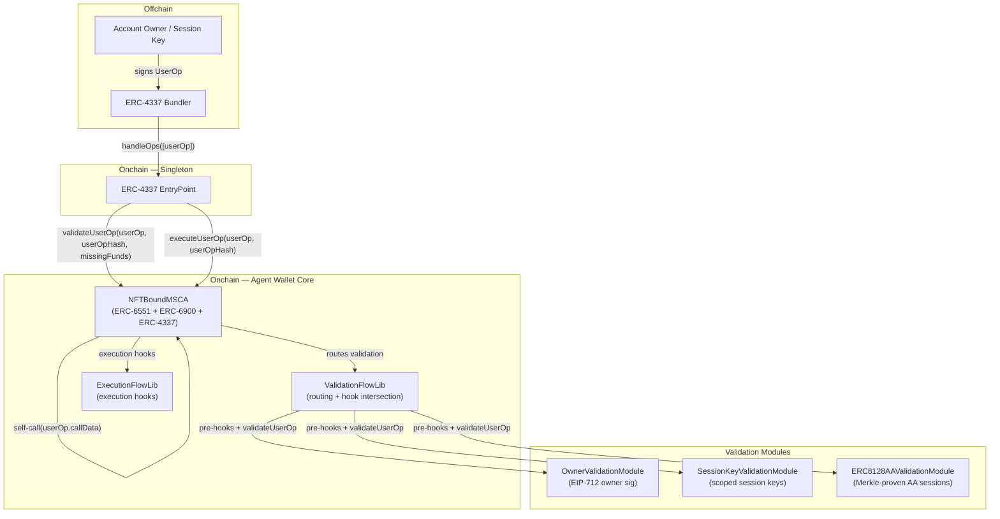

### Component Responsibilities

| Component | Responsibility |
|---|---|
| `EntryPoint` (external) | Singleton ERC-4337 contract. Calls `validateUserOp` for authorization, enforces returned validation data (time ranges), calls `executeUserOp` for execution, handles gas accounting. |
| `NFTBoundMSCA` | Abstract account contract implementing `IAccount.validateUserOp` and `IAccountExecute.executeUserOp`. Gates both to the immutable EntryPoint. Routes validation to ERC-6900 modules. Handles bootstrap mode and gas prepayment. |
| `ERC721BoundMSCA` | Concrete account with ownership resolved from `IERC721.ownerOf(tokenId)`. |
| `ResolverBoundMSCA` | Concrete account with ownership resolved from `IOwnerResolver.resolveOwner(...)`. |
| `ValidationFlowLib` | Library handling validation routing: selector permission checks, validation type enforcement, pre-validation hook execution with data intersection, and module dispatch. |
| `ExecutionFlowLib` | Library handling execution hook routing: pre/post hooks with depth and gas guards. |
| `OwnerValidationModule` | Validates UserOps signed by the current NFT-bound owner via EIP-712 typed data. Supports EOA (ECDSA), SCA (ERC-1271), and counterfactual (ERC-6492) owner signatures. |
| `SessionKeyValidationModule` | Validates UserOps signed by scoped session keys with target/selector allowlists, value limits, cumulative budget tracking, and time windows. |
| `ERC8128AAValidationModule` | Validates UserOps using ERC-8128 session delegation envelopes with Merkle-proven call scope, install presets, and policy registry integration. |

### Contract Inheritance and Interface Graph

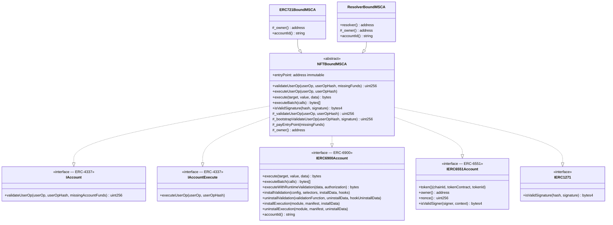


## ERC-4337 Account Interface Implementation

### `validateUserOp`

The account's `validateUserOp` is the entry point for all ERC-4337 validation. It enforces EntryPoint exclusivity, routes to the appropriate validation path, and prepays gas.

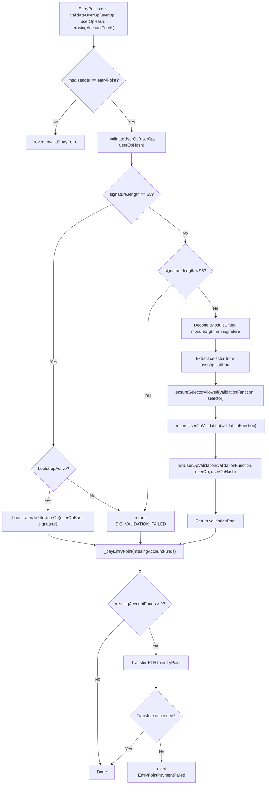

### Signature Encoding

The UserOp signature field carries different payloads depending on the validation path:

| Signature Length | Interpretation | Validation Path |
|---|---|---|
| 65 bytes | Raw ECDSA signature (r, s, v) | Bootstrap mode: direct owner ECDSA over `userOpHash` |
| ≥ 96 bytes | ABI-encoded `(ModuleEntity, bytes)` | Module routing: `ModuleEntity` identifies the validation module + entity ID, `bytes` is the module-specific signature |
| < 96 bytes (non-65) | Invalid | Returns `SIG_VALIDATION_FAILED` |

```solidity
// Bootstrap mode (65 bytes)
userOp.signature = abi.encodePacked(r, s, v);

// Module routing (≥ 96 bytes)
userOp.signature = abi.encode(
    ModuleEntity validationFunction,  // packed: module address (20 bytes) + entityId (4 bytes)
    bytes moduleSig                   // module-specific signature payload
);
```

### `executeUserOp`

After successful validation, the EntryPoint calls `executeUserOp` to perform the actual operation. The implementation is a simple self-call forwarding pattern:

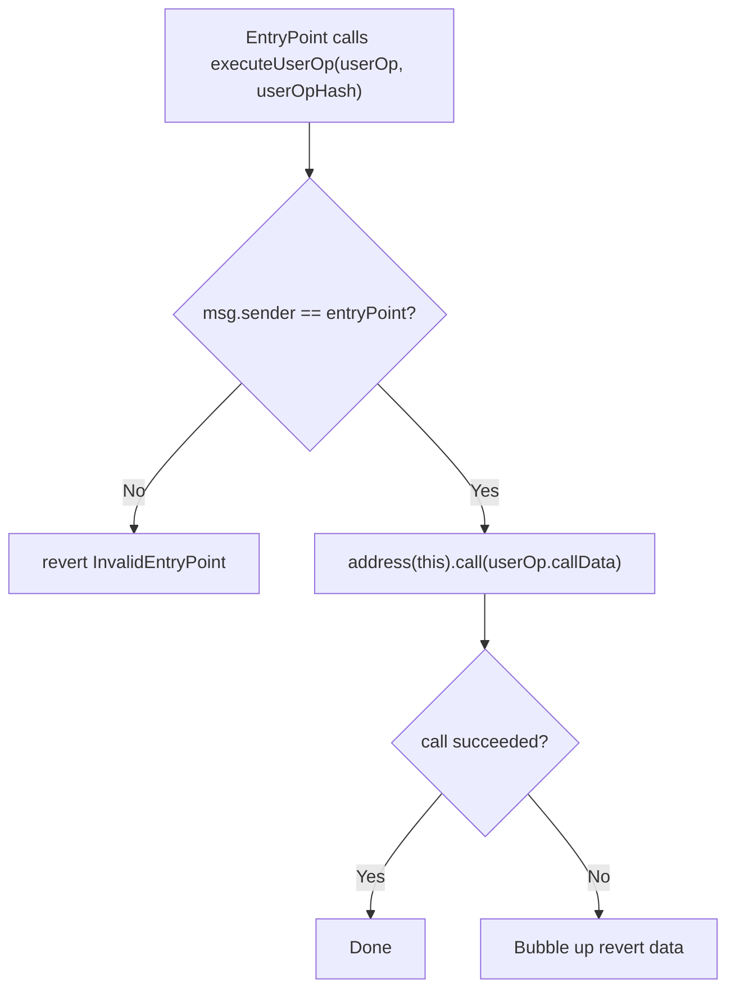

The self-call pattern means `userOp.callData` is executed as if the account called itself. This allows the callData to target any of the account's public functions: `execute`, `executeBatch`, `installValidation`, `uninstallValidation`, `installExecution`, `uninstallExecution`, or any installed execution module selector.

### EntryPoint Binding

The EntryPoint address is set as an `immutable` in the constructor and cannot be changed after deployment. Both `validateUserOp` and `executeUserOp` check `msg.sender == entryPoint` before proceeding.

```solidity
constructor(address entryPoint_) {
    entryPoint = entryPoint_;
    _bootstrapActive = true;
}
```

Both `ERC721BoundMSCA` and `ResolverBoundMSCA` pass the EntryPoint address through to `NFTBoundMSCA`:

```solidity
// ERC721BoundMSCA
constructor(address entryPoint_) NFTBoundMSCA(entryPoint_) {}

// ResolverBoundMSCA
constructor(address entryPoint_, address resolver_) NFTBoundMSCA(entryPoint_) { ... }
```

## Bootstrap Mode

### Purpose

Newly deployed accounts have no validation modules installed. Bootstrap mode provides a minimal validation path that allows the account owner to submit UserOps (e.g., to install modules) without requiring a pre-existing module.

### Behavior

Bootstrap mode is active by default (`_bootstrapActive = true` in constructor) and can be permanently disabled by the owner via `disableBootstrap()`.

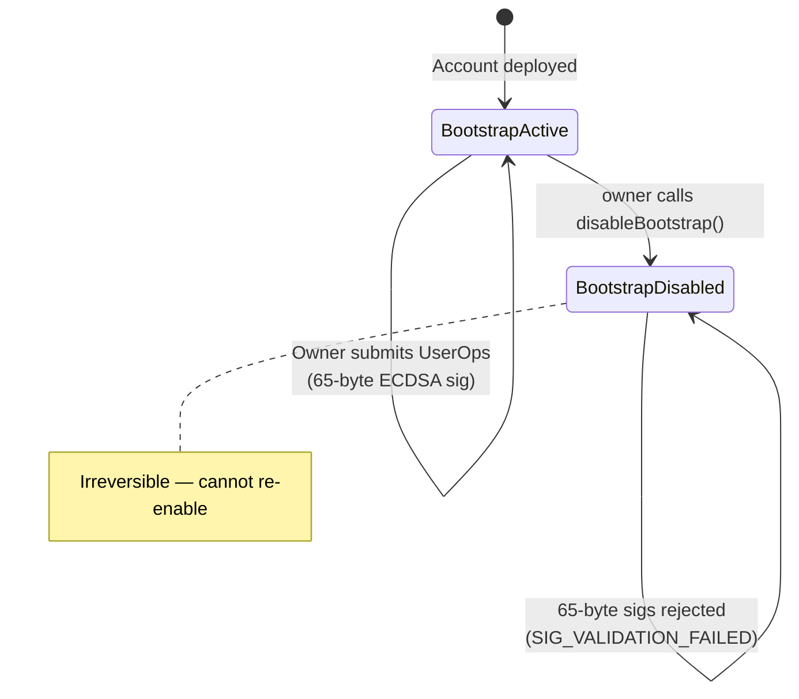

### Bootstrap Validation Logic

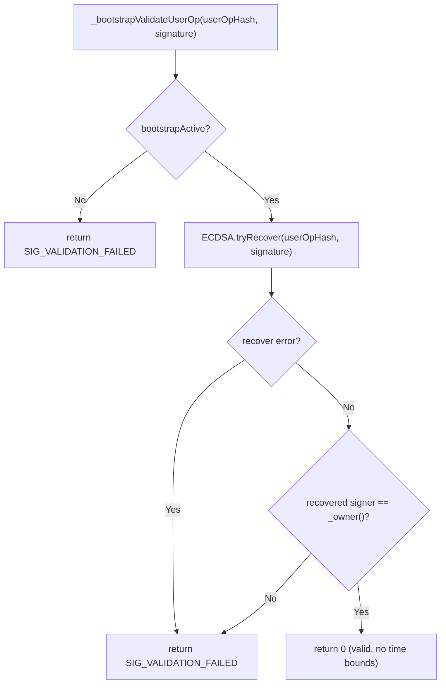

Bootstrap validation signs the raw `userOpHash` directly (no EIP-712 wrapping). This is intentionally simpler than module-based validation to minimize the trusted code surface during initial setup.

### Bootstrap and ERC-1271

Bootstrap mode also applies to `isValidSignature` (ERC-1271). When active and the signature is 65 bytes, the account validates directly against the owner via ECDSA recovery. This allows the account to participate in ERC-1271 flows before any signature validation module is installed.

### Disabling Bootstrap

```solidity
function disableBootstrap() external {
    _requireOwner();
    if (!_bootstrapActive) {
        revert BootstrapAlreadyDisabled();
    }
    _bootstrapActive = false;
    emit BootstrapDisabled(address(this), block.timestamp);
}
```

Once disabled, bootstrap mode cannot be re-enabled. This is a one-way security hardening step that forces all subsequent validation through installed modules.

## Validation Routing

### ValidationFlowLib

`ValidationFlowLib` is the central routing layer between the account and its installed validation modules. It handles three concerns:

1. Permission checks: is the validation function allowed for the target selector?
2. Type enforcement: is the validation function registered for UserOp validation?
3. Hook + module execution: run pre-validation hooks, call the module, intersect all validation data.

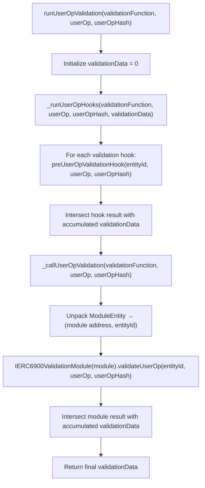

### Selector Permission Model

Each installed validation function has an associated set of permitted selectors (or a global flag):

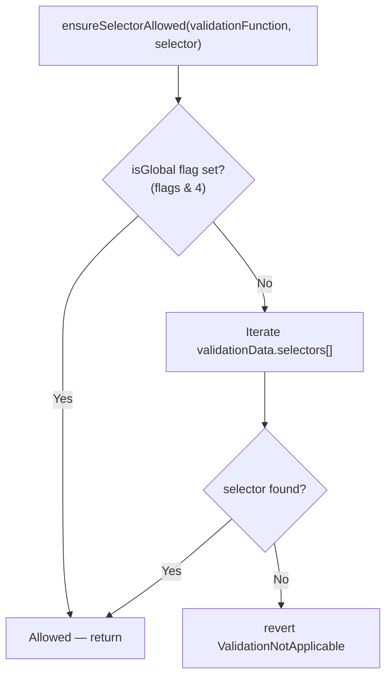

### Validation Type Enforcement

Each validation function is flagged for the types of validation it supports:

| Flag Bit | Meaning | Check Function |
|---|---|---|
| bit 0 | `isUserOpValidation` | `ensureUserOpValidation` |
| bit 1 | `isSignatureValidation` | `ensureSignatureValidation` |
| bit 2 | `isGlobal` | Allows all selectors |

A validation function registered only for signature validation (bit 1) cannot be used for UserOp validation, and vice versa. This prevents misuse of a module outside its intended validation path.

### Validation Data Intersection

ERC-4337 validation data is a packed `uint256` with three fields:

```
| validAfter (48 bits) | validUntil (48 bits) | authorizer (160 bits) |
|       bits 208-255   |    bits 160-207      |      bits 0-159       |
```

When multiple hooks and the module each return validation data, the results are intersected:

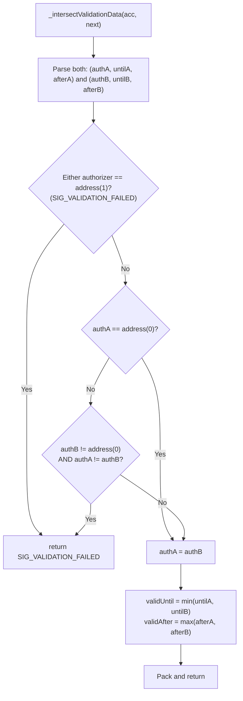

This ensures the final validation data represents the most restrictive time window across all hooks and the module. If any component signals failure (`authorizer = address(1)`), the entire validation fails.


## Validation Modules

### OwnerValidationModule

The default validation module for direct owner authorization. Validates UserOps signed by the current NFT-bound account owner using EIP-712 typed data.

#### Signature Scheme

```
EIP-712 Domain:
    name            = "Agent Wallet Owner Validation"
    version         = "1.0.0"
    chainId         = block.chainid
    verifyingContract = account address (not module address)

Typed Struct:
    UserOp(bytes32 userOpHash)

Digest:
    keccak256(0x1901 || domainSeparator || keccak256(abi.encode(USER_OP_TYPEHASH, userOpHash)))
```

#### Validation Flow

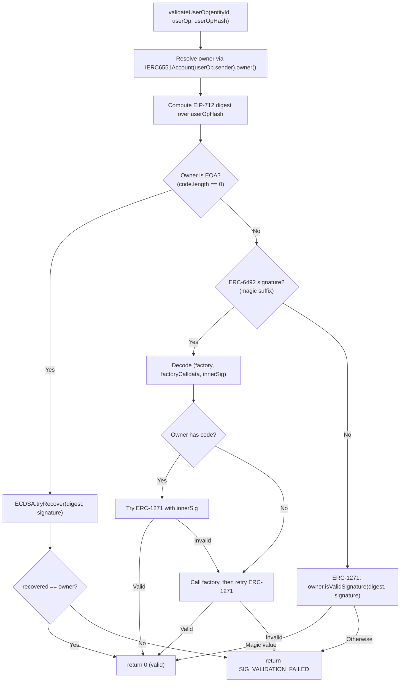

#### Owner Signature Types

| Owner Type | Signature Format | Verification |
|---|---|---|
| EOA | 65-byte ECDSA (r, s, v) | `ECDSA.tryRecover` against EIP-712 digest |
| Deployed SCA | Arbitrary bytes | `IERC1271.isValidSignature` on owner contract |
| Counterfactual SCA | ERC-6492 wrapped (factory + calldata + innerSig) | Deploy via factory, then `IERC1271.isValidSignature` |

### SessionKeyValidationModule

Validates UserOps signed by scoped session keys with fine-grained call constraints and budget tracking.

#### Policy Model

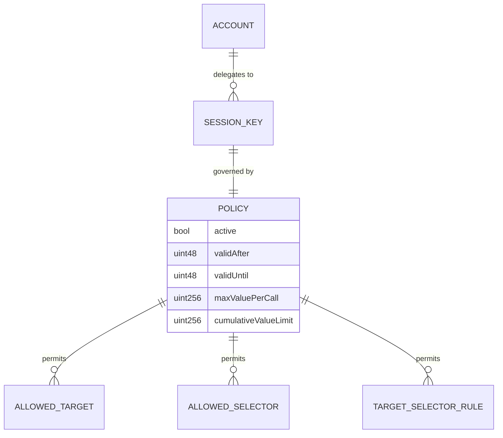

#### Signature Scheme

```
Digest = ERC-191(keccak256(
    AGENT_WALLET_SESSION_USEROP_V1,
    block.chainid,
    module address,
    account,
    entityId,
    userOpHash
))
```

The session key signs an ERC-191 message hash over a tagged payload that binds the signature to the chain, module, account, entity, and specific UserOp.

#### Validation Flow

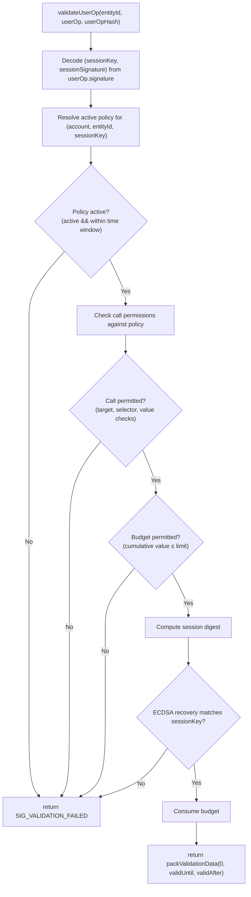

#### Call Permission Checks

The module parses `userOp.callData` to extract the inner call targets, selectors, and values:

| Top-Level Selector | Parsing | Value Tracking |
|---|---|---|
| `execute(address,uint256,bytes)` | Single call extraction | `callValue` |
| `execute(address,uint256,bytes,uint8)` | Single call + operation type. `operation != 0` (delegatecall) is rejected. | `callValue` |
| `executeBatch((address,uint256,bytes)[])` | Iterate all calls | Sum of all `call.value` |

For each extracted call, the module checks:
1. Target is in the allowed targets list (if a target allowlist is configured)
2. Inner selector is in the allowed selectors list
3. Per-target selector rules are satisfied (if configured)
4. `callValue ≤ policy.maxValuePerCall`

#### Budget Tracking

The module tracks cumulative ETH value spent per policy key. Each successful `validateUserOp` call that involves value transfer increments the cumulative counter and emits `SessionBudgetConsumed`. If `cumulativeValueUsed + spendAmount > cumulativeValueLimit`, validation fails.

#### Epoch Revocation

The module supports two revocation granularities (mirroring the ERC-8128 policy registry pattern):
- `revokeSessionKey(account, entityId, sessionKey)` — increments `policyNonce`, invalidating the current policy for one session key
- `revokeAllSessionKeys(account, entityId)` — increments `epoch`, invalidating all session keys for the entity

### ERC8128AAValidationModule

The most sophisticated validation module, designed for ERC-8128 session delegation over the ERC-4337 path. This module is documented in detail in the [ERC-8128 Unified Session Architecture](./ERC8128-SIWA-Spec.md). The following summarizes its ERC-4337-specific behavior.

#### Key Differences from SessionKeyValidationModule

| Aspect | SessionKeyValidationModule | ERC8128AAValidationModule |
|---|---|---|
| Policy storage | Module-internal mappings | External `ERC8128PolicyRegistry` (shared with gateway module) |
| Scope model | Target/selector allowlists | Merkle tree of scope leaves with per-call proofs |
| Batch verification | Per-call target/selector check | Merkle multiproof for `executeBatch` |
| Signature scheme | ERC-191 tagged hash | EIP-712 typed data (`SessionAuthorizationV2`) |
| Session envelope | `(sessionKey, sessionSignature)` | Full `SessionAuthV2` with mode, epoch, policyNonce, claims |
| Delegatecall support | Rejected (operation != 0) | Per-claim `allowDelegateCall` flag + install preset default |
| Install presets | None | Required `InstallPresetConfig` with allowed selectors and TTL bounds |
| Budget tracking | Onchain cumulative counter | Offchain (not enforced in `validateUserOp`) |
| Cross-module replay | Chain + module binding via tagged hash | EIP-712 `verifyingContract` + `mode` field |

#### Validation Data Packing

The AA module returns packed validation data with time bounds derived from both the session auth envelope and the onchain policy:

```
validAfter = max(auth.created, policy.validAfter)
validUntil = min(auth.expires, policy.validUntil)  // auth.expires if policy.validUntil == 0
aggregator = address(0)
```

This ensures the EntryPoint enforces the most restrictive time window from both the session delegation and the policy configuration.


## Execution Flow

### UserOp Lifecycle

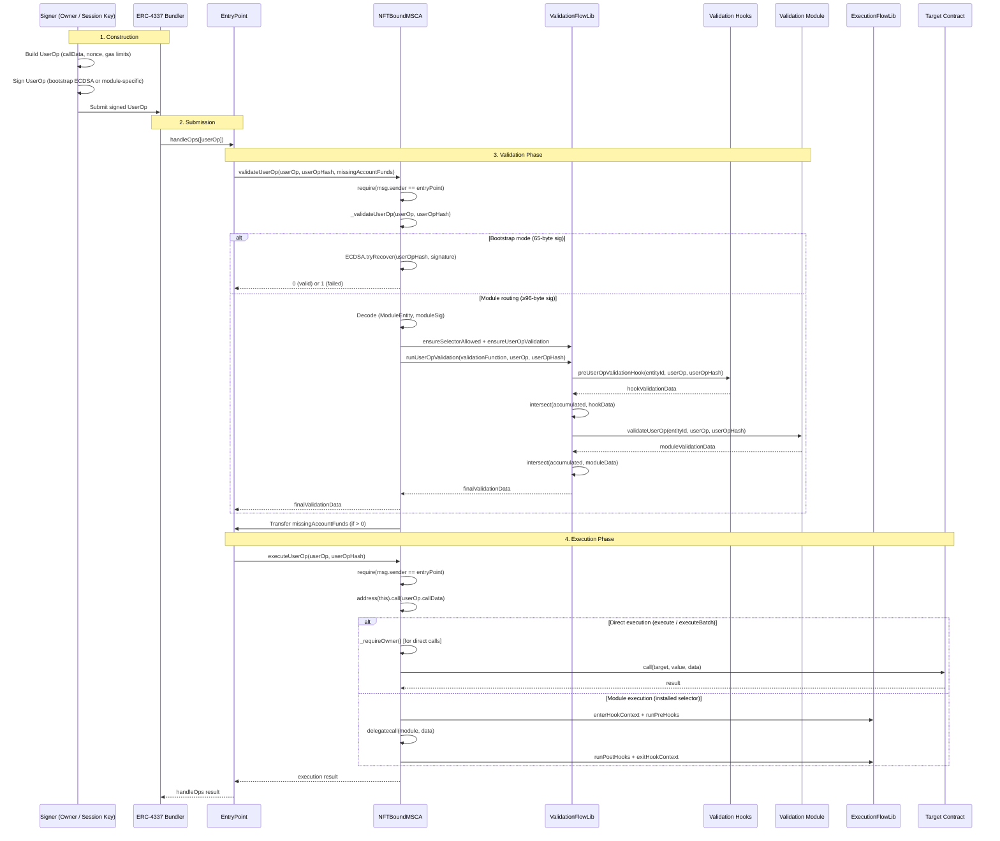

### Execution Selectors

The account exposes three execution entry points that can appear in `userOp.callData`:

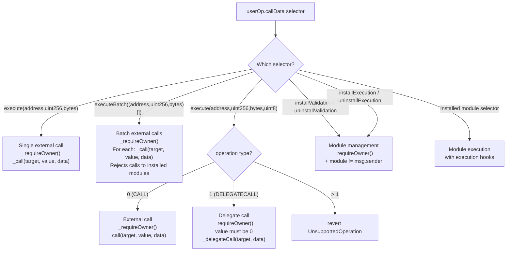

### Execution Guards

| Guard | Location | Purpose |
|---|---|---|
| EntryPoint exclusivity | `validateUserOp`, `executeUserOp` | Only the EntryPoint can invoke these functions |
| Owner authorization | `execute`, `executeBatch`, `installValidation`, etc. | Only the NFT-bound owner can call execution functions directly |
| Module target prohibition | `executeBatch` | Batch calls cannot target installed modules (prevents module state manipulation via batch) |
| Module self-modification | `installExecution`, `uninstallExecution` | A module cannot install or uninstall itself (`msg.sender != module`) |
| Hook depth limit | `ExecutionFlowLib` | Maximum 8 nested hook levels; recursive hooks are detected and reverted |
| Hook gas budget | `ExecutionFlowLib` | Maximum 13,000,000 gas across all hooks per execution |
| Delegatecall value guard | `execute(address,uint256,bytes,uint8)` | Delegatecall with `value > 0` reverts with `UnsupportedOperation` |

### State Increment

Every successful execution increments the account's `_state` counter (exposed as `nonce()` via ERC-6551). This provides a monotonically increasing state counter that external observers can use to detect account activity, independent of the ERC-4337 nonce managed by the EntryPoint.

## Deployment Patterns

### Direct Deployment

The simplest deployment mode uses `DirectDeploymentFactory` to deploy account contracts directly:

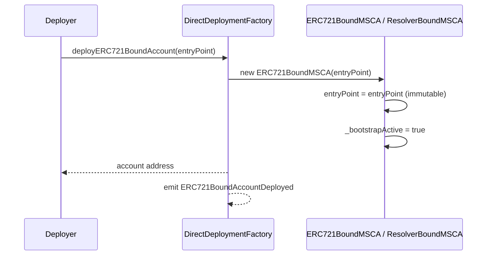

### Beacon Proxy Deployment

For upgradeable deployments, `BeaconProxy` delegates all calls to an implementation resolved from a beacon contract. The EntryPoint is bound to the implementation, not the proxy.

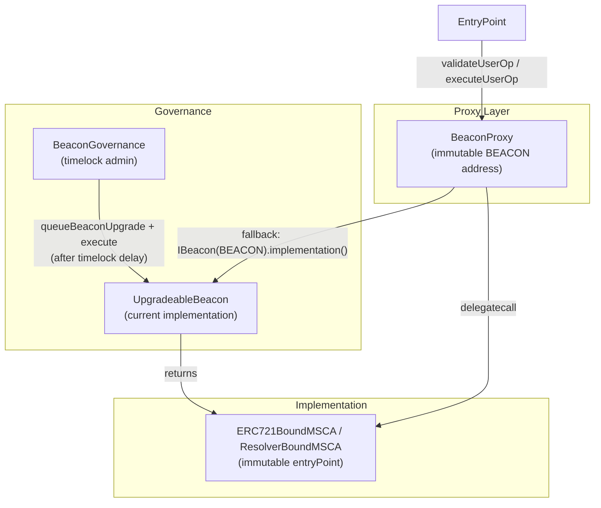

The `BeaconGovernance` contract enforces a minimum timelock delay on implementation upgrades, preventing instant changes to account behavior.

### ERC-6551 Token Binding

Both account types extract their token binding data from runtime bytecode appended during deployment (ERC-6551 pattern). The `TokenDataLib` reads the last 128 bytes of the contract's deployed code to extract `(salt, chainId, tokenContract, tokenId)`.

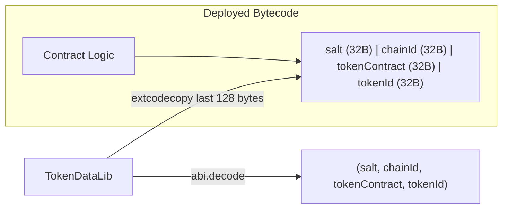

## Validation Data Format

### ERC-4337 Packed Validation Data

The EntryPoint interprets the `uint256` returned by `validateUserOp` as follows:

```
Bits 0-159:    authorizer (address)
    address(0) = valid signature
    address(1) = SIG_VALIDATION_FAILED
    other      = signature aggregator address (not used by this project)

Bits 160-207:  validUntil (uint48)
    0 = no expiry (treated as type(uint48).max internally)
    non-zero = signature valid until this Unix timestamp

Bits 208-255:  validAfter (uint48)
    0 = valid immediately
    non-zero = signature valid from this Unix timestamp
```

### Validation Data by Module

| Module | authorizer | validUntil | validAfter |
|---|---|---|---|
| Bootstrap | `address(0)` on success, `address(1)` on failure | 0 (no expiry) | 0 (immediate) |
| OwnerValidationModule | `address(0)` on success, `address(1)` on failure | 0 (no expiry) | 0 (immediate) |
| SessionKeyValidationModule | `address(0)` | `policy.validUntil` | `policy.validAfter` |
| ERC8128AAValidationModule | `address(0)` | `min(auth.expires, policy.validUntil)` | `max(auth.created, policy.validAfter)` |

## Security Considerations

### EntryPoint Trust

The account trusts the EntryPoint to:
1. Correctly compute `userOpHash` from the UserOp fields
2. Call `validateUserOp` before `executeUserOp`
3. Enforce the returned validation data (reject operations outside the valid time window)
4. Handle gas accounting and refunds correctly

The EntryPoint address is immutable. If the EntryPoint is compromised or upgraded, a new account deployment is required.

### Bootstrap Mode Risks

Bootstrap mode uses raw ECDSA over `userOpHash` without EIP-712 domain separation. This is intentionally simpler but has a narrower security profile:
- No chain binding beyond what the EntryPoint provides via `userOpHash`
- No module-level policy enforcement
- Available to anyone who controls the owner's private key

Mitigation: owners should install validation modules and call `disableBootstrap()` as early as possible. Bootstrap disable is irreversible and emits `BootstrapDisabled` for indexer awareness.

### Signature Routing Safety

The account enforces two checks before routing to a validation module:
1. `ensureSelectorAllowed` — the validation function must be permitted for the target selector in `userOp.callData`
2. `ensureUserOpValidation` — the validation function must have the `isUserOpValidation` flag set

This prevents:
- A signature-only module from being used for UserOp validation
- A module installed for `execute` from being used to validate `installValidation` calls (unless it has the global flag)

### Self-Call Execution Model

`executeUserOp` uses `address(this).call(userOp.callData)`, which means the execution runs in the account's own context with `msg.sender == address(this)`. This is important because:
- The fallback handler checks `msg.sender == address(this)` to skip runtime validation for self-calls
- Installed execution modules are invoked via `delegatecall`, sharing the account's storage
- The `_requireOwner()` check in `execute`/`executeBatch` uses the resolved NFT owner, not `msg.sender`

### Hook Reentrancy Protection

`ExecutionFlowLib` prevents reentrancy and resource exhaustion in execution hooks:
- `hookExecutionActive` flag prevents recursive hook entry
- `hookDepth` counter limits nesting to 8 levels
- `MAX_HOOK_GAS` (13,000,000) caps total gas consumed by hooks per execution

### Module Target Prohibition in Batch

`executeBatch` checks each call target against `installedModules` and reverts with `ModuleTargetNotAllowed` if a batch call targets an installed module. This prevents batch operations from manipulating module state outside the proper install/uninstall flow.

### Attack Surface

| Vector | Mitigation |
|---|---|
| Non-EntryPoint calling validateUserOp | `msg.sender == entryPoint` check; reverts with `InvalidEntryPoint` |
| Non-EntryPoint calling executeUserOp | Same EntryPoint gate |
| Bootstrap mode after module installation | Owner calls `disableBootstrap()` to permanently disable |
| Module used for wrong validation type | `ensureUserOpValidation` flag check |
| Module used for unauthorized selector | `ensureSelectorAllowed` permission check |
| Validation hook returning conflicting aggregator | `_intersectValidationData` returns `SIG_VALIDATION_FAILED` |
| Execution hook reentrancy | `RecursiveHookDetected` revert |
| Execution hook gas exhaustion | `HookGasBudgetExceeded` revert at 13M gas |
| Batch call targeting installed module | `ModuleTargetNotAllowed` revert |
| Delegatecall with ETH value | `UnsupportedOperation` revert |
| Module self-install/uninstall | `ModuleSelfModification` revert |

## Integration with Other Standards

### ERC-6900 (Modular Smart Contract Accounts)

ERC-4337 validation is fully mediated by ERC-6900. The account does not contain any validation logic beyond bootstrap mode — all policy decisions are delegated to installed validation modules via `ValidationFlowLib`. The `ValidationConfig` type encodes which validation types a module supports:

```
ValidationConfig = ModuleEntity (24 bytes) + flags (1 byte)
    bit 0: isUserOpValidation  — module can handle validateUserOp
    bit 1: isSignatureValidation — module can handle validateSignature
    bit 2: isGlobal — module can validate any selector
```

### ERC-6551 (Token Bound Accounts)

The account's ownership is derived from its token binding. `_owner()` resolves the current NFT owner, which determines:
- Who can call `execute`, `executeBatch`, and module management functions
- Who can sign bootstrap-mode UserOps
- Who can authorize policy mutations in the `ERC8128PolicyRegistry`

The `_state` counter (exposed as `nonce()`) increments on every execution, providing ERC-6551 state tracking independent of the ERC-4337 nonce.

### ERC-1271 (Standard Signature Validation)

The account's `isValidSignature` implementation shares the same module routing infrastructure as `validateUserOp`. Both paths use `ValidationFlowLib` but with different type enforcement:
- `validateUserOp` requires `isUserOpValidation` flag
- `isValidSignature` requires `isSignatureValidation` flag

A module can support both by setting both flags during installation.

### ERC-6492 (Predeploy Signature Verification)

`OwnerValidationModule` supports ERC-6492 counterfactual signatures for owners that are not yet deployed. When the owner is an SCA with no code at the current address, the module can deploy it via a factory call before verifying the ERC-1271 signature. This enables UserOp validation where the owner is itself a smart account that hasn't been deployed yet.

## Testing Strategy

### Test Organization

| Test File | Focus |
|---|---|
| `test/core/ERC721BoundMSCA.t.sol` | Account-level ERC-4337 integration: EntryPoint exclusivity, bootstrap validation, module installation round-trip, selector conflict detection, hook depth enforcement, bootstrap disable irreversibility |
| `test/core/ResolverBoundMSCA.t.sol` | Resolver-based ownership with same ERC-4337 surface |
| `test/modules/OwnerValidationModule.t.sol` | Owner signature validation: EIP-712 UserOp digest, EOA/SCA/ERC-6492 paths |
| `test/modules/SessionKeyValidationModule.t.sol` | Session key validation: policy enforcement, call permission parsing, budget tracking, epoch revocation |
| `test/modules/ERC8128AAValidationModule.t.sol` | AA session validation: Merkle proofs, install presets, call parsing, time-range packing |
| `test/modules/SIWAValidationModule.t.sol` | SIWA gateway validation (signature path), malformed envelope rejection, policy/NR checks |
| `test/siwa/SIWACompatVectors.t.sol` | SIWA canonical vectors and pause-state enforcement |
| `test/core/DirectDeploymentFactory.t.sol` | Factory deployment with EntryPoint binding |
| `test/core/BeaconProxy.t.sol` | Beacon proxy delegation |
| `test/core/BeaconGovernance.t.sol` | Timelock governance for upgrades |

### Property Tests

| Property | Description |
|---|---|
| P1: EntryPoint exclusivity | Any caller other than the immutable EntryPoint is rejected by `validateUserOp` and `executeUserOp` with `InvalidEntryPoint`. |
| P2: Bootstrap validation correctness | A 65-byte ECDSA signature from the current owner over `userOpHash` returns 0 when bootstrap is active; any other signer returns `SIG_VALIDATION_FAILED`. |
| P3: Bootstrap disable irreversibility | After `disableBootstrap()`, bootstrap mode cannot be re-enabled; 65-byte signatures return `SIG_VALIDATION_FAILED`; calling `disableBootstrap()` again reverts with `BootstrapAlreadyDisabled`. |
| P4: Module routing selector enforcement | A validation function not permitted for a given selector reverts with `ValidationNotApplicable`. |
| P5: Module routing type enforcement | A validation function without the `isUserOpValidation` flag reverts with `ValidationTypeMismatch` when used for UserOp validation. |
| P6: Validation data intersection correctness | Intersecting two validation data values produces `validAfter = max(a, b)`, `validUntil = min(a, b)`, and `SIG_VALIDATION_FAILED` if either authorizer is `address(1)` or authorizers conflict. |
| P7: Module installation round-trip | Installing and then uninstalling a validation module correctly enables and disables its validation path. |
| P8: Native selector conflict detection | Installing an execution module with a selector that conflicts with a native account function (`execute`, `executeUserOp`, etc.) reverts with `NativeSelectorConflict`. |
| P9: Module self-modification prevention | A module cannot install or uninstall itself; the account reverts with `ModuleSelfModification`. |
| P10: Hook depth enforcement | Exceeding 8 nested hook levels reverts with `MaxHookDepthExceeded`; recursive hooks revert with `RecursiveHookDetected`. |
| P11: Session key policy round-trip | Any valid session key policy written can be read back with identical fields; revocation increments nonce and invalidates the policy. |
| P12: Session key budget tracking | Cumulative value consumption is tracked correctly; exceeding the limit causes validation failure. |
| P13: Session key epoch revocation | Incrementing the epoch invalidates all session keys for the entity. |
| P14: Owner signature acceptance | A correctly signed EIP-712 UserOp digest from the current owner is accepted by `OwnerValidationModule`. |
| P15: ERC-6492 counterfactual support | An ERC-6492 wrapped signature from an undeployed owner SCA is accepted after factory deployment. |
| P16: AA install preset enforcement | Without an initialized preset, `ERC8128AAValidationModule` rejects all UserOps; with a preset, only listed selectors are accepted. |
| P17: AA Merkle scope verification | Valid single proofs and multiproofs are accepted; invalid proofs are rejected. |
| P18: AA time-range packing | Returned `validAfter` and `validUntil` correctly reflect `max(auth.created, policy.validAfter)` and `min(auth.expires, policy.validUntil)`. |
| P19: Batch module target prohibition | `executeBatch` calls targeting installed modules revert with `ModuleTargetNotAllowed`. |
| P20: Delegatecall value guard | `execute(target, value, data, 1)` with `value > 0` reverts with `UnsupportedOperation`. |
| P21: Gas prepayment | `_payEntryPoint` transfers the requested `missingAccountFunds` to the EntryPoint; failure reverts with `EntryPointPaymentFailed`. |

## Deployment

### Deployment Order

1. Deploy the ERC-4337 `EntryPoint` (or use the canonical singleton deployment).
2. Deploy account implementations: `ERC721BoundMSCA(entryPoint)` and/or `ResolverBoundMSCA(entryPoint, resolver)`.
3. Optionally deploy `BeaconProxy` + `BeaconGovernance` for upgradeable accounts.
4. Deploy `DirectDeploymentFactory` for non-upgradeable accounts.
5. Deploy validation modules: `OwnerValidationModule`, `SessionKeyValidationModule`, `ERC8128AAValidationModule(registryAddress)`.
6. Create account instances via factory or beacon proxy.
7. Install validation modules via `installValidation` (using bootstrap-mode UserOps or direct owner calls).
8. Call `disableBootstrap()` from the owner to lock down the account.
9. Set session key policies and ERC-8128 policies as needed.

### Constructor Validation

| Contract | Constructor Check |
|---|---|
| `NFTBoundMSCA` | Sets `entryPoint` immutable; no zero-address check (EntryPoint is a trusted deployment parameter) |
| `ERC721BoundMSCA` | Passes `entryPoint` to `NFTBoundMSCA` |
| `ResolverBoundMSCA` | Passes `entryPoint` to `NFTBoundMSCA`; reverts with `InvalidResolver(address(0))` if resolver is zero |
| `BeaconProxy` | Reverts with `BeaconNotContract` if beacon has no code |
| `BeaconGovernance` | Reverts with `InvalidAdmin(address(0))` and `InvalidMinDelay(0)` |
| `ERC8128AAValidationModule` | Reverts with `InvalidRegistry(address(0))` if registry is zero |

## Open Questions

1. Should the account support ERC-4337 v0.7 `PackedUserOperation` exclusively, or should it also handle v0.6 `UserOperation` for backward compatibility?
2. Should paymaster integration be added to support gasless UserOps for session key holders?
3. Should the account implement `IAccountFactory` with `initCode` support for counterfactual account deployment via the EntryPoint?
4. Should `executeUserOp` support a return value path for bundlers that need execution results?
5. Should bootstrap mode have an optional time-based auto-disable (e.g., disable after N blocks or T seconds)?
6. Should the `_state` counter (ERC-6551 nonce) be unified with or derived from the ERC-4337 nonce managed by the EntryPoint?
