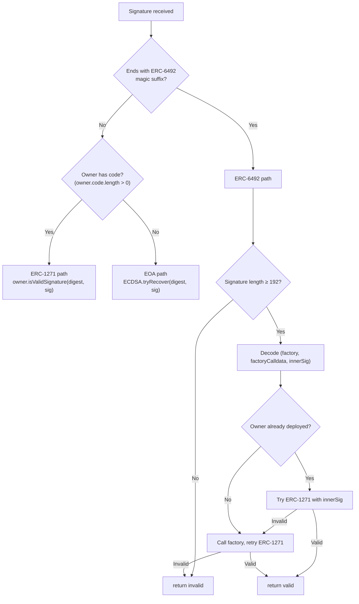
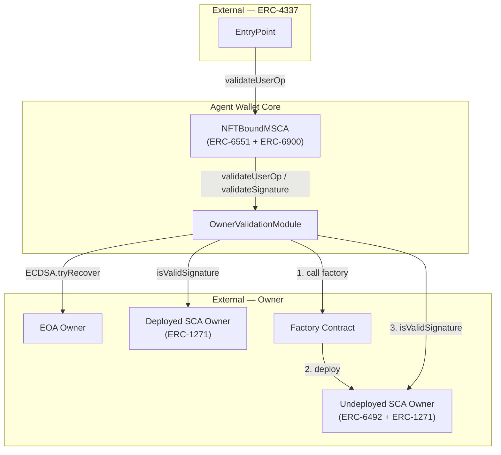
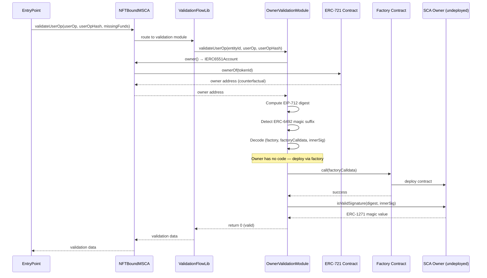
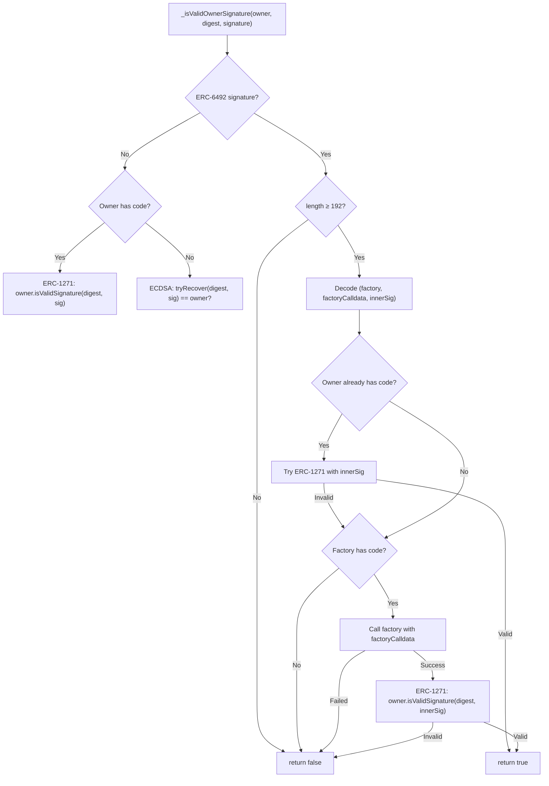
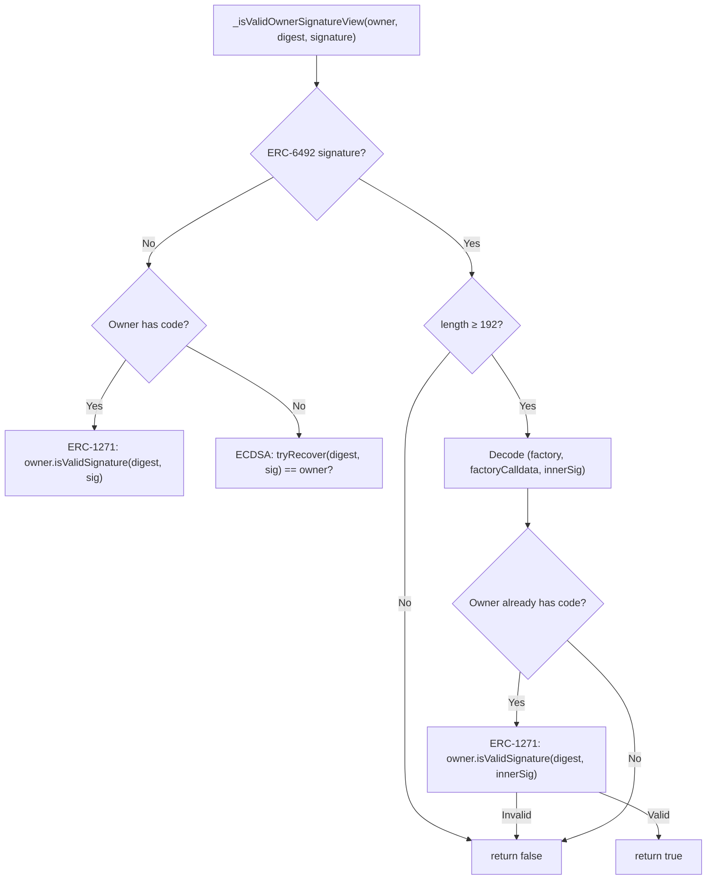
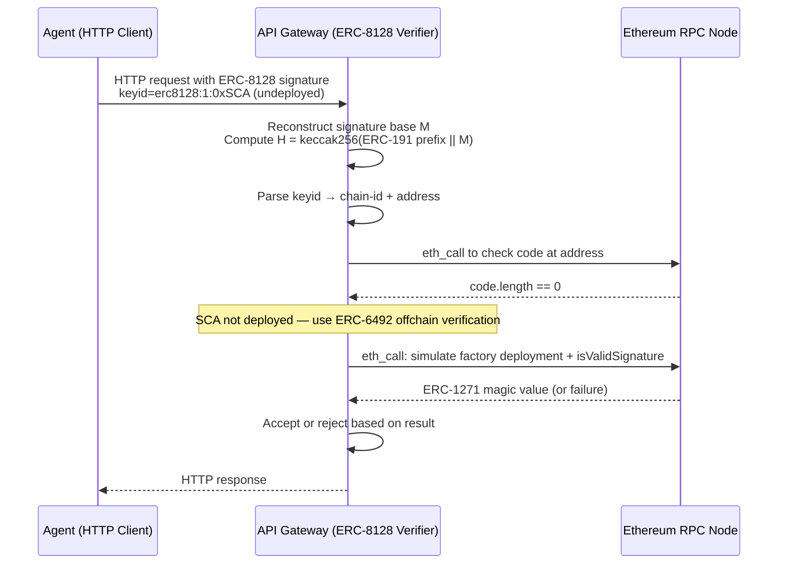
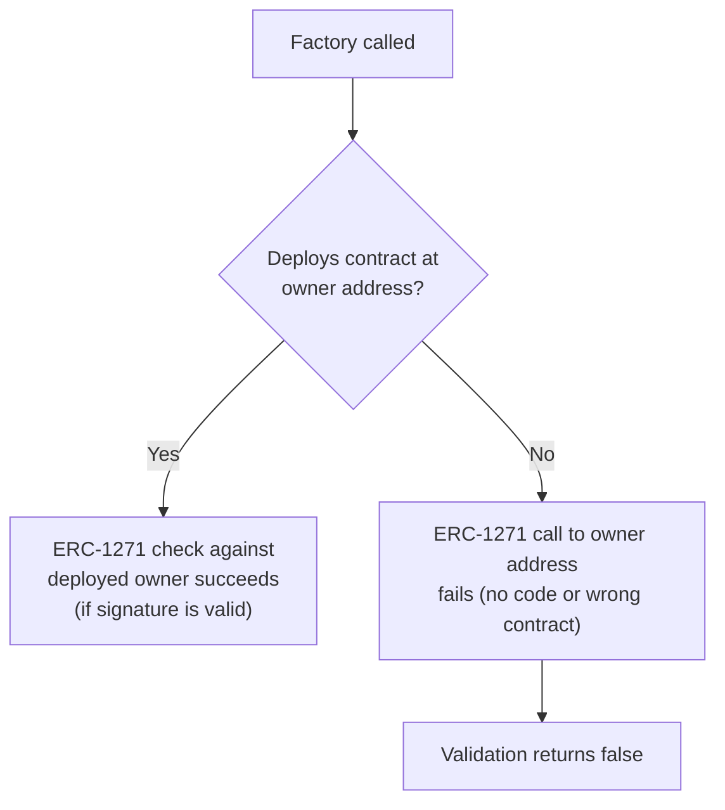
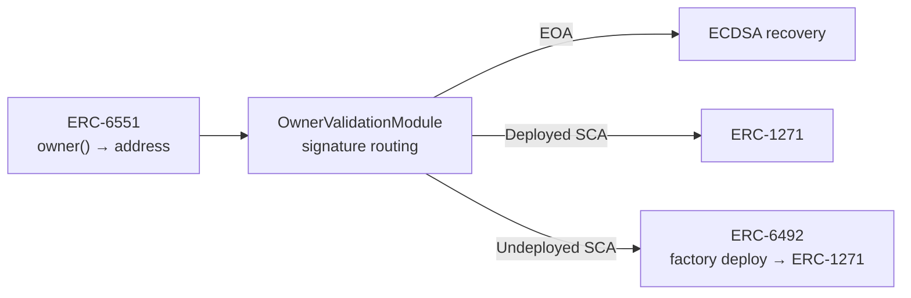

# ERC-6492 Counterfactual Signature Integration Design

Status: Draft

## Summary

This document describes how Agent Wallet Core integrates with [ERC-6492](https://eips.ethereum.org/EIPS/eip-6492) (Predeploy Signature Verification for Contracts) to support signature validation from smart contract owners that have not yet been deployed onchain. ERC-6492 defines a wrapper format that bundles a factory address, factory calldata, and an inner signature, allowing a verifier to deploy the signer contract on-the-fly and then verify via [ERC-1271](https://eips.ethereum.org/EIPS/eip-1271).

The integration lives in `OwnerValidationModule`, the default ERC-6900 validation module for NFT-bound smart accounts. It enables accounts whose owner is itself a smart contract account (SCA) — such as a multisig, another abstracted wallet, or a DAO — to authorize UserOps and sign messages before that owner contract exists onchain. This closes the bootstrap gap in the ERC-4337 flow where the owner SCA may not yet be deployed at the time the first UserOp requires validation.

Core outcomes:
- transparent ERC-6492 detection via magic suffix on signature bytes
- counterfactual owner deployment during `validateUserOp` (state-changing path)
- graceful ERC-6492 handling in `validateSignature` (view path) when owner is already deployed
- three-branch signature routing: EOA → ECDSA, deployed SCA → ERC-1271, undeployed SCA → ERC-6492 → ERC-1271
- no additional storage, no configuration, no module installation changes

## Scope

In scope:
- ERC-6492 signature detection and decoding in `OwnerValidationModule`
- counterfactual deployment flow during UserOp validation
- view-safe handling during ERC-1271 signature validation
- interaction with ERC-6551 ownership resolution, ERC-6900 validation routing, and ERC-4337 UserOp validation
- security model for factory calls and signature verification ordering

Out of scope:
- ERC-6492 support in session key or ERC-8128 validation modules (session keys are expected to be EOAs or already-deployed SCAs)
- offchain ERC-6492 verification (e.g., in the ERC-8128 gateway verifier — that is an offchain concern documented in the ERC-8128 spec)
- factory contract implementation details
- ERC-1271 implementation within owner contracts

## Design Goals

1. Zero-configuration: ERC-6492 support is built into `OwnerValidationModule` with no install-time parameters, no storage, and no feature flags.
2. Transparent routing: the module auto-detects ERC-6492 signatures by their magic suffix and routes accordingly. Callers do not need to signal the signature type.
3. Correctness ordering: when the owner SCA is already deployed, the module attempts ERC-1271 with the inner signature first, avoiding unnecessary factory calls.
4. Minimal trust surface: the factory call is a raw `CALL` with no value transfer. The module trusts only that the factory deploys a contract at the expected owner address — ownership is still verified via `IERC6551Account.owner()` resolution.
5. View-path safety: the `validateSignature` (ERC-1271) path is `view` and cannot deploy contracts. ERC-6492 signatures are handled gracefully: if the owner is already deployed, the inner signature is extracted and verified; if not, validation fails without revert.

## Non-Goals

1. Universal ERC-6492 verification. The module does not implement the universal `ValidateSigOffchain` contract from the ERC-6492 spec. It handles only the onchain owner validation case.
2. Factory validation or whitelisting. Any factory with deployed code is accepted. The security model relies on the fact that the factory must produce a contract at the address matching `IERC6551Account.owner()`.
3. Persisting deployment state. The module does not track whether it triggered a factory deployment. The deployment is a side effect of validation.
4. Supporting ERC-6492 for session keys or delegated signers. Only the account owner path uses ERC-6492.

## Architecture

### Signature Routing Overview

`OwnerValidationModule` implements a three-branch signature routing strategy. ERC-6492 is the third branch, activated when the signature ends with the 32-byte magic suffix.



### Component Context



### Relationship to Validation Paths

ERC-6492 support is internal to `OwnerValidationModule` and transparent to the rest of the system. The ERC-6900 validation routing, ERC-4337 EntryPoint, and ERC-6551 ownership resolution are unaware of whether an ERC-6492 signature was used.



## ERC-6492 Signature Format

### Wire Format

An ERC-6492 signature is a standard ABI-encoded tuple with a 32-byte magic suffix appended:

```
| abi.encode(factory, factoryCalldata, innerSignature) | ERC6492_MAGIC_VALUE (32 bytes) |
```

| Field | Type | Description |
|---|---|---|
| `factory` | `address` | Contract that deploys the signer when called with `factoryCalldata` |
| `factoryCalldata` | `bytes` | Calldata passed to the factory to trigger deployment |
| `innerSignature` | `bytes` | The actual signature to verify via ERC-1271 after deployment |
| Magic suffix | `bytes32` | `0x6492649264926492649264926492649264926492649264926492649264926492` |

### Detection

The module detects ERC-6492 signatures by checking the last 32 bytes of the signature against the magic value:

```solidity
function _isERC6492Signature(bytes calldata signature) internal pure returns (bool) {
    if (signature.length < 32) {
        return false;
    }
    bytes32 suffix;
    assembly {
        suffix := calldataload(add(signature.offset, sub(signature.length, 32)))
    }
    return suffix == ERC6492_MAGIC_VALUE;
}
```

### Minimum Length

The module enforces a minimum signature length of 192 bytes (`ERC6492_MIN_LENGTH`). This accounts for the ABI encoding overhead of three dynamic fields plus the 32-byte suffix. Signatures shorter than this are rejected immediately without attempting to decode.

### Decoding

The wrapped payload (everything before the magic suffix) is ABI-decoded as `(address, bytes, bytes)`:

```solidity
function _decodeERC6492Signature(bytes calldata signature)
    internal
    pure
    returns (address factory, bytes memory factoryCalldata, bytes memory innerSig)
{
    bytes memory wrapped = signature[:signature.length - 32];
    (factory, factoryCalldata, innerSig) = abi.decode(wrapped, (address, bytes, bytes));
}
```

## Validation Flows

### UserOp Validation (State-Changing Path)

`validateUserOp` can modify state, so it supports the full ERC-6492 flow including factory deployment.



The ordering is important:

1. If the owner is already deployed, try ERC-1271 with the inner signature first. This handles the case where the owner was deployed between signature creation and validation (e.g., by a prior UserOp in the same bundle).
2. Only if that fails (or the owner has no code), attempt the factory deployment.
3. After deployment, verify via ERC-1271.

This avoids redundant factory calls and handles race conditions in bundled UserOp execution.

### Signature Validation (View Path)

`validateSignature` is called via the ERC-1271 `isValidSignature` flow, which is a `view` function. It cannot deploy contracts, so the ERC-6492 handling is limited.



In the view path:
- If the owner is already deployed, the inner signature is extracted and verified via ERC-1271. This works because the ERC-6492 wrapper is just packaging — the inner signature is a valid ERC-1271 signature.
- If the owner is not deployed, validation returns `false`. There is no way to deploy the owner in a `view` context.

This means ERC-6492 signatures work in the ERC-1271 path only after the owner has been deployed (typically by a prior `validateUserOp` call or an independent deployment transaction).

### Comparison of Paths

| Aspect | `validateUserOp` (state-changing) | `validateSignature` (view) |
|---|---|---|
| Can deploy owner via factory | Yes | No |
| ERC-6492 with undeployed owner | Deploys, then verifies | Returns invalid |
| ERC-6492 with deployed owner | Verifies inner sig via ERC-1271 | Verifies inner sig via ERC-1271 |
| Non-ERC-6492 with SCA owner | ERC-1271 directly | ERC-1271 directly |
| Non-ERC-6492 with EOA owner | ECDSA recovery | ECDSA recovery |

## ERC-8128 Offchain Verification

The ERC-8128 specification's reference verifier implementation also references ERC-6492 for offchain SCA signature verification. When an API gateway receives an ERC-8128 signed HTTP request from a smart contract account that is not yet deployed, the offchain verifier can use ERC-6492's simulation-based approach to verify the signature without an onchain transaction.



This is an offchain concern handled by the gateway implementation, not by the onchain modules. The onchain `OwnerValidationModule` handles the equivalent flow for UserOp validation where actual deployment occurs.

## Constants

| Constant | Value | Purpose |
|---|---|---|
| `ERC6492_MAGIC_VALUE` | `0x6492649264926492649264926492649264926492649264926492649264926492` | 32-byte suffix identifying ERC-6492 wrapped signatures |
| `ERC6492_MIN_LENGTH` | `192` | Minimum byte length for a valid ERC-6492 signature (ABI overhead + suffix) |
| `ERC1271_MAGICVALUE` | `0x1626ba7e` | ERC-1271 success return value |

## Security Considerations

### Factory Trust Model

The module does not whitelist or validate factory contracts beyond checking that the factory address has deployed code (`factory.code.length > 0`). The security relies on a different invariant: the factory must deploy a contract at the address that `IERC6551Account.owner()` returns. If the factory deploys to a different address, the subsequent ERC-1271 call targets the original (still undeployed) owner address and fails.



This means a malicious factory that deploys to the wrong address cannot compromise validation — it simply causes the signature check to fail.

### Factory Side Effects

The factory call is an unrestricted `CALL` with zero value. A malicious factory could:
- Deploy arbitrary contracts at arbitrary addresses (but not at the owner address unless it controls the CREATE2 salt)
- Consume gas
- Emit events

These side effects do not affect the security of the validation outcome. The module only cares whether `isValidSignature` succeeds on the owner address after the factory call.

However, gas consumption is a concern in the ERC-4337 context. The EntryPoint's gas accounting covers the `validateUserOp` call, so a factory that consumes excessive gas would cause the UserOp to fail with an out-of-gas error, not a security breach.

### Deployed Owner Short-Circuit

When the owner is already deployed, the module tries ERC-1271 with the inner signature before attempting the factory call. This prevents:
- Unnecessary factory calls when the owner was deployed by a prior transaction
- Redundant deployment attempts that would revert (CREATE2 to an existing address)
- Wasted gas on factory execution

### View Path Limitations

The `validateSignature` path cannot deploy contracts. An ERC-6492 signature from a truly undeployed owner will fail in this path. This is an inherent limitation of `view`/`staticcall` contexts and is documented behavior, not a bug. Consumers should be aware that:
- The first interaction with an undeployed owner must go through `validateUserOp` (ERC-4337 path)
- After the owner is deployed, ERC-6492 signatures work in both paths (the inner signature is extracted and verified)
- Standard ERC-1271 signatures (without the ERC-6492 wrapper) also work after deployment

### Replay and Cross-Module Safety

ERC-6492 does not introduce new replay vectors. The inner signature is verified against the same EIP-712 digest used for non-ERC-6492 signatures. All existing replay protections apply:
- `verifyingContract` (account address) in the EIP-712 domain prevents cross-account replay
- `chainId` in the EIP-712 domain prevents cross-chain replay
- `userOpHash` binding prevents cross-UserOp replay
- The ERC-6492 wrapper is stripped before verification — it is transport packaging, not part of the signed payload

### Attack Surface

| Vector | Mitigation |
|---|---|
| Malicious factory deploys wrong contract | ERC-1271 check targets the owner address from `IERC6551Account.owner()`, not the factory output |
| Factory consumes excessive gas | ERC-4337 gas accounting; UserOp fails, no security impact |
| Factory reverts | `_callFactory` returns `false`, validation returns invalid |
| ERC-6492 signature with EOA owner | Factory deploys, but `isValidSignature` on the owner address (which is an EOA) fails — no code to call |
| Forged magic suffix on non-ERC-6492 sig | Decode fails or inner signature is invalid; validation returns false |
| Short signature with magic suffix | `ERC6492_MIN_LENGTH` check rejects before decode attempt |
| Re-deployment of already-deployed owner | Short-circuit tries ERC-1271 first; factory call only on ERC-1271 failure |

## Interaction with Other Standards

### ERC-6551 (Token Bound Accounts)

ERC-6492 operates downstream of ERC-6551 ownership resolution. The module first resolves the owner via `IERC6551Account(account).owner()`, then determines the signature verification strategy based on the owner's code status and signature format. ERC-6551 is unaware of ERC-6492 — it simply returns the owner address.



### ERC-6900 (Modular Smart Contract Accounts)

ERC-6492 support is encapsulated within `OwnerValidationModule`, which implements `IERC6900ValidationModule`. The ERC-6900 validation routing (`ValidationFlowLib`) is unaware of ERC-6492 — it calls `validateUserOp` or `validateSignature` on the module and receives standard return values. No changes to the module installation, hook system, or selector permissions are needed.

### ERC-4337 (Account Abstraction)

ERC-6492 is most relevant in the ERC-4337 path. The `validateUserOp` call from the EntryPoint is the only onchain context where the module can deploy the owner contract via the factory. This aligns with ERC-4337's design where `validateUserOp` is expected to perform signature verification and may have side effects (e.g., nonce updates). The gas cost of the factory deployment is covered by the UserOp's verification gas limit.

### ERC-1271 (Standard Signature Validation)

ERC-6492 is a wrapper around ERC-1271. After the factory deploys the owner contract (or if it is already deployed), the module calls `isValidSignature(digest, innerSig)` on the owner — standard ERC-1271. The two standards are complementary: ERC-1271 defines how to verify, ERC-6492 defines how to make the verifier available.

### ERC-8128 (Signed HTTP Requests)

The ERC-8128 reference implementation lists ERC-6492 as a verification path for the offchain gateway verifier. This is separate from the onchain `OwnerValidationModule` integration but uses the same conceptual flow: detect the ERC-6492 wrapper, simulate factory deployment via `eth_call`, then verify via ERC-1271. The onchain and offchain paths are independent implementations of the same pattern.

## Testing Strategy

### Unit Tests

The test suite (`test/modules/OwnerValidationModule.t.sol`) covers ERC-6492 alongside EOA and deployed SCA owner paths:

| Test | Validates |
|---|---|
| `testFuzz_Property9_ERC6492CounterfactualSignatureValidation` | Full ERC-6492 happy path: factory deploys owner during `validateUserOp`, inner signature verified via ERC-1271, owner code confirmed post-deployment. Then verifies the same owner works in `validateSignature` (view path) since owner is now deployed. |
| `testFuzz_Property7_OwnerSignatureValidationCorrectness` | EOA and deployed SCA owner paths (non-ERC-6492), ensuring ERC-6492 routing does not interfere with standard paths. Fuzzed across owner keys, contract vs EOA owners, and arbitrary hashes. |
| `testFuzz_Property8_OwnerRuntimeAuthorization` | Runtime authorization remains owner-gated for both ERC-6492 and non-ERC-6492 account owners. |
| `test_ERC6492_AlreadyDeployedOwner_ShortCircuitWithoutFactoryCall` | Already-deployed owner path short-circuits to ERC-1271 inner signature verification without invoking factory deployment again. |
| `test_ERC6492_FactoryReverts_ReturnsInvalid` | Factory revert during ERC-6492 deployment path yields signature validation failure (no revert bubbling). |
| `test_ERC6492_FactoryHasNoCode_ReturnsInvalid` | ERC-6492 wrapper with EOA/non-contract factory address is rejected. |
| `test_ERC6492_SignatureShorterThanMinLength_ReturnsInvalid` | ERC-6492 signatures below `ERC6492_MIN_LENGTH` are rejected in both `validateUserOp` and `validateSignature` paths. |
| `test_ERC6492_InvalidInnerSignatureAfterSuccessfulFactoryDeploy_ReturnsInvalid` | Even after successful owner deployment, invalid inner ERC-1271 signature fails validation. |
| `test_ERC6492_FactoryDeploysWrongAddress_ReturnsInvalid` | Factory deployments that do not place code at the expected owner address cannot satisfy validation. |
| `test_ValidateSignatureView_ERC6492UndeployedOwner_ReturnsInvalid` | View path (`validateSignature`) returns invalid for undeployed ERC-6492 owners because deployment is not permitted. |
| `test_ValidateSignatureView_ERC6492DeployedOwner_ReturnsValid` | View path accepts ERC-6492-wrapped signatures once owner is already deployed, by verifying inner ERC-1271 signature. |
| `test_NonERC6492LikeSuffixButTooShort_RemainsInvalid` | Non-ERC-6492 signatures that coincidentally end with magic-like bytes but remain below minimum wrapper length are rejected. |
| `test_ERC6492_FactoryDeploymentGasWithinVerificationBound` | Factory deployment path stays within a bounded verification-gas envelope suitable for ERC-4337 validation assumptions. |
| `testFuzz_ERC6492_ArbitraryFactoryCalldataAndInnerSignatureCombinations` | Fuzzed combinations of factory type/code presence, calldata, predeployment state, and valid/invalid inner signatures preserve expected accept/reject behavior. |

### Test Infrastructure

| Component | Purpose |
|---|---|
| `Mock6551Account` | Minimal `IERC6551Account` implementation with configurable owner address |
| `Mock1271Owner` | ERC-1271 contract that validates ECDSA signatures against a configured signer |
| `Mock1271Factory` | CREATE2 factory that deploys `Mock1271Owner` instances at deterministic addresses |
| `Mock1271CallTrackingFactory` | Factory variant that counts deployment invocations for short-circuit path assertions |
| `Mock1271RevertingFactory` | Factory variant that always reverts to test failure handling |
| `Mock1271WrongAddressFactory` | Factory variant that deploys to an unexpected address to verify owner-address invariant enforcement |

The `Mock1271Factory.computeAddress` function enables the test to predict the owner address before deployment, simulating the real-world scenario where the counterfactual address is known but the contract does not yet exist.

## Open Questions

1. Should `OwnerValidationModule` emit an event when it triggers a factory deployment during `validateUserOp`? This would aid offchain indexers in tracking counterfactual-to-deployed transitions.
2. Should there be a factory whitelist or registry to restrict which factories the module will call, reducing the attack surface for gas griefing?
3. Should the view path (`validateSignature`) attempt an `eth_call` simulation of the factory deployment for better UX, or is the current fail-fast behavior the right tradeoff?
4. Should ERC-6492 support be extended to `SessionKeyValidationModule` for session keys that are themselves undeployed SCAs?
5. Should the module track whether it has previously deployed an owner (to skip redundant factory calls in subsequent UserOps within the same transaction)?
