# ERC-6551 Token Bound Account Integration Design

Status: Draft

## Summary

This document describes how Agent Wallet Core implements ERC-6551 (Non-fungible Token Bound Accounts) as the foundational ownership and execution layer for smart contract accounts. ERC-6551-compliant deployments are token-bound accounts (TBAs): identity is derived from an NFT binding, ownership is resolved from that binding, and the execution surface implements the ERC-6551 interface. The direct deployment helper is a non-registry convenience path and does not append ERC-6551 token footer bytes.

The implementation is split across an abstract base contract (`NFTBoundMSCA`), two concrete account types (`ERC721BoundMSCA`, `ResolverBoundMSCA`), a bytecode-level token data library (`TokenDataLib`), a beacon proxy for upgradeable deployments (`BeaconProxy`), and a deployment factory (`DirectDeploymentFactory`).

Core outcomes:
- deterministic ERC-6551 account identity (for footer-based deployments) derived from `(salt, chainId, tokenContract, tokenId)` appended to runtime bytecode
- pluggable ownership resolution via abstract `_owner()` with two production strategies
- full ERC-6551 interface surface: `token()`, `owner()`, `nonce()`, `isValidSigner()`, `execute()`
- monotonically increasing state counter for external activity detection
- two deployment modes: direct implementation deployment (convenience path) and beacon proxy with timelocked upgrades
- composability with ERC-6900 (modular account), ERC-4337 (account abstraction), ERC-1271 (signature validation), and ERC-8128 (HTTP authentication)

## Scope

In scope:
- ERC-6551 token binding data extraction from runtime bytecode
- ownership resolution strategies (ERC-721 direct, resolver-based)
- `execute()` implementation with CALL and DELEGATECALL support
- state counter (`nonce()`) semantics and increment rules
- signer validation via `isValidSigner()`
- beacon proxy deployment pattern with timelocked governance
- direct deployment factory pattern
- interaction with ERC-6900, ERC-4337, ERC-1271, and ERC-8128

Out of scope:
- ERC-6551 registry contract implementation (the project uses the canonical registry)
- ERC-6900 module internals (covered in ERC6900-Modular-Account-Integration-Design.md)
- ERC-4337 validation flow details (covered in ERC4337-Account-Abstraction-Integration-Design.md)
- ERC-8004 identity adapter details (covered in ERC8004-Identity-Integration-Design.md)
- offchain tooling for account discovery or indexing

## Design Goals

1. NFT-native identity: in ERC-6551-compliant deployment paths, account address and ownership are derived from NFT binding, making account identity transferable by transferring the bound token.
2. Minimal trust surface: ownership resolution is read-only and stateless — no admin roles, no stored owner state, no governance over ownership.
3. Pluggable resolution: the abstract `_owner()` pattern allows different ownership strategies without modifying the core account logic.
4. Standard compliance: full implementation of `IERC6551Account` and `IERC6551Executable` interfaces for interoperability with any ERC-6551-aware tooling.
5. Upgradeable without migration: the beacon proxy pattern allows implementation upgrades without redeploying accounts or changing their addresses.
6. Activity observability: the `_state` counter provides a monotonically increasing signal for external observers to detect account activity.

## Non-Goals

1. Implementing the ERC-6551 registry. The project relies on the canonical `IERC6551Registry` for account creation and address computation.
2. Cross-chain ownership resolution. `ERC721BoundMSCA` requires `chainId == block.chainid`; cross-chain token binding is not supported.
3. Multi-owner or threshold ownership. Each account has exactly one owner at any point in time.
4. Storing ownership state. Ownership is always resolved dynamically — never cached or written to storage.

## Architecture

### System Context

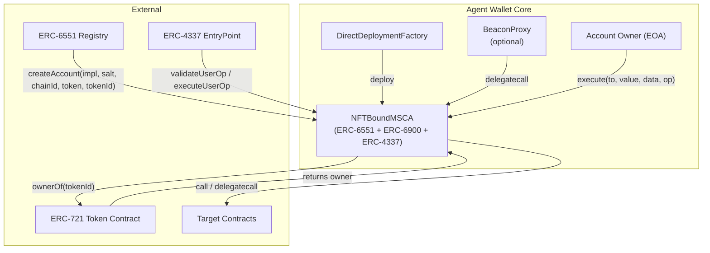

### Contract Hierarchy

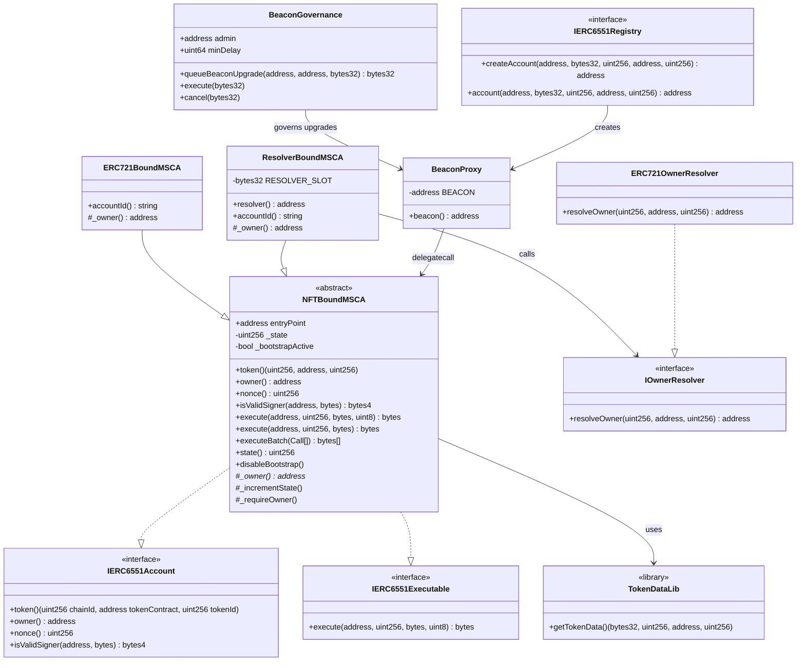

### Token Binding Data Layout

ERC-6551 accounts encode their token binding in the last 128 bytes (0x80) of the deployed runtime bytecode. `TokenDataLib` extracts this data using `extcodecopy`.

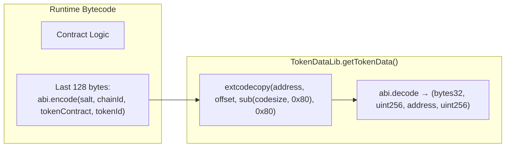

| Offset (from end) | Size | Field | Type |
|---|---|---|---|
| 0x60–0x80 | 32 bytes | `salt` | `bytes32` |
| 0x40–0x60 | 32 bytes | `chainId` | `uint256` |
| 0x20–0x40 | 32 bytes | `tokenContract` | `address` |
| 0x00–0x20 | 32 bytes | `tokenId` | `uint256` |

The library reverts if the contract's code size is less than 128 bytes, preventing misuse on contracts without appended token data.

## Ownership Resolution

### Resolution Strategies

The abstract `_owner()` function in `NFTBoundMSCA` is the single point of ownership resolution. All authorization checks (`_requireOwner()`, `isValidSigner()`, bootstrap signature validation) flow through it.

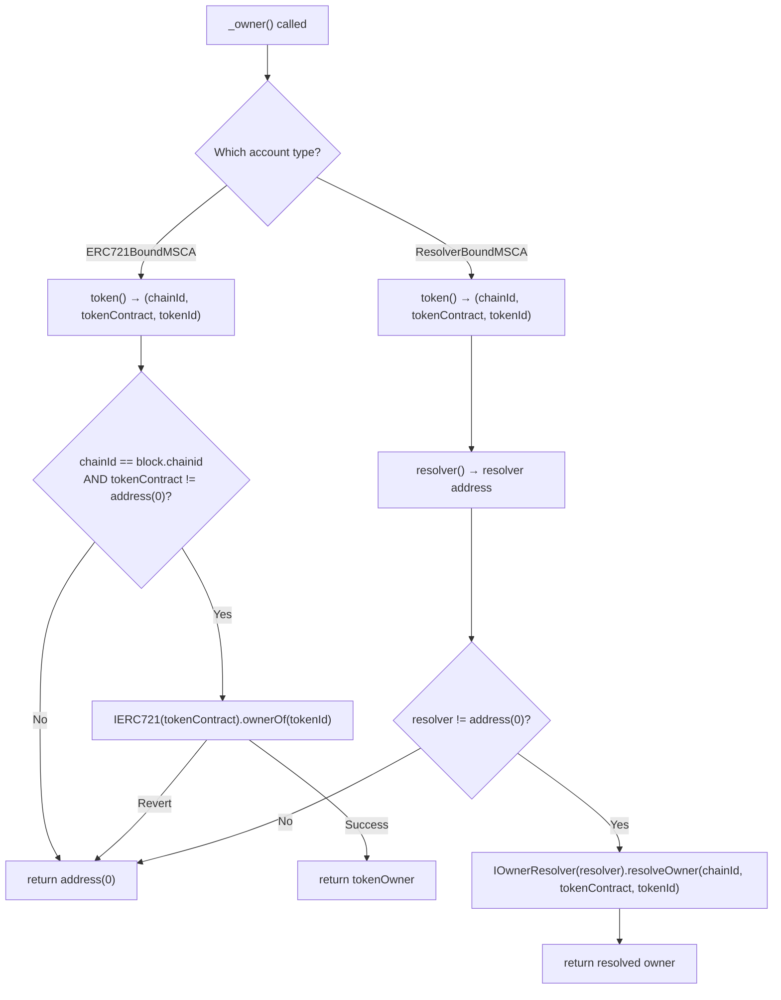

### ERC721BoundMSCA

The simplest ownership model: calls `IERC721(tokenContract).ownerOf(tokenId)` directly. Ownership transfers when the bound NFT is transferred.

| Property | Value |
|---|---|
| Ownership source | `IERC721.ownerOf(tokenId)` |
| Chain restriction | Same chain only (`chainId == block.chainid`) |
| Failure mode | Returns `address(0)` on revert or chain mismatch |
| Storage cost | Zero (stateless resolution) |
| Account ID | `agent.wallet.erc721-bound-msca.1.0.0` |

### ResolverBoundMSCA

Delegates ownership resolution to a pluggable `IOwnerResolver` contract stored in a dedicated storage slot. This enables custom ownership logic (multi-sig resolvers, DAO-controlled resolvers, cross-protocol resolvers) while preserving the ERC-6551 token binding.

| Property | Value |
|---|---|
| Ownership source | `IOwnerResolver.resolveOwner(chainId, tokenContract, tokenId)` |
| Resolver storage | ERC-7201 namespaced slot (`agent.wallet.core.resolver-bound-msca.resolver.v1`) |
| Resolver mutability | Set at construction; updatable via `BeaconGovernance` timelock |
| Failure mode | Returns `address(0)` if resolver is `address(0)` |
| Account ID | `agent.wallet.resolver-bound-msca.1.0.0` |

### IOwnerResolver Interface

```solidity
interface IOwnerResolver {
    function resolveOwner(
        uint256 chainId,
        address tokenContract,
        uint256 tokenId
    ) external view returns (address owner);
}
```

The project includes `ERC721OwnerResolver` as a reference implementation that mirrors `ERC721BoundMSCA`'s logic through the resolver interface, useful for `ResolverBoundMSCA` deployments that want standard ERC-721 semantics with the option to swap resolvers later.

## ERC-6551 Interface Implementation

### token()

Returns the account's immutable token binding extracted from runtime bytecode via `TokenDataLib`.

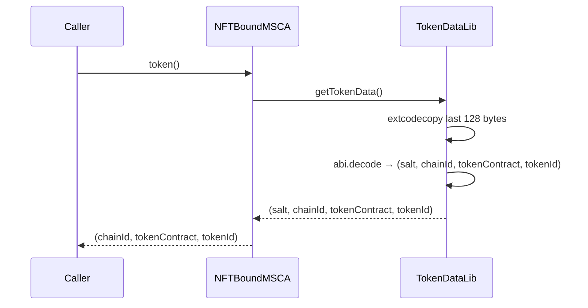

Note: `salt` is extracted but not returned by `token()` — it is used only for deterministic address computation by the ERC-6551 registry.

### owner()

Delegates to the abstract `_owner()` resolved by the concrete account type. This is the primary authorization primitive used throughout the system.

### nonce()

Returns `_state`, a monotonically increasing counter incremented on every successful execution. This is distinct from the ERC-4337 nonce managed by the EntryPoint — it provides an independent activity signal for external observers.

| Increment trigger | Method |
|---|---|
| `execute(to, value, data)` | Single call execution |
| `execute(to, value, data, operation)` | ERC-6551 execute (CALL or DELEGATECALL) |
| `executeBatch(calls)` | Batch execution (single increment for entire batch) |
| `installExecution(...)` | Module installation |
| `uninstallExecution(...)` | Module uninstallation |
| `installValidation(...)` | Validation installation |
| `uninstallValidation(...)` | Validation uninstallation |
| `_executeWithRuntimeValidation(...)` | Runtime-validated execution |
| `_executeModuleWithHooks(...)` | Module execution with hooks |

### isValidSigner()

Returns the ERC-6551 magic value (`0x523e3260`) if the provided signer matches `_owner()`, otherwise returns `0xffffffff`. The `data` parameter is ignored — signer validity is determined solely by ownership.

```solidity
function isValidSigner(address signer, bytes calldata) external view returns (bytes4) {
    return signer == _owner() ? ERC6551_VALID_SIGNER : bytes4(0xffffffff);
}
```

### execute()

Two overloads are implemented:

**ERC-6900 execute (3 params):** `execute(address target, uint256 value, bytes calldata data)`
- Owner-gated via `_requireOwner()`
- Performs a CALL to the target
- Increments `_state`

**ERC-6551 execute (4 params):** `execute(address to, uint256 value, bytes calldata data, uint8 operation)`
- Owner-gated via `_requireOwner()`
- `operation == 0`: CALL
- `operation == 1`: DELEGATECALL (value must be 0)
- Any other operation: reverts with `UnsupportedOperation`
- Increments `_state`

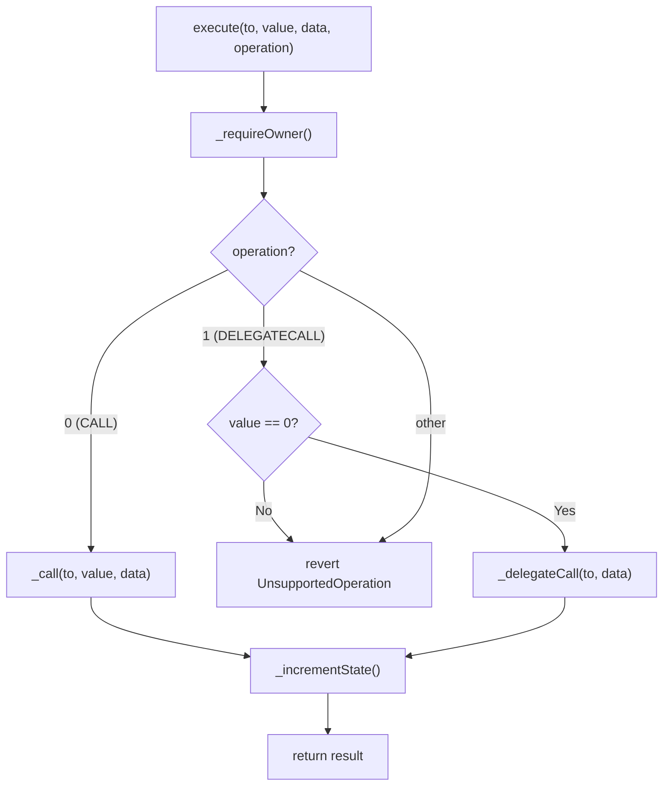

### executeBatch()

Executes multiple calls in sequence. Reverts if any target is an installed module (prevents module state corruption via direct calls). Single `_state` increment for the entire batch.

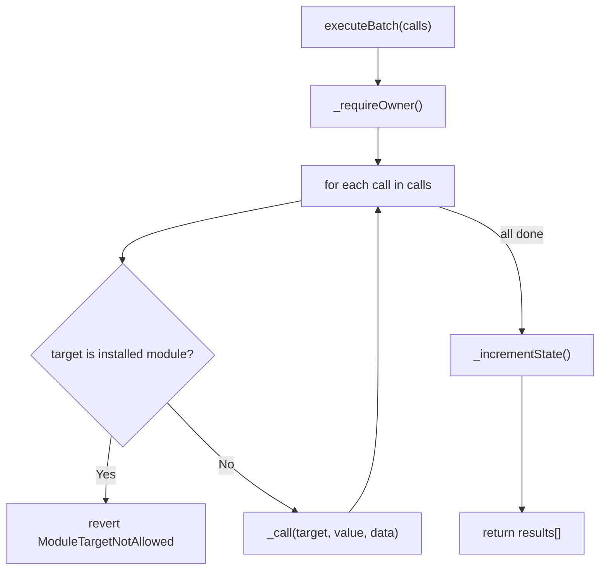

## Deployment Patterns

### Direct Deployment

The `DirectDeploymentFactory` deploys account implementations directly (no proxy). Suitable for development and testing where upgradeability is not required.

Important: this convenience path does not append ERC-6551 token footer bytes to runtime code. As a result, `token()`/`owner()` semantics are not equivalent to registry/proxy deployments that include the footer.

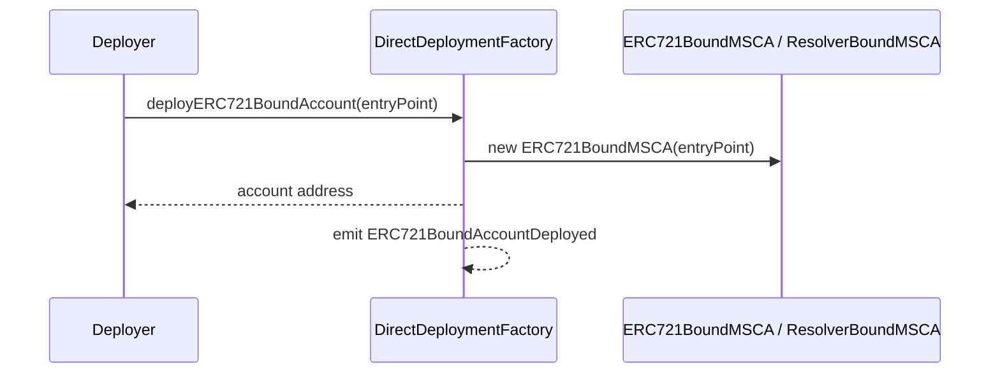

### Beacon Proxy Deployment

The `BeaconProxy` pattern enables upgradeable accounts. The proxy delegates all calls to the implementation address returned by an `IBeacon` contract. Implementation upgrades are governed by `BeaconGovernance` with a mandatory timelock.

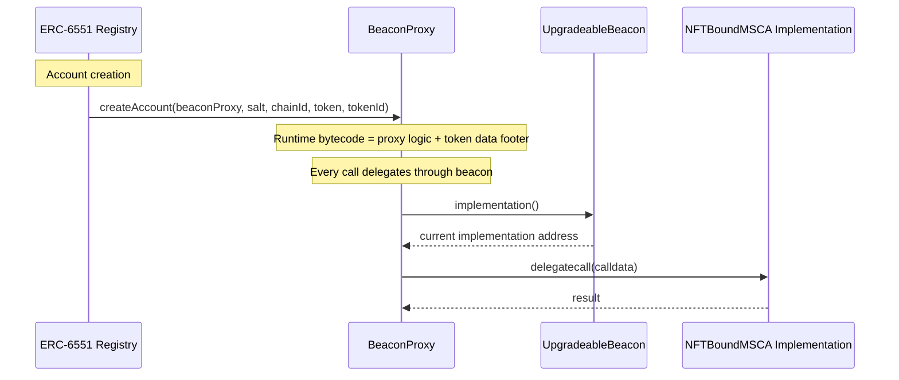

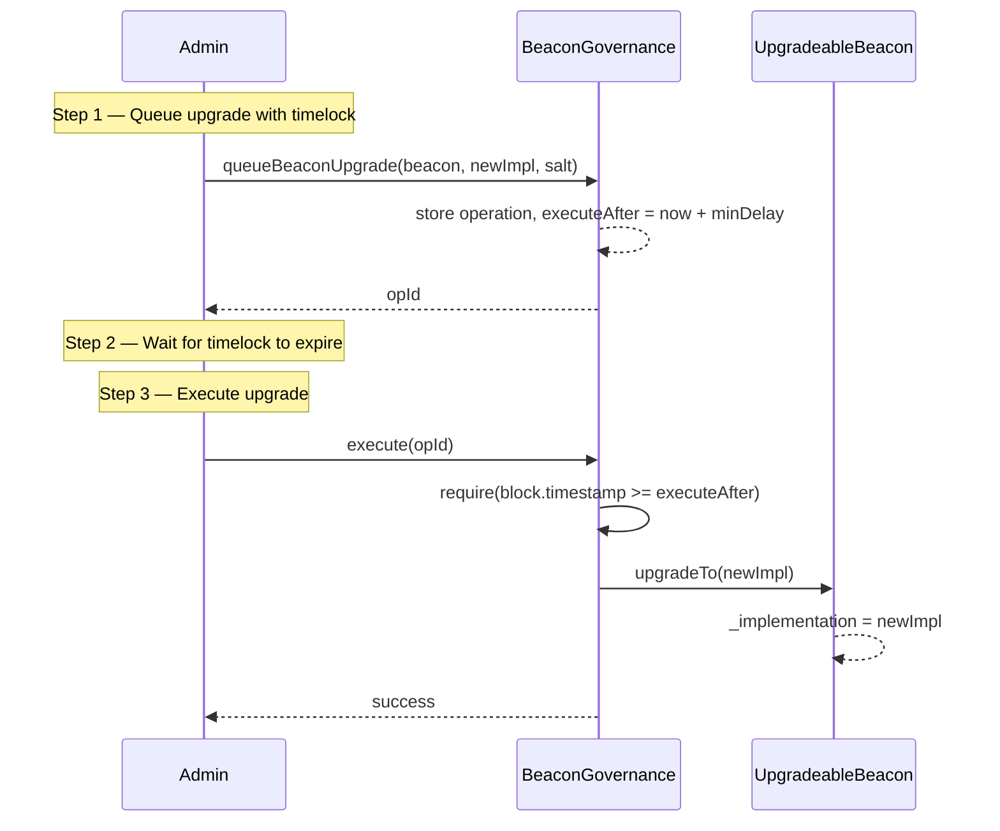

### Deployment Mode Comparison

| Property | Direct Deployment | Beacon Proxy |
|---|---|---|
| Upgradeability | None | Via beacon + governance timelock |
| Gas cost (deploy) | Higher (full bytecode) | Lower (minimal proxy) |
| Gas cost (call) | Direct | +1 SLOAD for beacon lookup |
| Address determinism | Factory-dependent | ERC-6551 registry `create2` |
| Implementation sharing | Each account is independent | All proxies share one implementation |
| Governance | None needed | `BeaconGovernance` with `minDelay` |
| ERC-6551 token footer | Not appended by `DirectDeploymentFactory` | Appended by ERC-6551-style deployment bytecode |

## State Management

### State Counter

The `_state` variable serves as the ERC-6551 nonce. It is a simple `uint256` that increments (unchecked, for gas efficiency) on every state-changing operation.

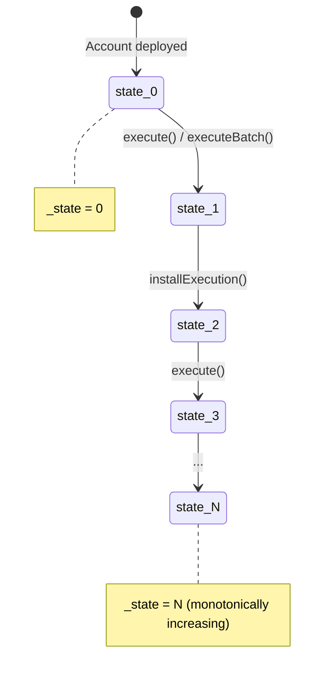

### Bootstrap Mode

Accounts deploy with `_bootstrapActive = true`, enabling a simplified signature validation path that accepts raw 65-byte ECDSA signatures from the owner without requiring module-routed validation. This allows initial module installation before any validation modules are configured.

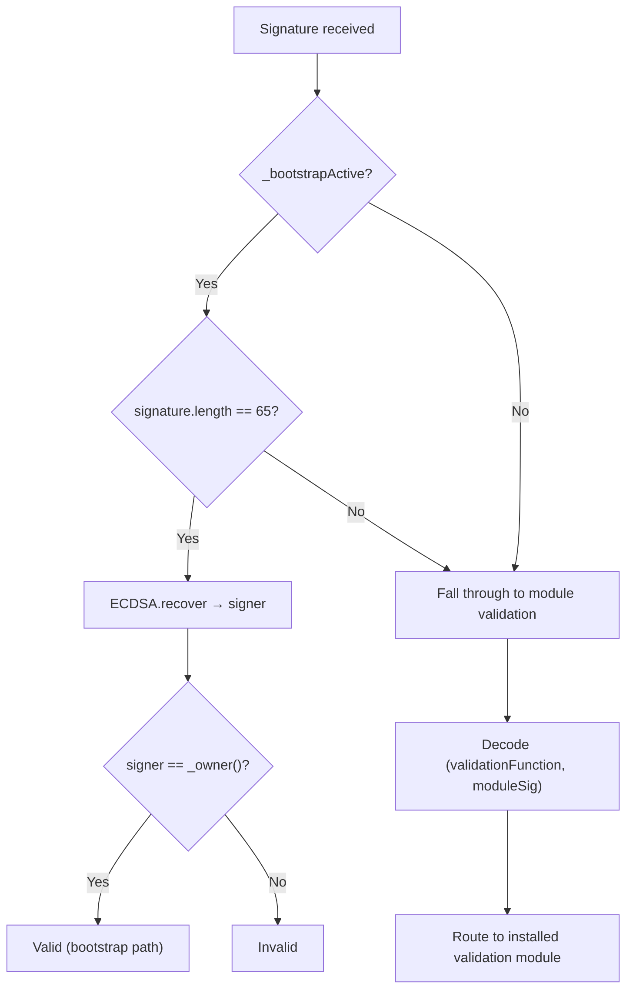

Bootstrap can be permanently disabled by the owner via `disableBootstrap()`. This is irreversible — once disabled, all validation must go through installed ERC-6900 modules.

## Error Taxonomy

| Error | Contract | Condition | Severity |
|---|---|---|---|
| `UnauthorizedCaller(address)` | `NFTBoundMSCA` | `msg.sender != _owner()` | Authorization |
| `InvalidEntryPoint(address)` | `NFTBoundMSCA` | `msg.sender != entryPoint` for UserOp methods | Authorization |
| `EntryPointPaymentFailed(uint256)` | `NFTBoundMSCA` | ETH transfer to EntryPoint failed | Runtime |
| `ModuleTargetNotAllowed(address)` | `NFTBoundMSCA` | `executeBatch` target is an installed module | Safety |
| `UnsupportedOperation(uint8)` | `NFTBoundMSCA` | `execute()` operation is not 0 (CALL) or 1 (DELEGATECALL), or DELEGATECALL with non-zero value | Input validation |
| `SelectorNotInstalled(bytes4)` | `NFTBoundMSCA` | Fallback dispatch to uninstalled selector | Configuration |
| `ModuleSelfModification(address)` | `NFTBoundMSCA` | Module attempts to install/uninstall itself | Safety |
| `BootstrapAlreadyDisabled()` | `NFTBoundMSCA` | `disableBootstrap()` called when already disabled | Idempotency |
| `InvalidResolver(address)` | `ResolverBoundMSCA` | Constructor: resolver is `address(0)` | Fatal (deploy-time) |
| `BeaconNotContract(address)` | `BeaconProxy` | Constructor: beacon address has no code | Fatal (deploy-time) |
| `Unauthorized(address)` | `BeaconGovernance` | Caller is not the admin | Authorization |
| `InvalidAdmin(address)` | `BeaconGovernance` | Constructor: admin is `address(0)` | Fatal (deploy-time) |
| `InvalidMinDelay(uint64)` | `BeaconGovernance` | Constructor: minDelay is 0 | Fatal (deploy-time) |
| `InvalidTarget(address)` | `BeaconGovernance` | Queue: beacon/resolver target is `address(0)` | Input validation |
| `InvalidImplementation(address)` | `BeaconGovernance` | Queue: new implementation is `address(0)` | Input validation |
| `InvalidResolver(address)` | `BeaconGovernance` | Queue: new resolver is `address(0)` | Input validation |
| `OperationAlreadyQueued(bytes32)` | `BeaconGovernance` | Duplicate operation ID | Conflict |
| `OperationNotQueued(bytes32)` | `BeaconGovernance` | Execute/cancel on non-existent operation | Input validation |
| `OperationNotReady(bytes32, uint64, uint64)` | `BeaconGovernance` | Execute before timelock expires | Timing |
| `OperationCallFailed(bytes32, bytes)` | `BeaconGovernance` | Timelocked call reverted | Runtime |

## Events

| Event | Contract | Parameters | Emitted When |
|---|---|---|---|
| `BootstrapDisabled` | `NFTBoundMSCA` | `address indexed account`, `uint256 timestamp` | Owner permanently disables bootstrap mode |
| `ExecutionInstalled` | `NFTBoundMSCA` | `address module`, `ExecutionManifest manifest` | Execution module installed |
| `ExecutionUninstalled` | `NFTBoundMSCA` | `address module`, `bool onUninstallSucceeded`, `ExecutionManifest manifest` | Execution module removed |
| `ValidationInstalled` | `NFTBoundMSCA` | `address module`, `uint32 entityId` | Validation module installed |
| `ValidationUninstalled` | `NFTBoundMSCA` | `address module`, `uint32 entityId`, `bool onUninstallSucceeded` | Validation module removed |
| `OperationQueued` | `BeaconGovernance` | `bytes32 indexed opId`, `bytes32 indexed opType`, `address indexed target`, `bytes data`, `uint64 executeAfter` | Upgrade or resolver update queued |
| `OperationExecuted` | `BeaconGovernance` | `bytes32 indexed opId`, `bytes32 indexed opType`, `address indexed target`, `bytes data` | Timelocked operation executed |
| `OperationCancelled` | `BeaconGovernance` | `bytes32 indexed opId`, `bytes32 indexed opType`, `address indexed target`, `bytes data` | Queued operation cancelled |
| `ERC721BoundAccountDeployed` | `DirectDeploymentFactory` | `address indexed account`, `address indexed entryPoint` | ERC721-bound account deployed |
| `ResolverBoundAccountDeployed` | `DirectDeploymentFactory` | `address indexed account`, `address indexed entryPoint`, `address indexed resolver` | Resolver-bound account deployed |

## supportsInterface

The account reports support for all implemented interfaces via ERC-165:

| Interface | Interface ID | Source |
|---|---|---|
| `IERC165` | `0x01ffc9a7` | Native |
| `IERC6551Account` | Computed | Native |
| `IERC6551Executable` | Computed | Native |
| `IERC6900Account` | Computed | Native |
| `IAccount` (ERC-4337) | Computed | Native |
| `IAccountExecute` (ERC-4337) | Computed | Native |
| `IERC1271` | Computed | Native |
| `IERC721Receiver` | Computed | Native |
| Module-registered IDs | Varies | Via `installExecution` manifest |

## Interaction with Other Standards

### ERC-6900 (Modular Smart Contract Accounts)

`NFTBoundMSCA` implements `IERC6900Account` alongside the ERC-6551 interfaces. The two standards are complementary:

- ERC-6551 provides identity (token binding), ownership (`_owner()`), and the base execution surface (`execute`)
- ERC-6900 provides the modular validation and execution hook framework layered on top

Module installation and uninstallation are owner-gated via `_requireOwner()`, which resolves through the ERC-6551 ownership chain. The `_state` counter increments on every module lifecycle operation, ensuring ERC-6551 state tracking captures module changes.

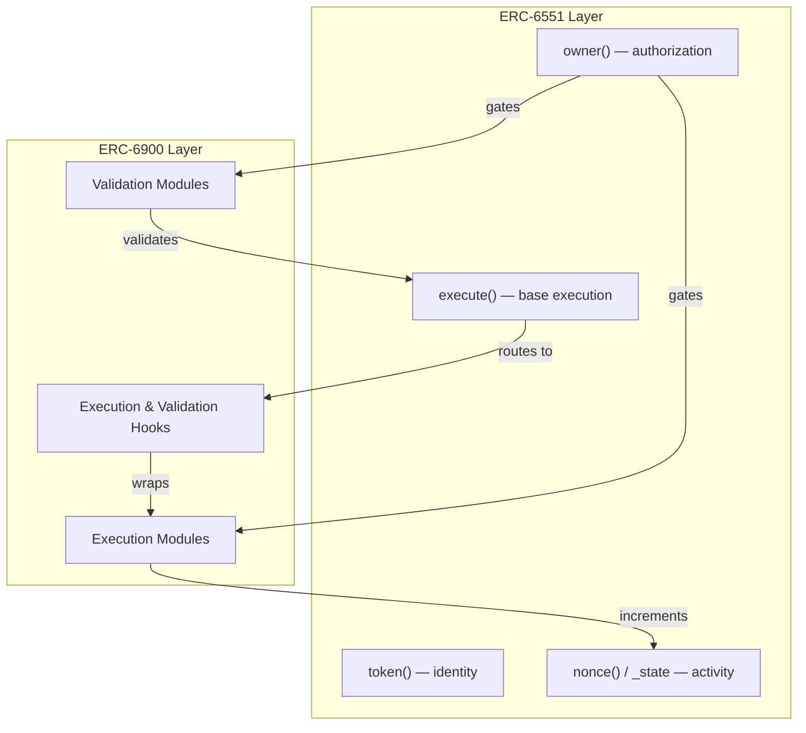

### ERC-4337 (Account Abstraction)

The account implements `IAccount.validateUserOp` and `IAccountExecute.executeUserOp` for ERC-4337 compatibility. The ERC-6551 ownership is the root of trust:

- `validateUserOp` resolves `_owner()` (via ERC-6551) for bootstrap signature validation
- Module-routed validation (post-bootstrap) uses `IERC6551Account.owner()` in modules like `OwnerValidationModule`
- The `_state` counter is independent of the ERC-4337 nonce managed by the EntryPoint

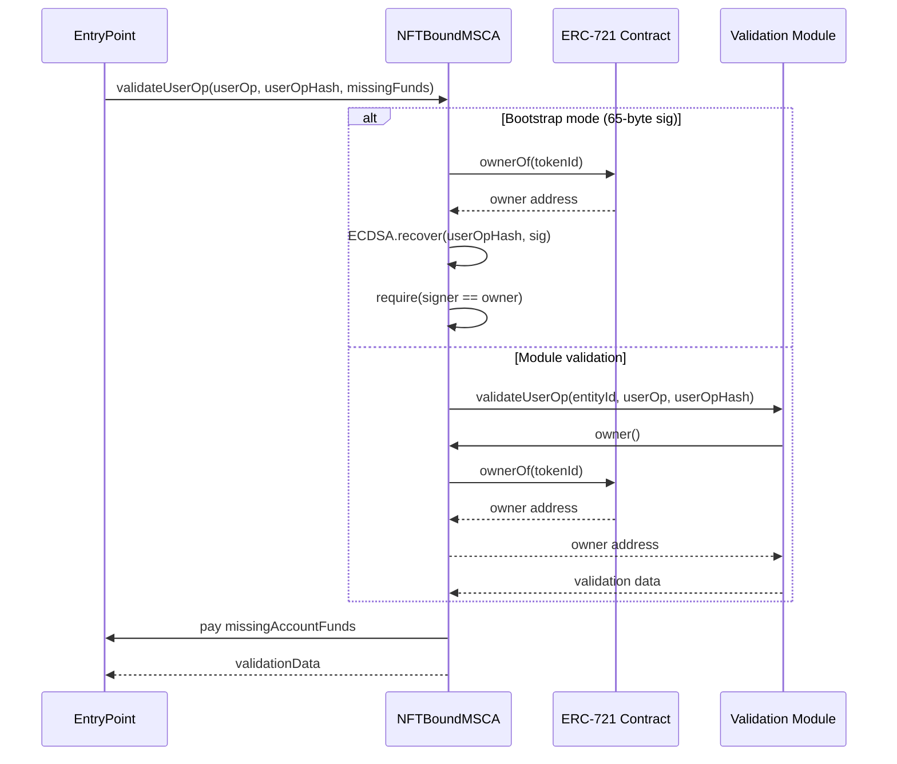

### ERC-1271 (Standard Signature Validation)

`isValidSignature` follows the same dual-path pattern as UserOp validation:

- Bootstrap mode: accepts raw 65-byte ECDSA signatures, recovers signer, checks against `_owner()`
- Post-bootstrap: decodes `(ModuleEntity, bytes)` from the signature, routes to the installed validation module

Both paths ultimately depend on ERC-6551 ownership resolution for authorization.

### ERC-8128 (Signed HTTP Requests)

The ERC-8128 policy registry uses `IERC6551Account(account).owner()` to authorize policy mutations. This means any account implementing the ERC-6551 `owner()` interface can participate in the ERC-8128 policy system without additional configuration.

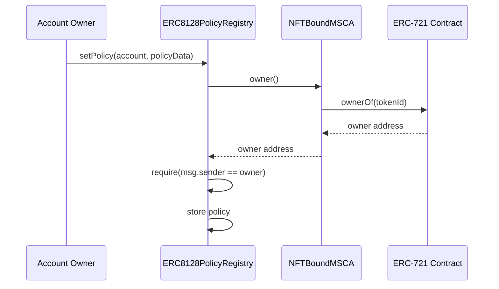

### ERC-8004 (Agent Identity)

The `ERC8004IdentityAdapter` relies on ERC-6551 for ownership verification when recording agent identity mappings, and provides calldata helpers for `execute()` calls through the TBA. See [ERC8004-Identity-Integration-Design.md](./ERC8004-Identity-Integration-Design.md) for full details.

## Security Considerations

### Trust Assumptions

1. The bound ERC-721 contract is trusted to correctly implement `ownerOf`. For `ERC721BoundMSCA`, a compromised or malicious token contract can return an incorrect owner, granting unauthorized control over the account.
2. For `ResolverBoundMSCA`, the `IOwnerResolver` implementation is trusted to return the correct owner. The resolver is set at construction time and can only be updated through the `BeaconGovernance` timelock.
3. For registry-based deployments, the ERC-6551 registry is trusted for deterministic address computation. The account's address is derived from `(implementation, salt, chainId, tokenContract, tokenId)` — if the registry is compromised, account addresses become unpredictable.
4. The ERC-4337 EntryPoint is trusted to correctly invoke `validateUserOp` and enforce returned validation data.
5. `TokenDataLib` assumes the last 128 bytes of runtime bytecode are valid ABI-encoded token data. Deploying the implementation directly (not through the registry or a proxy that appends token data) will produce garbage values.

### Attack Surface

| Vector | Mitigation |
|---|---|
| NFT transfer → ownership change | By design. Whoever holds the NFT controls the account. Account holders should understand this. |
| Malicious ERC-721 `ownerOf` | Trust assumption. Use only audited, well-known token contracts. |
| Resolver returning wrong owner | Timelock governance on resolver updates. Reference `ERC721OwnerResolver` mirrors standard semantics. |
| DELEGATECALL to malicious contract | Owner-gated. Only the resolved owner can invoke `execute` with operation 1. |
| Module targeting via `executeBatch` | Installed modules are blocked as batch targets (`ModuleTargetNotAllowed`). |
| Module self-modification | `_requireModuleManagement` reverts if `msg.sender == module` during install/uninstall. |
| Bootstrap mode abuse | Bootstrap accepts only 65-byte ECDSA sigs from `_owner()`. Permanently disableable via `disableBootstrap()`. |
| State counter overflow | `_state` uses `unchecked` increment on `uint256`. Overflow at 2^256 is practically unreachable. |
| Beacon upgrade to malicious impl | `BeaconGovernance` enforces `minDelay` timelock. Admin-only queue/execute. |
| Front-running beacon upgrade | Timelock provides observation window for account holders to exit before upgrade takes effect. |
| Token data extraction on wrong contract | `TokenDataLib` reverts if code size < 128 bytes. |

### Immutability

| Component | Mutability | Governance |
|---|---|---|
| Token binding `(salt, chainId, tokenContract, tokenId)` | Immutable (bytecode, footer-based deployments) | None — set at deployment |
| `entryPoint` | Immutable (constructor) | None — set at deployment |
| `_bootstrapActive` | One-way: `true` → `false` | Owner only, irreversible |
| Resolver address (`ResolverBoundMSCA`) | Mutable via storage slot | `BeaconGovernance` timelock |
| Beacon implementation | Mutable via beacon | `BeaconGovernance` timelock |
| `_state` counter | Monotonically increasing | Automatic on state changes |

## Deployment

### Prerequisites

1. An ERC-721 token contract deployed on the target chain (for `ERC721BoundMSCA`).
2. An ERC-4337 EntryPoint deployed on the target chain.
3. (Optional) An `IOwnerResolver` implementation deployed (for `ResolverBoundMSCA`).
4. (Optional) An `UpgradeableBeacon` and `BeaconGovernance` deployed (for beacon proxy mode).

### Direct Deployment Checklist

1. Deploy `ERC721BoundMSCA` or `ResolverBoundMSCA` via `DirectDeploymentFactory`.
2. Verify `entryPoint` immutable matches the intended EntryPoint.
3. Do not assume ERC-6551 token footer semantics for this path (`token()`/`owner()` are not guaranteed to represent a real NFT binding).
4. Use registry/proxy deployment when ERC-6551 token binding semantics are required.
5. (Optional) Install initial ERC-6900 validation and execution modules while bootstrap is active.
6. (Optional) Call `disableBootstrap()` to lock down to module-only validation.

### Beacon Proxy Deployment Checklist

1. Deploy the account implementation contract (`ERC721BoundMSCA` or `ResolverBoundMSCA`).
2. Deploy an `UpgradeableBeacon` pointing to the implementation.
3. Deploy `BeaconGovernance` with the admin address and minimum timelock delay.
4. Deploy `BeaconProxy` with the beacon address.
5. Use the ERC-6551 registry to create accounts with the `BeaconProxy` as the implementation.
6. Verify accounts delegate correctly through the beacon to the implementation.

## Testing Strategy

### Unit Tests

The test suite covers ERC-6551 integration across multiple test files:

#### `test/core/ERC721BoundMSCA.t.sol`

| Test | Validates |
|---|---|
| `testFuzz_Property1_ERC721OwnershipResolutionConsistency` | Fuzz: `owner()` always matches `IERC721.ownerOf(tokenId)` for arbitrary token IDs and owner keys |
| `testFuzz_Property3_TokenBindingDataExtraction` | Fuzz: `token()` correctly extracts `(chainId, tokenContract, tokenId)` from bytecode footer for arbitrary values via `ERC6551DelegateProxy` |
| `testFuzz_IsValidSigner_ReturnsMagicValueOnlyForOwner` | Fuzz: `isValidSigner` returns ERC-6551 magic value only for current owner; all non-owner signers return `0xffffffff` |
| `testFuzz_NonceAndStateMonotonic_AcrossInterleavedExecuteInstallUninstall` | Fuzz: `nonce()` and `state()` increase monotonically across interleaved `execute` / `installExecution` / `uninstallExecution` operations |
| `testFuzz_ExecuteDelegatecallWithValue_Reverts` | Fuzz: `execute(..., operation=1)` reverts with `UnsupportedOperation` when `value > 0` |
| `testFuzz_ExecuteBatch_RevertsWhenAnyTargetIsInstalledModule` | Fuzz: `executeBatch` reverts with `ModuleTargetNotAllowed` if any call target is an installed module |
| `test_Owner_ReturnsZeroAddressWhenChainIdMismatch` | `owner()` returns `address(0)` when bound `chainId` does not equal `block.chainid` |
| `test_Owner_ReturnsZeroAddressWhenTokenContractIsZero` | `owner()` returns `address(0)` when bound token contract is zero address |
| `test_Owner_ReturnsZeroAddressWhenOwnerOfReverts` | `owner()` returns `address(0)` when underlying `ownerOf` call reverts |
| `test_SupportsInterface_ReturnsTrueForAllNativeInterfaceIds` | `supportsInterface` returns `true` for all native interface IDs (`IERC165`, ERC-6900 account, ERC-4337 account/execute, ERC-6551 account/executable, ERC-1271, ERC-721 receiver) |
| `test_SupportsInterface_ModuleRegisteredInterfaceIds_RoundTrip` | `supportsInterface` returns `true` for module-registered interface IDs after install and `false` after uninstall |
| `testFuzz_Property4_ModuleInstallationRoundTrip` | Module install/uninstall lifecycle preserves account integrity; state increments on each operation |
| `testFuzz_Property5_ModuleSelfModificationPrevention` | Module cannot install itself via the account it's installed on |
| `testFuzz_Property6_NativeSelectorConflictDetection` | Cannot install execution modules that conflict with native selectors |
| `testFuzz_Property17_BootstrapDisableIrreversibility` | Bootstrap disable is permanent; signatures and UserOps rejected after disable; double-disable reverts |
| `testFuzz_Property18_EntryPointExclusivity` | `validateUserOp` and `executeUserOp` revert for any caller other than the EntryPoint |
| `testFuzz_Property19_ERC721TokenReception` | Account can receive ERC-721 tokens via `safeTransferFrom` (implements `IERC721Receiver`) |
| `testFuzz_Property20_HookDepthEnforcement` | Max hook depth and recursive hook detection prevent unbounded execution |

#### `test/core/ResolverBoundMSCA.t.sol`

| Test | Validates |
|---|---|
| `testFuzz_Property2_ResolverOwnershipResolutionConsistency` | Fuzz: `owner()` matches `IOwnerResolver.resolveOwner()` for arbitrary chain/token/owner combinations |
| `test_Constructor_RevertsWhenResolverIsZeroAddress` | Constructor input validation: reverts with `InvalidResolver(address(0))` |

#### `test/core/BeaconGovernance.t.sol`

| Test | Validates |
|---|---|
| `test_Timelock_CannotExecuteBeforeMinDelayExpires` | Timelock guarantee: queued operation cannot execute before `minDelay` has elapsed |
| `test_Cancel_RemovesQueuedOperationAndPreventsExecution` | Cancel flow: removing a queued operation prevents later execution (`OperationNotQueued`) |
| `testFuzz_Property23_TimelockGovernedUpgradeDelayEnforcement` | Fuzzed governance flow for queue/execute/cancel/requeue across beacon upgrades and resolver updates |

#### `test/core/BeaconProxy.t.sol`

| Test | Validates |
|---|---|
| `testFuzz_Property21_BeaconProxyConstructionValidation` | Fuzz: constructor reverts for any non-contract beacon address |
| `test_BeaconProxy_DelegatesThroughCurrentBeaconImplementation` | Proxy delegates to current beacon implementation; follows beacon upgrades |

#### `test/core/ERC6551RegistryBeaconIntegration.t.sol`

| Test | Validates |
|---|---|
| `test_Integration_EndToEndRegistryBeaconProxyAccountCreationOwnershipResolution` | End-to-end ERC-6551 flow: registry account derivation/creation using beacon-proxy implementation, token-bound `token()` metadata, and ownership resolution updates after ERC-721 transfer |

## Open Questions

1. Should `_state` be unified with or derived from the ERC-4337 nonce managed by the EntryPoint, or is the independent counter the right design?
2. Should `ResolverBoundMSCA` support resolver updates directly (owner-gated) in addition to the `BeaconGovernance` timelock path?
3. Should `isValidSigner` consider the `data` parameter for context-dependent signer validation (e.g., per-operation signer restrictions)?
4. Should the account implement `IERC6551Registry` address discovery (e.g., a `registry()` view) for tooling convenience?
5. Should `execute()` with operation 1 (DELEGATECALL) be restricted to a whitelist of approved targets to reduce the attack surface?
6. Should bootstrap mode have an optional time-based auto-disable (e.g., disable after N blocks or T seconds)?
7. Should cross-chain token binding be supported in a future version, and if so, how should ownership resolution work for remote-chain NFTs?
