# ERC-6900 Modular Account Integration Design

Status: Draft

## Summary

This document describes how Agent Wallet Core integrates with [ERC-6900](https://eips.ethereum.org/EIPS/eip-6900) (Modular Smart Contract Accounts) to provide a pluggable validation and execution framework for NFT-bound smart accounts. ERC-6900 defines a standard interface for modular smart contract accounts where validation logic, execution logic, and hook logic are encapsulated in independently installable modules.

Agent Wallet Core implements ERC-6900 at the account layer (`NFTBoundMSCA`) with two concrete variants (`ERC721BoundMSCA` and `ResolverBoundMSCA`). The account delegates all authorization decisions — UserOp validation, runtime validation, and signature validation — to installed validation modules via `ValidationFlowLib`. Execution modules extend the account's function surface via `delegatecall`, with pre/post hooks managed by `ExecutionFlowLib`. Four supporting libraries (`ValidationManagementLib`, `ExecutionManagementLib`, `ModuleEntityLib`, `ValidationConfigLib`) handle module lifecycle operations.

Core outcomes:
- full `IERC6900Account` implementation with validation and execution module installation/uninstallation
- three validation paths: UserOp (ERC-4337), runtime (direct calls), and signature (ERC-1271)
- validation routing with pre-validation hook intersection via `ValidationFlowLib`
- execution module dispatch with pre/post execution hooks via `ExecutionFlowLib`
- packed type system (`ModuleEntity`, `ValidationConfig`, `HookConfig`) for gas-efficient module references
- ERC-7201 namespaced diamond storage for safe module coexistence
- four installed validation modules: owner, session key, ERC-8128 gateway, and ERC-8128 AA
- bootstrap mode for pre-module account usability with automatic fallback to module routing

## Scope

In scope:
- `IERC6900Account` interface implementation in `NFTBoundMSCA`
- validation module interface (`IERC6900ValidationModule`) and lifecycle
- execution module interface (`IERC6900ExecutionModule`) and lifecycle
- validation hook interface (`IERC6900ValidationHookModule`) and execution hook interface (`IERC6900ExecutionHookModule`)
- module installation and uninstallation flows
- validation routing through `ValidationFlowLib` (selector permissions, type enforcement, hook intersection)
- execution routing through `ExecutionFlowLib` (pre/post hooks, depth/gas guards)
- packed type system: `ModuleEntity`, `ValidationConfig`, `HookConfig`, `ValidationFlags`
- `MSCAStorage` diamond storage layout
- management libraries: `ValidationManagementLib`, `ExecutionManagementLib`
- helper libraries: `ModuleEntityLib`, `ValidationConfigLib`, `HookConfigLib`
- interaction with ERC-6551, ERC-4337, ERC-1271, and ERC-8128

Out of scope:
- ERC-4337 EntryPoint implementation details (covered in [ERC-4337 Integration Design](./ERC4337-Account-Abstraction-Integration-Design.md))
- individual validation module internals (owner, session key, ERC-8128 modules are summarized but not fully specified here)
- ERC-8004 identity adapter (not an ERC-6900 module; covered in [ERC-8004 Integration Design](./ERC8004-Identity-Integration-Design.md))
- offchain tooling, bundler behavior, or indexer integration

## Design Goals

1. Modular validation: all authorization decisions are delegated to installed modules. The account contains no validation logic beyond bootstrap mode.
2. Composable hooks: validation hooks participate in validation data intersection; execution hooks wrap module calls with pre/post logic.
3. Gas efficiency: packed types (`ModuleEntity` = 24 bytes, `ValidationConfig` = 25 bytes, `HookConfig` = 25 bytes) minimize storage and calldata costs.
4. Safe coexistence: ERC-7201 namespaced storage prevents module storage collisions. Execution modules run via `delegatecall` in the account's context but cannot conflict with native selectors.
5. Minimal trust surface: modules cannot self-install or self-uninstall. Only the account owner can manage modules. Hook depth and gas budgets are enforced.

## Non-Goals

1. Module discovery or registry. The account does not maintain a queryable list of installed modules beyond the `installedModules` mapping.
2. Module upgradeability. Modules are immutable contracts; upgrading requires uninstall + reinstall.
3. Cross-account module sharing. Each account maintains its own module state independently.
4. Onchain module verification or auditing. Module trust is established offchain before installation.

## Architecture

### System Context


### Contract Inheritance and Interface Graph


### Library Dependency Graph


## Packed Type System

ERC-6900 uses tightly packed types to minimize storage and calldata overhead. All module references, validation configs, and hook configs fit in a single storage slot.

### ModuleEntity (24 bytes)

A packed reference to a specific function within a module contract. Combines the module's address with an entity ID that distinguishes multiple functions within the same module.

```
| module address (20 bytes) | entityId (4 bytes) |
|        bytes 0-19         |    bytes 20-23     |
```

```solidity
function pack(address module, uint32 entityId) internal pure returns (ModuleEntity) {
    return ModuleEntity.wrap(bytes24(bytes20(module)) | bytes24(uint192(entityId)));
}
```

### ValidationConfig (25 bytes)

Extends `ModuleEntity` with a flags byte that declares which validation types the module supports.

```
| module address (20 bytes) | entityId (4 bytes) | flags (1 byte) |
|        bytes 0-19         |    bytes 20-23     |    byte 24     |
```

| Flag Bit | Name | Meaning |
|---|---|---|
| bit 0 | `isUserOpValidation` | Module can handle `validateUserOp` calls |
| bit 1 | `isSignatureValidation` | Module can handle `validateSignature` calls |
| bit 2 | `isGlobal` | Module can validate any selector (no allowlist) |

Example: a module installed with flags `0x07` (all bits set) can validate UserOps, signatures, and any selector.

### HookConfig (25 bytes)

Same layout as `ValidationConfig` but with hook-specific flags.

```
| module address (20 bytes) | entityId (4 bytes) | flags (1 byte) |
|        bytes 0-19         |    bytes 20-23     |    byte 24     |
```

| Flag Bit | Name | Meaning |
|---|---|---|
| bit 0 | `isValidationHook` | 1 = validation hook, 0 = execution hook |
| bit 1 | `hasPost` | Execution hook has a `postExecutionHook` |
| bit 2 | `hasPre` | Execution hook has a `preExecutionHook` |

### ExecutionManifest

Declares the selectors, hooks, and interface IDs that an execution module provides. Passed to `installExecution` and `uninstallExecution`.

```solidity
struct ExecutionManifest {
    ManifestExecutionFunction[] executionFunctions;
    ManifestExecutionHook[] executionHooks;
    bytes4[] interfaceIds;
}

struct ManifestExecutionFunction {
    bytes4 executionSelector;
    bool skipRuntimeValidation;
    bool allowGlobalValidation;
}

struct ManifestExecutionHook {
    bytes4 executionSelector;
    uint32 entityId;
    bool isPreHook;
    bool isPostHook;
}
```

## Storage Layout

### ERC-7201 Namespaced Storage

The account uses ERC-7201 namespaced storage via `MSCAStorage` to prevent collisions between the account's own state and any execution modules that share its storage context via `delegatecall`.


### Storage Mappings

| Mapping | Key | Value | Purpose |
|---|---|---|---|
| `executionData` | `bytes4` selector | `ExecutionData` (module, flags) | Maps installed execution selectors to their module |
| `selectorExecHooks` | `bytes4` selector | `HookConfig[]` | Execution hooks for a given selector |
| `validationData` | `ModuleEntity` | `ValidationData` (flags, selectors) | Validation type flags and permitted selectors |
| `validationHooks` | `ModuleEntity` | `HookConfig[]` | Pre-validation hooks for a validation function |
| `validationExecHooks` | `ModuleEntity` | `HookConfig[]` | Execution hooks associated with a validation function |
| `supportedInterfaces` | `bytes4` interfaceId | `uint256` count | Reference-counted interface support from modules |
| `installedModules` | `address` module | `bool` | Whether a module is currently installed |
| `hookDepth` | — | `uint256` | Current execution hook nesting depth |
| `hookExecutionActive` | — | `bool` | Reentrancy guard for hook execution |

## Module Lifecycle

### Validation Module Installation


### Validation Module Uninstallation


### Execution Module Installation


### Execution Module Uninstallation


## Validation Routing

### Three Validation Paths

ERC-6900 defines three validation paths, each serving a different caller context. The account routes all three through `ValidationFlowLib`.


| Path | Entry Point | Module Method | Hook Method | Returns |
|---|---|---|---|---|
| UserOp | `validateUserOp` via EntryPoint | `validateUserOp(entityId, userOp, userOpHash)` | `preUserOpValidationHook(entityId, userOp, userOpHash)` | `uint256` packed validation data |
| Runtime | `executeWithRuntimeValidation` or fallback | `validateRuntime(account, entityId, sender, value, data, authorization)` | `preRuntimeValidationHook(entityId, sender, value, data, authorization)` | reverts on failure |
| Signature | `isValidSignature` (ERC-1271) | `validateSignature(account, entityId, sender, hash, signature)` | `preSignatureValidationHook(entityId, sender, hash, signature)` | `bytes4` magic value |

### Selector Permission Model

Each installed validation function has an associated set of permitted selectors. When a validation request arrives, the account extracts the target selector from the calldata and checks it against the validation function's permissions.


### Validation Type Enforcement

Before routing to a module, the account verifies the module is registered for the requested validation type.


### UserOp Validation Flow (Detail)


### Validation Data Intersection

When multiple hooks and the module each return packed validation data, results are intersected to produce the most restrictive time window.


### Signature Routing (ERC-1271)

The account's `isValidSignature` implementation routes through the same module infrastructure:


## Execution Routing

### Execution Module Dispatch

When a call arrives at the account targeting an installed execution selector, the fallback handler routes it through `ExecutionFlowLib` with pre/post hooks.


### Execution Hook Flow


### Execution Guards

| Guard | Constant | Enforcement |
|---|---|---|
| Max hook depth | `MAX_HOOK_DEPTH = 8` | `hookDepth > 8` reverts with `MaxHookDepthExceeded` |
| Recursive hook detection | — | `hookExecutionActive == true` on entry reverts with `RecursiveHookDetected` |
| Hook gas budget | `MAX_HOOK_GAS = 13,000,000` | Cumulative gas across all pre + post hooks; exceeding reverts with `HookGasBudgetExceeded` |

### Native Selector Protection

Execution modules cannot register selectors that conflict with the account's native functions. `ExecutionManagementLib.checkSelectorConflicts` rejects the following selectors:

| Protected Selector | Source Interface |
|---|---|
| `execute(address,uint256,bytes)` | `IERC6900Account` |
| `executeBatch((address,uint256,bytes)[])` | `IERC6900Account` |
| `executeWithRuntimeValidation(bytes,bytes)` | `IERC6900Account` |
| `installExecution(address,ExecutionManifest,bytes)` | `IERC6900Account` |
| `uninstallExecution(address,ExecutionManifest,bytes)` | `IERC6900Account` |
| `installValidation(ValidationConfig,bytes4[],bytes,bytes[])` | `IERC6900Account` |
| `uninstallValidation(ModuleEntity,bytes,bytes[])` | `IERC6900Account` |
| `accountId()` | `IERC6900Account` |
| `validateUserOp(PackedUserOperation,bytes32,uint256)` | `IAccount` (ERC-4337) |
| `executeUserOp(PackedUserOperation,bytes32)` | `IAccountExecute` (ERC-4337) |
| `token()` | `IERC6551Account` |
| `owner()` | `IERC6551Account` |
| `nonce()` | `IERC6551Account` |
| `isValidSigner(address,bytes)` | `IERC6551Account` |
| `execute(address,uint256,bytes,uint8)` | `IERC6551Executable` |
| `isValidSignature(bytes32,bytes)` | `IERC1271` |
| `supportsInterface(bytes4)` | `IERC165` |
| `onERC721Received(address,address,uint256,bytes)` | `IERC721Receiver` |
| `entryPoint()` | Account getter |

## Installed Validation Modules

Agent Wallet Core ships with four validation modules, each implementing `IERC6900ValidationModule`. They cover different authorization models from direct owner signing to scoped session delegation.

### Module Summary


| Module | UserOp | Runtime | Signature | Signature Scheme | Policy Storage |
|---|---|---|---|---|---|
| `OwnerValidationModule` | Yes | Yes | Yes | EIP-712 typed data over account address | None (stateless — resolves owner from `IERC6551Account.owner()`) |
| `SessionKeyValidationModule` | Yes | Yes | Yes | ERC-191 tagged hash bound to chain + module + account + entity | Module-internal mappings with epoch/nonce revocation |
| `SIWAValidationModule` | No | No | Yes | EIP-712 typed data (`GatewayClaimsV2`) | External `ERC8128PolicyRegistry` |
| `ERC8128AAValidationModule` | Yes | No | No | EIP-712 typed data (`SessionAuthorizationV2`) | External `ERC8128PolicyRegistry` |

### OwnerValidationModule

The default module for direct owner authorization. Resolves the current owner from `IERC6551Account(account).owner()` and validates signatures using EIP-712 typed data with the account address as `verifyingContract`.


Owner signature types supported:

| Owner Type | Signature Format | Verification |
|---|---|---|
| EOA | 65-byte ECDSA (r, s, v) | `ECDSA.tryRecover` against EIP-712 digest |
| Deployed SCA | Arbitrary bytes | `IERC1271.isValidSignature` on owner contract |
| Counterfactual SCA | ERC-6492 wrapped (factory + calldata + innerSig) | Deploy via factory, then `IERC1271.isValidSignature` |

### SessionKeyValidationModule

Validates operations signed by scoped session keys with fine-grained call constraints and cumulative budget tracking.


Policy model:

```mermaid
erDiagram
    ACCOUNT ||--o{ SESSION_KEY : "delegates to"
    SESSION_KEY ||--|| POLICY : "governed by"
    POLICY {
        bool active
        uint48 validAfter
        uint48 validUntil
        uint256 maxValuePerCall
        uint256 cumulativeValueLimit
    }
    POLICY ||--o{ ALLOWED_TARGET : "permits"
    POLICY ||--o{ ALLOWED_SELECTOR : "permits"
    POLICY ||--o{ TARGET_SELECTOR_RULE : "permits"
```



Revocation granularities:
- `revokeSessionKey(account, entityId, sessionKey)` — increments `policyNonce`, invalidating the current policy for one session key
- `revokeAllSessionKeys(account, entityId)` — increments `epoch`, invalidating all session keys for the entity

### ERC-8128 Modules

The two ERC-8128 validation modules split the ERC-6900 validation surface by path:

- `SIWAValidationModule` handles `validateSignature` only (ERC-1271 path for gateway-originated claims). It rejects `validateUserOp` and `validateRuntime`.
- `ERC8128AAValidationModule` handles `validateUserOp` only (ERC-4337 path for AA session delegation with Merkle-proven call scope). It rejects `validateSignature` and `validateRuntime`.

Both modules read policy state from the shared external `ERC8128PolicyRegistry` rather than maintaining module-internal storage. See the [ERC-8128 Unified Session Architecture](./ERC8128-SIWA-Spec.md) for full details.

## Bootstrap Mode

Newly deployed accounts have no validation modules installed. Bootstrap mode provides a minimal validation path so the owner can submit initial operations (e.g., to install modules) without requiring a pre-existing module.

```mermaid
stateDiagram-v2
    [*] --> BootstrapActive: Account deployed
    BootstrapActive --> BootstrapActive: 65-byte ECDSA sigs accepted<br/>(owner signs userOpHash directly)
    BootstrapActive --> ModulesInstalled: Owner installs validation modules
    ModulesInstalled --> BootstrapDisabled: Owner calls disableBootstrap()
    BootstrapDisabled --> BootstrapDisabled: All validation via modules only<br/>(irreversible)
```

Bootstrap mode applies to both `validateUserOp` (65-byte raw ECDSA over `userOpHash`) and `isValidSignature` (65-byte raw ECDSA over `hash`). Once `disableBootstrap()` is called, bootstrap mode is permanently disabled and all validation must flow through installed ERC-6900 modules.

### Bootstrap vs Module Routing Decision

```mermaid
flowchart TD
    A["Incoming validation request"] --> B{"signature.length == 65?"}
    B -->|Yes| C{"bootstrapActive?"}
    C -->|Yes| D["Bootstrap path:<br/>ECDSA.tryRecover(hash, signature)<br/>Check recovered == _owner()"]
    C -->|No| E["return SIG_VALIDATION_FAILED"]
    B -->|No| F{"signature.length >= 96?"}
    F -->|No| E
    F -->|Yes| G["Module path:<br/>Decode (ModuleEntity, moduleSig)<br/>Route through ValidationFlowLib"]
```

## Account Variants

Both concrete account types inherit from `NFTBoundMSCA` and differ only in how `_owner()` is resolved.

```mermaid
graph TD
    subgraph "Abstract"
        MSCA["NFTBoundMSCA<br/>#_owner() abstract"]
    end

    subgraph "Concrete"
        ERC721["ERC721BoundMSCA<br/>_owner() = IERC721(tokenContract).ownerOf(tokenId)"]
        Resolver["ResolverBoundMSCA<br/>_owner() = IOwnerResolver(resolver).resolveOwner(chainId, tokenContract, tokenId)"]
    end

    subgraph "Ownership Sources"
        NFT["ERC-721 Contract"]
        Res["IOwnerResolver Contract"]
    end

    ERC721 -->|extends| MSCA
    Resolver -->|extends| MSCA
    ERC721 -->|"ownerOf(tokenId)"| NFT
    Resolver -->|"resolveOwner(...)"| Res
```

| Account Type | Account ID | Ownership Source | Constructor |
|---|---|---|---|
| `ERC721BoundMSCA` | `agent.wallet.erc721-bound-msca.1.0.0` | `IERC721(tokenContract).ownerOf(tokenId)` | `(address entryPoint)` |
| `ResolverBoundMSCA` | `agent.wallet.resolver-bound-msca.1.0.0` | `IOwnerResolver(resolver).resolveOwner(chainId, tokenContract, tokenId)` | `(address entryPoint, address resolver)` |

Both account types extract their ERC-6551 token binding data from runtime bytecode appended during deployment via `TokenDataLib`.

## Error Taxonomy

### Account Errors

| Error | Condition | Severity |
|---|---|---|
| `UnauthorizedCaller(address)` | `msg.sender != _owner()` | Authorization |
| `InvalidEntryPoint(address)` | `msg.sender != entryPoint` in `validateUserOp` / `executeUserOp` | Authorization |
| `EntryPointPaymentFailed(uint256)` | ETH transfer to EntryPoint failed | Execution |
| `ModuleTargetNotAllowed(address)` | `executeBatch` call targets an installed module | Safety |
| `UnsupportedOperation(uint8)` | `execute` with operation > 1, or delegatecall with value | Input validation |
| `SelectorNotInstalled(bytes4)` | Fallback hit for uninstalled selector | Input validation |
| `ModuleSelfModification(address)` | Module attempting to install/uninstall itself | Safety |
| `BootstrapAlreadyDisabled()` | `disableBootstrap()` called when already disabled | Idempotency |

### ValidationFlowLib Errors

| Error | Condition | Severity |
|---|---|---|
| `ValidationNotApplicable(ModuleEntity, bytes4)` | Validation function not permitted for the target selector | Authorization |
| `ValidationTypeMismatch(ModuleEntity)` | Validation function used for wrong validation type (e.g., signature module for UserOp) | Authorization |

### ExecutionFlowLib Errors

| Error | Condition | Severity |
|---|---|---|
| `MaxHookDepthExceeded()` | Hook nesting exceeds 8 levels | Resource protection |
| `RecursiveHookDetected()` | Hook execution attempted while hooks already active | Reentrancy protection |
| `HookGasBudgetExceeded(uint256)` | Cumulative hook gas exceeds 13,000,000 | Resource protection |

### ExecutionManagementLib Errors

| Error | Condition | Severity |
|---|---|---|
| `NativeSelectorConflict(bytes4)` | Execution module declares a selector that conflicts with a native account function | Safety |
| `SelectorAlreadyInstalled(bytes4)` | Execution module declares a selector already registered to another module | Conflict |

## Integration with Other Standards

### ERC-4337 (Account Abstraction)

ERC-4337 validation is fully mediated by ERC-6900. The account's `validateUserOp` decodes a `ModuleEntity` from the UserOp signature and routes through `ValidationFlowLib`. The `ValidationConfig` flags determine which modules can handle UserOp validation (bit 0). Bootstrap mode provides a fallback for pre-module UserOps. See [ERC-4337 Integration Design](./ERC4337-Account-Abstraction-Integration-Design.md) for full details.

```mermaid
sequenceDiagram
    participant EP as EntryPoint
    participant SCA as NFTBoundMSCA
    participant VFL as ValidationFlowLib
    participant Module as Validation Module

    EP->>SCA: validateUserOp(userOp, userOpHash, missingFunds)
    SCA->>SCA: Decode (ModuleEntity, moduleSig) from userOp.signature
    SCA->>VFL: ensureSelectorAllowed(validationFunction, selector)
    SCA->>VFL: ensureUserOpValidation(validationFunction)
    SCA->>VFL: runUserOpValidation(validationFunction, userOp, userOpHash)
    VFL->>Module: validateUserOp(entityId, userOp, userOpHash)
    Module-->>VFL: validationData
    VFL-->>SCA: intersected validationData
    SCA-->>EP: validationData
    SCA->>EP: Transfer missingAccountFunds
```

### ERC-6551 (Token Bound Accounts)

The account's ownership is derived from its ERC-6551 token binding. `_owner()` resolves the current NFT owner, which determines who can:
- call `execute`, `executeBatch`, and module management functions
- sign bootstrap-mode operations
- authorize policy mutations in validation modules

The `_state` counter (exposed as `nonce()` via ERC-6551) increments on every execution and module lifecycle operation, providing state tracking independent of the ERC-4337 nonce.

### ERC-1271 (Standard Signature Validation)

The account's `isValidSignature` shares the same module routing infrastructure as `validateUserOp`. Both paths use `ValidationFlowLib` but with different type enforcement:
- `validateUserOp` requires `isUserOpValidation` flag (bit 0)
- `isValidSignature` requires `isSignatureValidation` flag (bit 1)

A module can support both by setting both flags during installation.

### ERC-8128 (Signed HTTP Requests)

ERC-8128 session delegation is implemented as two ERC-6900 validation modules that share an external `ERC8128PolicyRegistry`:
- `SIWAValidationModule` — installed with `isSignatureValidation` flag for the ERC-1271 gateway path
- `ERC8128AAValidationModule` — installed with `isUserOpValidation` flag for the ERC-4337 AA path

This split ensures each module handles exactly one validation type, preventing cross-path misuse.

### ERC-8004 (Agent Identity Registry)

The `ERC8004IdentityAdapter` is intentionally not an ERC-6900 module. Identity registration is a lifecycle operation that flows through the account's normal `execute` path. The adapter provides calldata encoding and post-registration mapping verification. See [ERC-8004 Integration Design](./ERC8004-Identity-Integration-Design.md).

## Security Considerations

### Trust Model

```mermaid
graph TB
    subgraph "Trusted"
        EP["EntryPoint (immutable)"]
        Owner["Account Owner (NFT-bound)"]
        Modules["Installed Modules"]
    end

    subgraph "Untrusted"
        Caller["External Callers"]
        Targets["Execution Targets"]
    end

    subgraph "Account"
        SCA["NFTBoundMSCA"]
    end

    EP -->|"validateUserOp / executeUserOp"| SCA
    Owner -->|"execute / module management"| SCA
    Modules -->|"validation decisions / delegatecall"| SCA
    Caller -->|"rejected unless authorized"| SCA
    SCA -->|"external calls"| Targets
```

### Trust Assumptions

1. The EntryPoint is trusted to correctly compute `userOpHash`, call `validateUserOp` before `executeUserOp`, and enforce returned validation data.
2. The account owner (resolved from the NFT binding) is trusted to install only safe modules.
3. Installed validation modules are trusted to make correct authorization decisions. A malicious module can approve unauthorized operations.
4. Installed execution modules run via `delegatecall` and share the account's storage. A malicious execution module can corrupt account state.

### Attack Surface

| Vector | Mitigation |
|---|---|
| Unauthorized module installation | `_requireOwner()` on all install/uninstall functions |
| Module self-install/uninstall | `ModuleSelfModification` revert when `msg.sender == module` |
| Execution module selector squatting | `NativeSelectorConflict` and `SelectorAlreadyInstalled` checks |
| Execution module storage corruption | ERC-7201 namespaced storage isolates account state |
| Validation module used for wrong type | `ensureUserOpValidation` / `ensureSignatureValidation` flag checks |
| Validation module used for wrong selector | `ensureSelectorAllowed` permission check |
| Execution hook reentrancy | `RecursiveHookDetected` revert on re-entry |
| Execution hook gas exhaustion | `HookGasBudgetExceeded` at 13M gas cap |
| Execution hook depth bomb | `MaxHookDepthExceeded` at depth 8 |
| Batch call targeting installed module | `ModuleTargetNotAllowed` revert in `executeBatch` |
| Bootstrap mode after module installation | Owner calls `disableBootstrap()` (irreversible) |
| Conflicting validation hook aggregators | `_intersectValidationData` returns `SIG_VALIDATION_FAILED` |
| Stale owner after NFT transfer | `_owner()` resolves live from NFT contract on every call |

### Module Installation Safety

The account enforces several invariants during module installation:

1. Only the account owner can install or uninstall modules.
2. A module cannot install or uninstall itself (`msg.sender != module`).
3. Execution modules cannot register native selectors.
4. Execution modules cannot register selectors already claimed by another module.
5. `onInstall` is called after storage is written, allowing the module to read its own installation state.
6. `onUninstall` failures are caught and reported but do not prevent uninstallation. This ensures a buggy module cannot prevent its own removal.

### Hook Safety

Execution hooks are protected by three guards:
- Reentrancy: `hookExecutionActive` flag prevents recursive hook entry
- Depth: `hookDepth` counter limits nesting to 8 levels
- Gas: cumulative gas across all pre + post hooks is capped at 13,000,000

Post-execution hooks run in reverse order of pre-execution hooks, ensuring LIFO semantics for hook pairs.

## Events

| Event | Parameters | Emitted When |
|---|---|---|
| `ExecutionInstalled` | `address indexed module`, `ExecutionManifest manifest` | Execution module successfully installed |
| `ExecutionUninstalled` | `address indexed module`, `bool onUninstallSucceeded`, `ExecutionManifest manifest` | Execution module uninstalled (reports `onUninstall` success) |
| `ValidationInstalled` | `address indexed module`, `uint32 indexed entityId` | Validation module successfully installed |
| `ValidationUninstalled` | `address indexed module`, `uint32 indexed entityId`, `bool onUninstallSucceeded` | Validation module uninstalled (reports `onUninstall` success) |
| `BootstrapDisabled` | `address indexed account`, `uint256 timestamp` | Bootstrap mode permanently disabled |

## Deployment

### Module Deployment Order

```mermaid
sequenceDiagram
    participant Deployer
    participant OwnerMod as OwnerValidationModule
    participant SessionMod as SessionKeyValidationModule
    participant Registry as ERC8128PolicyRegistry
    participant GatewayMod as SIWAValidationModule
    participant AAMod as ERC8128AAValidationModule
    participant SCA as NFTBoundMSCA (account)

    Note over Deployer: 1. Deploy validation modules
    Deployer->>OwnerMod: deploy()
    Deployer->>SessionMod: deploy()
    Deployer->>Registry: deploy()
    Deployer->>GatewayMod: deploy(registryAddress)
    Deployer->>AAMod: deploy(registryAddress)

    Note over Deployer: 2. Deploy account (via factory or beacon)
    Deployer->>SCA: deploy(entryPoint)

    Note over Deployer: 3. Install modules (bootstrap or owner call)
    Deployer->>SCA: installValidation(ownerModConfig, selectors, "", [])
    Deployer->>SCA: installValidation(sessionModConfig, selectors, "", [])
    Deployer->>SCA: installValidation(gatewayModConfig, selectors, "", [])
    Deployer->>SCA: installValidation(aaModConfig, selectors, installData, [])

    Note over Deployer: 4. Lock down
    Deployer->>SCA: disableBootstrap()
```

### Installation Configuration

Each validation module is installed with a `ValidationConfig` that encodes its capabilities:

| Module | Typical Flags | Typical Selectors |
|---|---|---|
| `OwnerValidationModule` | `isUserOpValidation + isSignatureValidation + isGlobal` (0x07) | All selectors (global) |
| `SessionKeyValidationModule` | `isUserOpValidation + isSignatureValidation` (0x03) | `execute`, `executeBatch`, `execute(address,uint256,bytes,uint8)` |
| `SIWAValidationModule` | `isSignatureValidation` (0x02) | `isValidSignature` |
| `ERC8128AAValidationModule` | `isUserOpValidation` (0x01) | `execute`, `executeBatch` |

## Testing Strategy

### Test Organization

| Test File | Focus |
|---|---|
| `test/core/ERC721BoundMSCA.t.sol` | Account-level ERC-6900 integration: module installation round-trip, selector conflict detection, hook depth enforcement, execution routing, bootstrap mode, fallback dispatch |
| `test/core/ResolverBoundMSCA.t.sol` | Resolver-based ownership with same ERC-6900 surface |
| `test/modules/OwnerValidationModule.t.sol` | Owner validation: EIP-712 digest, EOA/SCA/ERC-6492 paths, `validateRuntime`, `validateSignature` |
| `test/modules/SessionKeyValidationModule.t.sol` | Session key validation: policy enforcement, call permission parsing, budget tracking, epoch revocation, runtime replay protection |
| `test/modules/SIWAValidationModule.t.sol` | Gateway signature validation, type enforcement (rejects UserOp/runtime) |
| `test/modules/ERC8128AAValidationModule.t.sol` | AA UserOp validation, Merkle proofs, install presets, type enforcement |
| `test/siwa/SIWACompatVectors.t.sol` | SIWA canonical vectors (positive/negative/pause cases) |
| `test/core/DirectDeploymentFactory.t.sol` | Factory deployment with EntryPoint binding |
| `test/core/BeaconProxy.t.sol` | Beacon proxy delegation |
| `test/core/BeaconGovernance.t.sol` | Timelock governance for upgrades |

### Property Tests

| Property | Description |
|---|---|
| P1: Validation module round-trip | Installing and then uninstalling a validation module correctly enables and disables its validation path. Storage is fully cleaned on uninstall. |
| P2: Execution module round-trip | Installing and then uninstalling an execution module correctly registers and removes its selectors, hooks, and interface IDs. |
| P3: Native selector protection | Installing an execution module with a selector that conflicts with a native account function reverts with `NativeSelectorConflict`. |
| P4: Selector conflict detection | Installing an execution module with a selector already registered to another module reverts with `SelectorAlreadyInstalled`. |
| P5: Module self-modification prevention | A module cannot install or uninstall itself; the account reverts with `ModuleSelfModification`. |
| P6: Validation type enforcement | A validation function without the `isUserOpValidation` flag reverts with `ValidationTypeMismatch` when used for UserOp validation. Same for `isSignatureValidation`. |
| P7: Selector permission enforcement | A validation function not permitted for a given selector reverts with `ValidationNotApplicable`. |
| P8: Global validation bypass | A validation function with the `isGlobal` flag can validate any selector without an explicit allowlist. |
| P9: Validation data intersection | Intersecting two validation data values produces `validAfter = max(a, b)`, `validUntil = min(a, b)`, and `SIG_VALIDATION_FAILED` if either authorizer is `address(1)` or authorizers conflict. |
| P10: Hook depth enforcement | Exceeding 8 nested hook levels reverts with `MaxHookDepthExceeded`; recursive hooks revert with `RecursiveHookDetected`. |
| P11: Hook gas budget | Cumulative hook gas exceeding 13,000,000 reverts with `HookGasBudgetExceeded`. |
| P12: Post-hook LIFO ordering | Post-execution hooks run in reverse order of pre-execution hooks. |
| P13: Bootstrap disable irreversibility | After `disableBootstrap()`, bootstrap mode cannot be re-enabled; 65-byte signatures return `SIG_VALIDATION_FAILED`; calling `disableBootstrap()` again reverts. |
| P14: Owner-only module management | Non-owner callers are rejected by `installValidation`, `uninstallValidation`, `installExecution`, `uninstallExecution` with `UnauthorizedCaller`. |
| P15: Batch module target prohibition | `executeBatch` calls targeting installed modules revert with `ModuleTargetNotAllowed`. |
| P16: Interface reference counting | Installing two modules that declare the same `interfaceId` increments the count to 2; uninstalling one decrements to 1; `supportsInterface` returns true until count reaches 0. |
| P17: onUninstall failure tolerance | A module whose `onUninstall` reverts is still fully removed from account state; `onUninstallSucceeded` is reported as `false` in the event. |
| P18: State increment on lifecycle | Every successful install, uninstall, and execution increments the `_state` counter. |

## Open Questions

1. Should the account support a queryable list of installed validation functions and execution selectors for onchain introspection?
2. Should execution module installation support an upgrade path (atomic uninstall + reinstall) to avoid gaps in selector availability?
3. Should validation hooks support a priority or ordering mechanism beyond array insertion order?
4. Should the hook gas budget be configurable per-selector rather than a global constant?
5. Should the account emit events for validation routing decisions (e.g., which module was selected) for debugging and indexer awareness?
6. Should `installValidation` support batch installation of multiple validation functions in a single transaction?
