# ERC-8004 Identity Integration Design

Status: Draft

## Summary

This document describes how Agent Wallet Core integrates with ERC-8004 (Agent Identity Registry) to provide onchain identity for NFT-bound smart accounts. The integration is implemented through `ERC8004IdentityAdapter`, a standalone helper contract that bridges ERC-6551 token-bound accounts (TBAs) with an external ERC-8004 Identity Registry.

The adapter is intentionally not an ERC-6900 module. It operates outside the modular account's validation and execution plugin system, serving purely as a bookkeeping and calldata-encoding layer. Registration transactions flow through the TBA's normal execution path; the adapter records and verifies the resulting `account <-> agentId` mappings after the fact.

Core outcomes:
- canonical calldata encoding for all ERC-8004 registry operations
- verified bidirectional `account <-> agentId` mapping with ownership proof
- 1:1 enforcement between accounts and agent identities
- live registration status checks against the registry
- no trust assumptions beyond ERC-6551 ownership resolution and registry state

## Scope

In scope:
- ERC-8004 `register()` and `register(string)` calldata encoding and execution helpers
- ERC-8004 `setAgentURI` and `setAgentWallet` calldata encoding
- post-registration mapping with ownership verification
- mapping query and liveness views

Out of scope:
- ERC-6900 module integration (the adapter is not a module)
- ERC-4337 UserOp flows for registration (registration uses direct TBA execution)
- ERC-8004 registry implementation details
- offchain indexing or caching of registration events

## Design Goals

1. Separation of concerns: identity registration is a lifecycle operation, not a validation concern. Keep it outside the module system.
2. Trustless verification: every recorded mapping is verified against the registry's `ownerOf` at record time.
3. Simplicity: the adapter is stateless except for the bidirectional mapping. No upgradability, no admin roles, no governance.
4. Composability: encode helpers produce standard calldata and execution tuples consumable by any ERC-6551 `execute` implementation.
5. Liveness: `isAgentRegistered` performs a live registry check, not just a cached lookup.

## Non-Goals

1. Replacing or wrapping the ERC-8004 registry. The adapter is a client-side helper, not a proxy.
2. Enforcing registration as a precondition for account operations.
3. Managing agent metadata (URIs, wallets) beyond calldata encoding.
4. Providing ERC-6900 hook or validation integration for identity checks.

## Architecture

### System Context

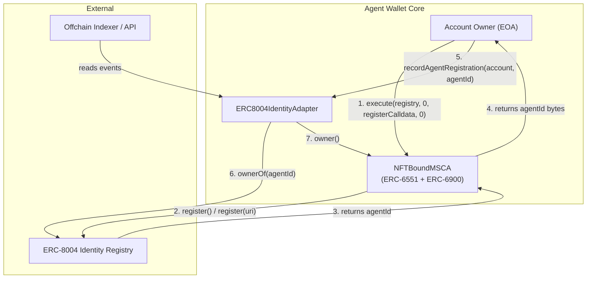

### Component Relationships

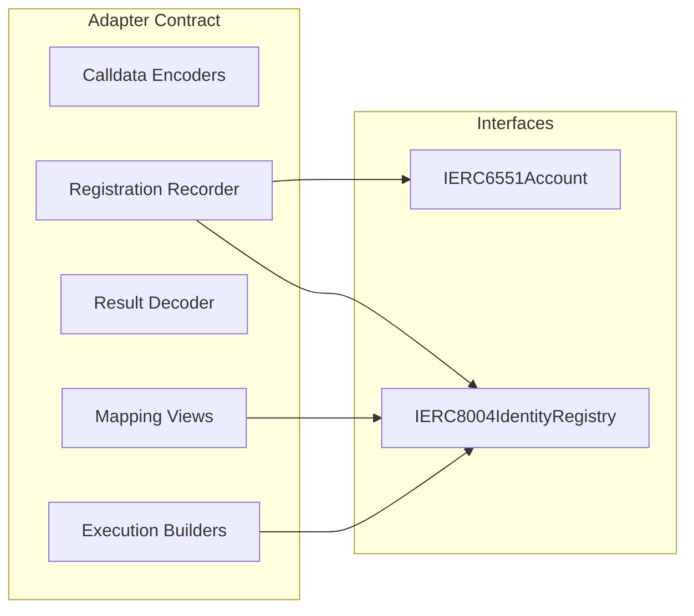

### Contract Dependency Graph

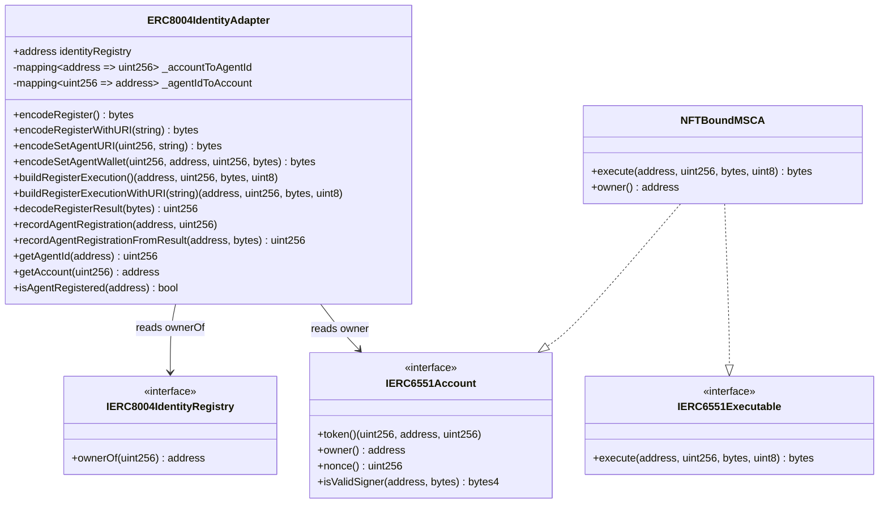

## Registration Flow

### End-to-End Sequence

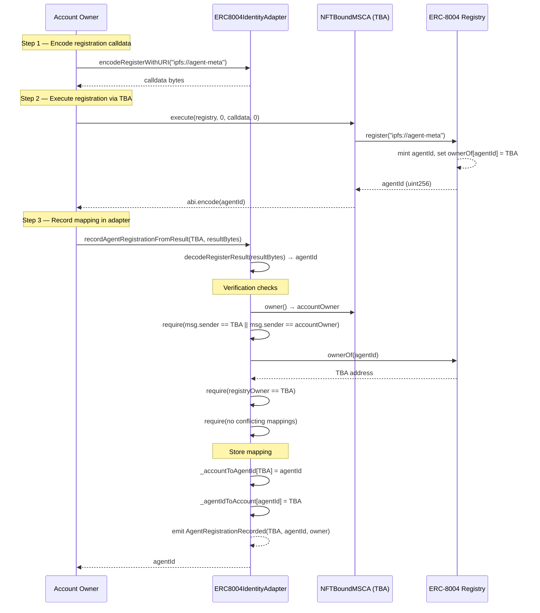

### Alternative: Direct Recording (Known agentId)

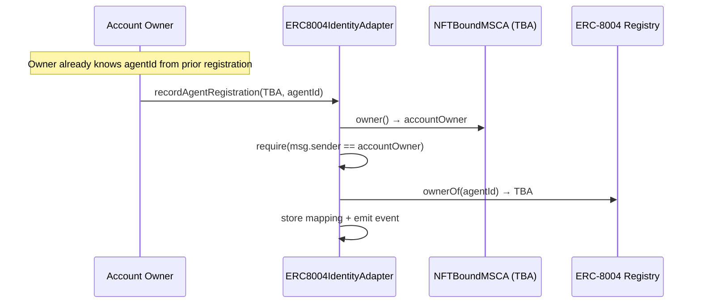

## Data Model

### Storage Layout

The adapter uses two simple mappings with no namespaced storage (it is not a module and does not share storage with the account).

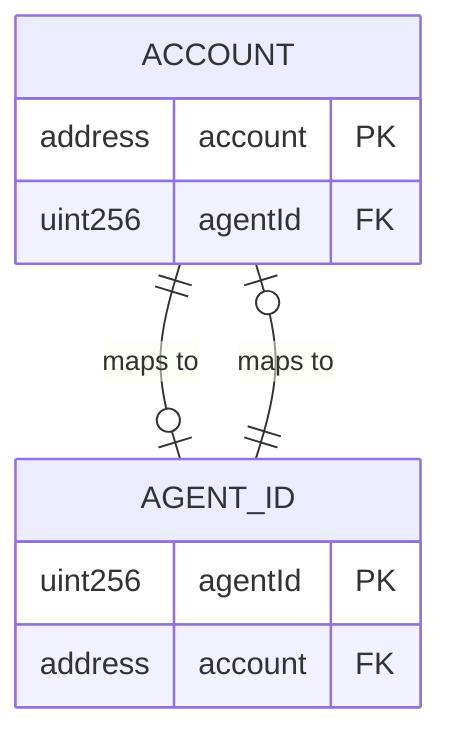

### Mapping Invariants

| Invariant | Enforcement |
|---|---|
| 1:1 account-to-agentId | `AccountAlreadyMapped` revert if `_accountToAgentId[account] != 0` and differs |
| 1:1 agentId-to-account | `AgentIdAlreadyMapped` revert if `_agentIdToAccount[agentId] != address(0)` and differs |
| Registry ownership proof | `ownerOf(agentId) == account` checked at record time |
| Caller authorization | `msg.sender == account` or `msg.sender == account.owner()` |
| Non-zero agentId | `agentId == 0` reverts with `InvalidAgentId` |
| Contract account only | `account.code.length == 0` reverts with `InvalidAccount` |

### Idempotent Re-recording

If `_accountToAgentId[account] == agentId` and `_agentIdToAccount[agentId] == account`, the same mapping can be re-recorded without revert. This supports retry-safe workflows where the owner may call `recordAgentRegistration` multiple times after a successful registry transaction.

## Calldata Encoding API

The adapter provides two categories of helpers for constructing ERC-8004 registry calls.

### Raw Calldata Encoders

These return ABI-encoded calldata suitable for passing to `IERC6551Executable.execute(target, value, data, operation)`.

| Function | Registry Selector | Returns |
|---|---|---|
| `encodeRegister()` | `register()` | `bytes` calldata |
| `encodeRegisterWithURI(string)` | `register(string)` | `bytes` calldata |
| `encodeSetAgentURI(uint256, string)` | `setAgentURI(uint256, string)` | `bytes` calldata |
| `encodeSetAgentWallet(uint256, address, uint256, bytes)` | `setAgentWallet(uint256, address, uint256, bytes)` | `bytes` calldata |

### Execution Tuple Builders

These return complete execution tuples `(target, value, data, operation)` with the registry address pre-filled. Useful for integrations that construct execution parameters programmatically.

| Function | Returns |
|---|---|
| `buildRegisterExecution()` | `(identityRegistry, 0, registerCalldata, 0)` |
| `buildRegisterExecutionWithURI(string)` | `(identityRegistry, 0, registerWithURICalldata, 0)` |

### Result Decoder

| Function | Input | Returns |
|---|---|---|
| `decodeRegisterResult(bytes)` | Raw `execute()` return bytes | `uint256 agentId` |

Reverts with `InvalidExecutionResult` if the result is not exactly 32 bytes.

## Verification Model

### Record-Time Verification

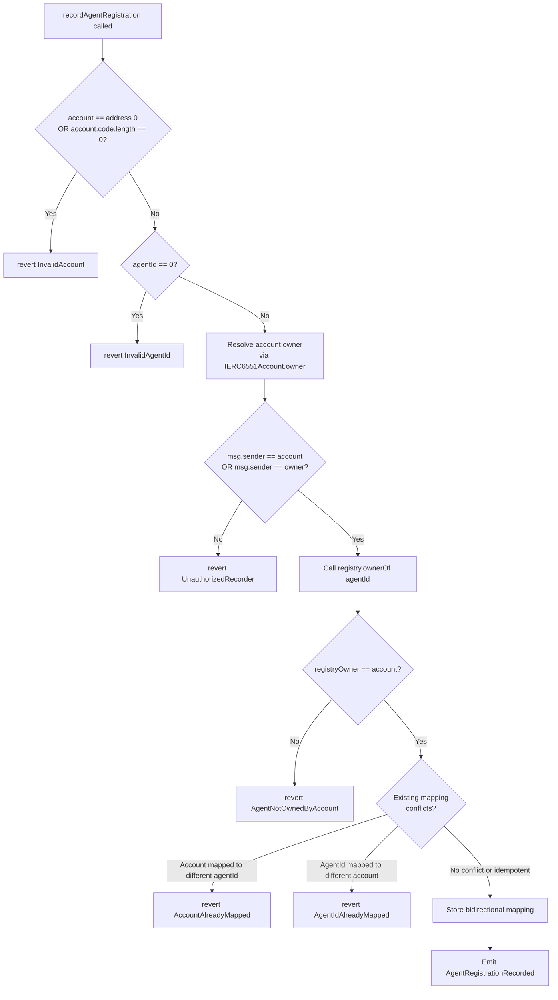

### Query-Time Liveness Check

`isAgentRegistered(address account)` does not simply return whether a mapping exists. It performs a live check:

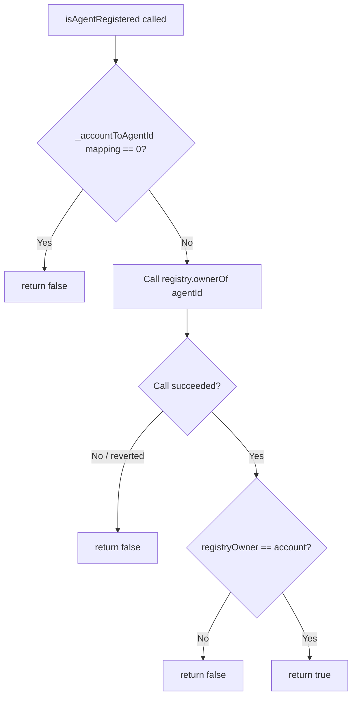

This means `isAgentRegistered` returns `false` if:
- no mapping was ever recorded
- the registry ownership has changed since recording (e.g., agent transferred)
- the registry call reverts (e.g., agentId burned or registry upgraded)

## Error Taxonomy

| Error | Condition | Severity |
|---|---|---|
| `InvalidIdentityRegistry(address)` | Constructor: registry has no code | Fatal (deploy-time) |
| `InvalidAccount(address)` | Account is zero address or has no code | Input validation |
| `InvalidAgentId(uint256)` | agentId is zero | Input validation |
| `InvalidExecutionResult(bytes)` | Decode result is not 32 bytes | Input validation |
| `UnauthorizedRecorder(address account, address caller, address owner)` | Caller is neither the account nor its owner | Authorization |
| `AgentNotOwnedByAccount(address account, uint256 agentId, address registryOwner)` | Registry `ownerOf` does not match account | Ownership proof |
| `AccountAlreadyMapped(address account, uint256 existingAgentId)` | Account already mapped to a different agentId | Conflict |
| `AgentIdAlreadyMapped(uint256 agentId, address existingAccount)` | agentId already mapped to a different account | Conflict |

## Integration with Account Types

The adapter works with any contract that implements `IERC6551Account.owner()` and `IERC6551Executable.execute()`. In Agent Wallet Core, this includes:

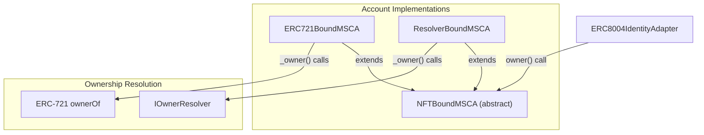

| Account Type | Ownership Source | Adapter Compatibility |
|---|---|---|
| `ERC721BoundMSCA` | `IERC721(tokenContract).ownerOf(tokenId)` | Full |
| `ResolverBoundMSCA` | `IOwnerResolver(resolver).resolveOwner(...)` | Full |
| Any `IERC6551Account` implementer | `owner()` return value | Full |

## Interaction with Other Standards

### ERC-6551 (Token Bound Accounts)

The adapter relies on ERC-6551 for two things:
1. `owner()` — to authorize who can record mappings
2. `execute(to, value, data, operation)` — as the execution surface through which registration calls reach the registry

The adapter does not call `execute` itself. It provides the calldata and execution tuples; the owner invokes `execute` on the TBA directly.

### ERC-6900 (Modular Smart Contract Accounts)

The adapter is explicitly not an ERC-6900 module. It does not:
- implement `IERC6900ValidationModule` or `IERC6900ExecutionModule`
- install into the account's module registry
- participate in validation or execution hook flows

This is a deliberate design choice. Identity registration is a lifecycle operation that happens once (or rarely). It does not need the overhead or trust surface of a module installation.

### ERC-8128 (Signed HTTP Requests)

ERC-8004 agent identity and ERC-8128 HTTP authentication are complementary:
- ERC-8004 provides the agent's onchain identity (`agentId`)
- ERC-8128 provides per-request authentication using the wallet as `keyid`

The adapter's `getAgentId(account)` view can be used by API gateways to resolve which agent identity is associated with a wallet making ERC-8128 authenticated requests.

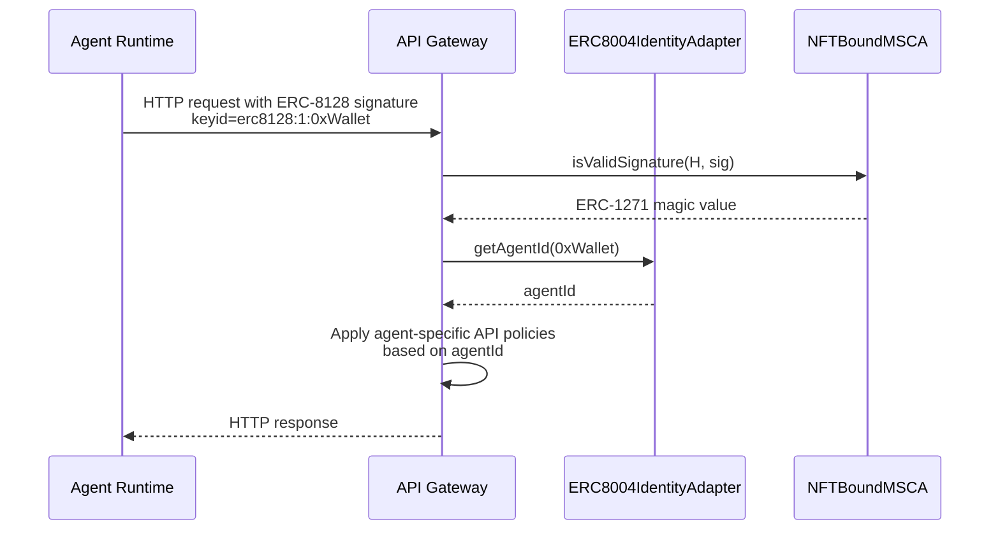

### ERC-4337 (Account Abstraction)

Registration can also be performed through ERC-4337 UserOps, though the adapter itself is agnostic to the execution path:

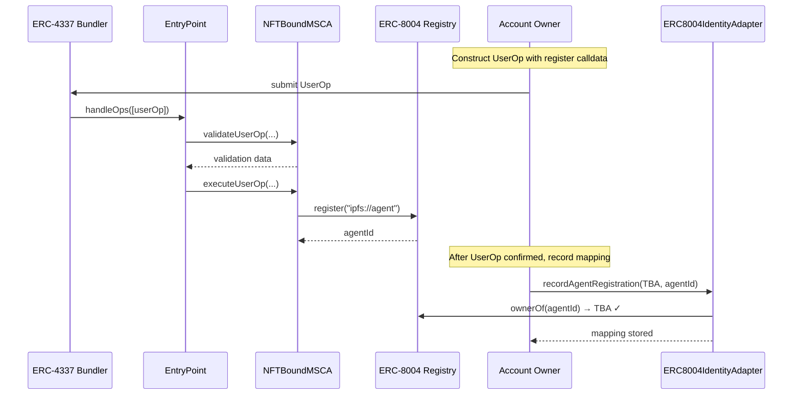

## Events

| Event | Parameters | Emitted When |
|---|---|---|
| `AgentRegistrationRecorded` | `address indexed account`, `uint256 indexed agentId`, `address indexed recorder` | Mapping successfully stored |

The `recorder` parameter distinguishes whether the mapping was recorded by the account itself or by its owner. This is useful for indexers tracking who initiated the registration workflow.

## Security Considerations

### Trust Assumptions

1. The ERC-8004 Identity Registry is trusted to correctly maintain `ownerOf` state. The adapter verifies against it but cannot detect a compromised registry.
2. The `IERC6551Account.owner()` implementation is trusted to return the correct owner. For `ERC721BoundMSCA`, this depends on the bound ERC-721 contract.
3. The adapter has no admin functions, no upgradeability, and no privileged roles. Its behavior is fully determined at construction time by the `identityRegistry` address.

### Attack Surface

| Vector | Mitigation |
|---|---|
| Unauthorized mapping recording | Caller must be account or account owner |
| Mapping to unowned agentId | `ownerOf(agentId)` must return the account |
| Double mapping (1:N or N:1) | Conflict checks revert on mismatch |
| Stale mapping after agent transfer | `isAgentRegistered` performs live registry check |
| Registry returning false owner | Out of scope — registry trust assumption |
| Front-running registration | Registry-level concern; adapter records post-facto |

### Immutability

The adapter's `identityRegistry` is set as `immutable` in the constructor. There is no mechanism to change the target registry after deployment. If the registry migrates, a new adapter instance must be deployed.

### Mapping Permanence

Once a mapping is recorded, it cannot be removed or overwritten (unless the same account/agentId pair is re-recorded idempotently). This is intentional: the adapter is an append-only record. Consumers should use `isAgentRegistered` for liveness checks rather than relying solely on the existence of a mapping.

## Deployment

### Constructor

```solidity
constructor(address identityRegistry_)
```

Reverts with `InvalidIdentityRegistry` if the provided address has no deployed code. This prevents misconfiguration with EOA addresses or undeployed contracts.

### Deployment Checklist

1. Verify the ERC-8004 Identity Registry is deployed and operational on the target chain.
2. Deploy `ERC8004IdentityAdapter` with the registry address.
3. Verify the adapter's `identityRegistry` immutable matches the intended registry.
4. No further configuration is needed — the adapter is ready to use immediately.

## Testing Strategy

### Unit Tests

The test suite (`test/adapters/ERC8004IdentityAdapter.t.sol`) covers:

| Test | Validates |
|---|---|
| `test_RecordAgentRegistration_FromTBAExecutionResult` | Full happy path: TBA executes registration, owner records mapping via result bytes, bidirectional mapping verified, event emitted |
| `test_RevertWhenRecorderIsNotAccountOwner` | Authorization: outsider cannot record mapping for an account they don't own |
| `test_RevertWhenAgentOwnerDoesNotMatchAccount` | Ownership proof: cannot map an agentId owned by a different account |
| `test_EncodeHelpers_ReturnCanonicalSelectors` | Calldata encoding: selectors match expected function signatures |
| `test_BuildRegisterExecution_TargetsConfiguredRegistry` | Execution builder: target is the configured registry, operation is CALL |
| `test_IdempotentReRecording_SameMapping` | Idempotency: re-recording the same account↔agentId mapping succeeds without conflict |
| `test_RevertWhenAccountAlreadyMappedToDifferentAgentId` | Conflict protection: `AccountAlreadyMapped` when an account is already linked to another agentId |
| `test_RevertWhenAgentIdAlreadyMappedToDifferentAccount` | Conflict protection: `AgentIdAlreadyMapped` when an agentId is already linked to another account |
| `test_IsAgentRegistered_ReturnsFalseAfterOwnershipTransfer` | Liveness: mapping can exist while live registry ownership has moved, so registration is not considered active |
| `test_IsAgentRegistered_ReturnsFalseWhenRegistryReverts` | Liveness hardening: `isAgentRegistered` safely returns `false` when `ownerOf` reverts |
| `test_RevertWhenAccountIsZeroAddress` | Input validation: `InvalidAccount` for zero-address account |
| `test_RevertWhenAccountIsEOA` | Input validation: `InvalidAccount` for EOA/non-contract account |
| `test_RevertWhenAgentIdIsZero` | Input validation: `InvalidAgentId` for zero-value id |
| `test_RevertWhenExecutionResultTooShort` | Decode validation: `InvalidExecutionResult` for short return payload |
| `test_RevertWhenExecutionResultTooLong` | Decode validation: `InvalidExecutionResult` for long return payload |
| `test_RevertWhenExecutionResultEmpty` | Decode validation: `InvalidExecutionResult` for empty return payload |
| `testFuzz_RecordAndQuery_WithValidRegistryState` | Fuzzed non-zero `agentId` mapping flow with valid ownership and live-registration check |
| `testFuzz_RecordAndQuery_RandomAccountAndAgentIdPair` | Fuzzed random account/agentId pair under valid registry ownership |
| `testFuzz_RejectZeroAgentId` | Fuzzed zero-id rejection path for `InvalidAgentId` |
| `testFuzz_RejectEOAAccount` | Fuzzed EOA rejection path for `InvalidAccount` |
| `testFuzz_DecodeRejectsBadLength` | Fuzzed decode rejection for any non-32-byte execution result |

## Open Questions

1. Should the adapter support batch registration recording for multiple accounts in a single transaction?
2. Should there be a mechanism to clear stale mappings when `isAgentRegistered` returns `false`?
3. Should the adapter emit an event when `isAgentRegistered` detects a stale mapping (for indexer awareness)?
4. Should future versions integrate as an ERC-6900 execution module to enable registration via the modular execution flow with hook support?
