# ERC-8128 Signed HTTP Requests with Ethereum Integration Design

Status: Draft

## Summary

This document describes how Agent Wallet Core integrates with [ERC-8128](https://eips.ethereum.org/EIPS/eip-8128) (Signed HTTP Requests with Ethereum) to provide session-based delegation for smart contract accounts authenticating HTTP requests. ERC-8128 defines how Ethereum accounts sign and verify HTTP requests using [RFC 9421 HTTP Message Signatures](https://www.rfc-editor.org/rfc/rfc9421). When the signing account is a Smart Contract Account (SCA), the verifier calls `isValidSignature` (ERC-1271) on the account to validate the request. This architecture provides the onchain policy and validation layer that makes SCA-based ERC-8128 signing practical.

The v2 design unifies two validation paths — gateway (ERC-1271) and account abstraction (ERC-4337) — under a single onchain policy registry and a shared cryptographic envelope. Both paths read from the same policy state, share the same revocation model, and use the same EIP-712 typed-data scheme for inner session delegation signatures.

Core outcomes:
- single policy registry and revocation model across gateway and AA validation
- canonical `SessionAuthV2` envelope with explicit mode binding
- EIP-712 typed signing for inner session delegation (does not replace ERC-8128 outer HTTP signatures)
- per-call AA scope verification including `executeBatch(...)` via Merkle multiproof
- guardian emergency controls, install-time presets, and normalized eventing

## Scope

In scope:
- ERC-8128 gateway signature path (`validateSignature` / ERC-1271)
- ERC-4337 path (`validateUserOp`) with AA call constraints
- unified policy storage, revocation, and digest conventions
- security model and test strategy

Out of scope:
- ERC-8128 outer HTTP signature construction and verification (handled by the offchain gateway)
- RFC 9421 parsing, canonicalization, and replay store implementation
- v1 backward compatibility (this is a clean-break v2)
- trustless onchain reconstruction of raw HTTP traffic

## Design Goals

1. Consistency: identical policy semantics across gateway and AA modules.
2. Safety: bounded delegation blast radius for both API and onchain execution.
3. Explicitness: payloads bind mode, module, account, chain, and policy epoch/nonce.
4. Efficiency: compact policy storage (Merkle root), scalable batch verification (multiproof).
5. Operability: emergency controls and deterministic revocation propagation.

## Non-Goals

1. One module for all paths at runtime. Dedicated modules are kept, but they share policy and logic.
2. Hidden defaults. Security-sensitive behavior is explicit and testable.
3. Replacing ERC-8128 HTTP signature construction or verification.

## ERC-8128 Compliance Profile

This v2 design is an extension around ERC-8128, not a replacement for ERC-8128 core verification semantics.

### Relationship to ERC-8128

ERC-8128 defines how an Ethereum account signs and verifies HTTP requests:
1. The client selects HTTP request components (method, authority, path, query, content-digest) and constructs a signature base `M` per RFC 9421.
2. The client computes `H = keccak256("\x19Ethereum Signed Message:\n" || len(M) || M)` and signs `H`.
3. The verifier reconstructs `M`, recomputes `H`, and verifies the signature — either by ECDSA recovery (EOA) or by calling `isValidSignature(H, sig)` on the SCA (ERC-1271).

This architecture handles step 3 for SCAs. When the gateway calls `isValidSignature`, the account delegates to the gateway validation module, which validates the session delegation envelope and returns the ERC-1271 magic value if the session key is authorized.

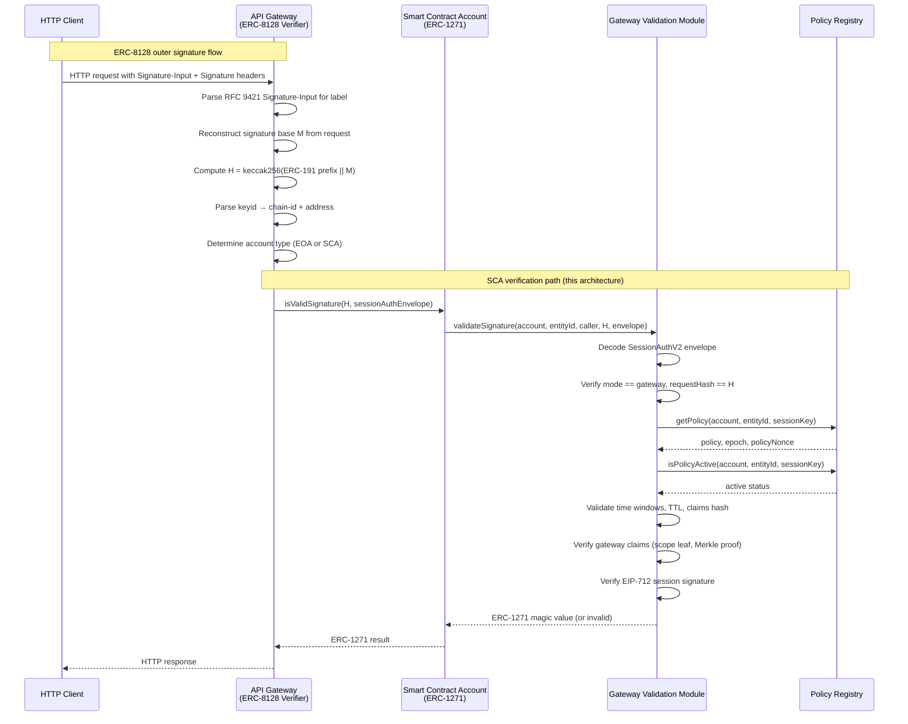

### Conformance Matrix

| ERC-8128 Requirement | Enforcement Location | Notes |
|---|---|---|
| Request-Bound minimum covered components | Gateway verifier (offchain) | RFC 9421 parsing and policy checks |
| Non-Replayable signatures MUST include `nonce` | Gateway verifier + `GatewayClaimsV2.nonceHash` | Nonce binding verified in module |
| Verifier MUST enforce (`keyid`, `nonce`) uniqueness | Gateway replay store (offchain) | Atomic check+insert in gateway |
| Verifier MUST reject Non-Replayable when validity exceeds retention window | Gateway replay policy (offchain) | Retention-window guard |
| Baseline: MUST accept Request-Bound + Non-Replayable | Gateway acceptance policy (offchain) | Preserved in v2 |
| `keyid` MUST be `erc8128:<chain-id>:<address>` | Gateway verifier + account resolution | Chain-scoped SCA/EOA resolution |
| `created`/`expires` time-window enforcement | Gateway verifier (outer) + module (inner) | Both layers enforce |
| Signature base `M` via RFC 9421, `H` via ERC-191 | Gateway verifier (offchain) | v2 does not alter `M`/`H` construction |
| EOA verification via ERC-191 | Gateway verifier (offchain) | Standard ECDSA recovery |
| SCA verification via ERC-1271 | Gateway verifier → module (onchain) | This architecture |
| Replayable acceptance requires early invalidation | Gateway replay policy (offchain) | Policy-driven |
| Invalidation endpoints require Request-Bound auth | Gateway/API policy layer | Deployment requirement |

## Architecture

### System Context

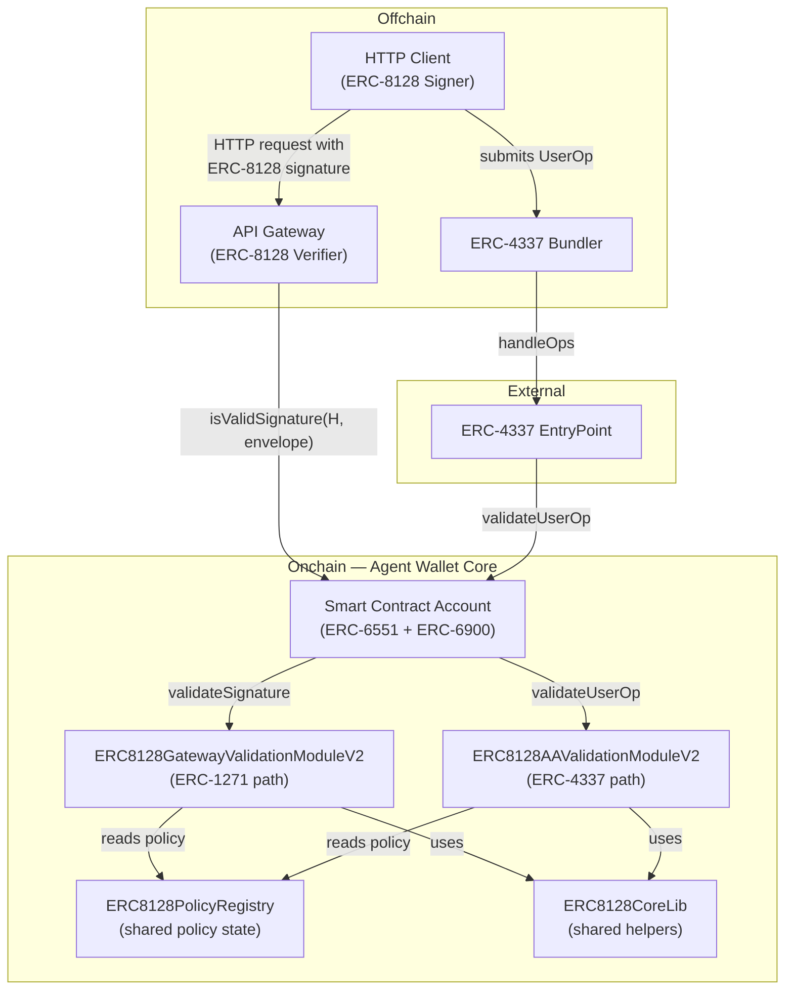

### Component Responsibilities

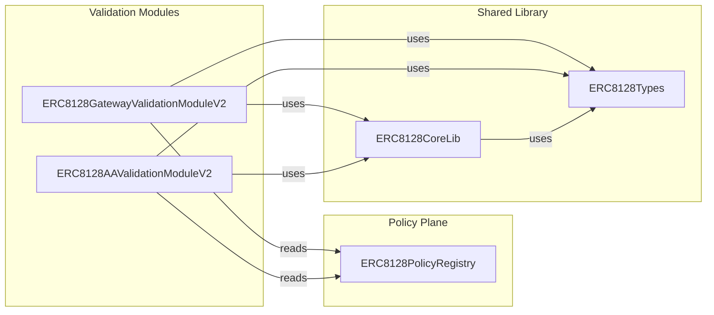

| Component | Responsibility |
|---|---|
| `ERC8128PolicyRegistry` | Canonical onchain registry for session policy state. Stores epoch, per-key policy nonce, policy config, scope roots, budget/rate controls. Emits all revocation/rotation/config events. |
| `ERC8128GatewayValidationModuleV2` | ERC-6900 validation module for the ERC-1271 path (`validateSignature`). Validates gateway-oriented claims against registry + scope proof. Rejects `validateUserOp` and `validateRuntime`. |
| `ERC8128AAValidationModuleV2` | ERC-6900 validation module for the ERC-4337 path (`validateUserOp`). Validates AA call claims (single or batch) against registry + Merkle proof/multiproof. Rejects `validateSignature` and `validateRuntime`. |
| `ERC8128CoreLib` | Shared pure/view helpers: key derivation, EIP-712 domain/struct hashing, scope leaf computation, claims hashing, session signer verification, validation data packing. |
| `ERC8128Types` | Canonical struct definitions: `SessionPolicyV2`, `SessionAuthV2`, `GatewayClaimsV2`, `AAClaimsV2`, `AACallClaimV2`, `ParsedCall`. |

### Contract Dependency Graph

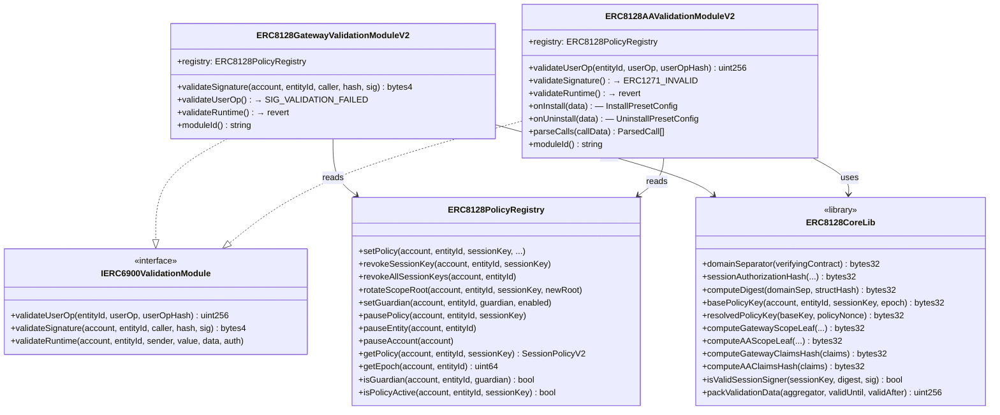

## Canonical Data Model

### Struct Definitions

```solidity
struct SessionPolicyV2 {
    bool active;
    uint48 validAfter;
    uint48 validUntil;       // 0 = unbounded
    uint32 maxTtlSeconds;
    bytes32 scopeRoot;       // Merkle root of allowed scope leaves
    uint64 maxCallsPerPeriod;
    uint128 maxValuePerPeriod;
    uint48 periodSeconds;
    bool paused;
}

struct SessionAuthV2 {
    uint8 mode;              // 0 = gateway, 1 = AA
    address sessionKey;
    uint64 epoch;
    uint64 policyNonce;
    uint48 created;
    uint48 expires;
    bytes32 requestHash;     // gateway: H from ERC-8128, AA: userOpHash
    bytes32 claimsHash;      // keccak256(abi.encode(mode-specific claims))
    bytes sessionSignature;  // EIP-712 typed-data signature by sessionKey
    bytes claims;            // ABI-encoded mode-specific claims
}

struct GatewayClaimsV2 {
    uint16 methodBit;
    bytes32 authorityHash;
    bytes32 pathPrefixHash;
    bool isReadOnly;
    bool allowReplayable;
    bool allowClassBound;
    uint32 maxBodyBytes;
    bool isReplayable;
    bool isClassBound;
    bytes32 nonceHash;
    bytes32 scopeLeaf;
    bytes32[] scopeProof;
}

struct AACallClaimV2 {
    address target;
    bytes4 selector;
    uint256 valueLimit;
    bool allowDelegateCall;
    bytes32 scopeLeaf;
    bytes32[] scopeProof;    // used for single-call proofs
}

struct AAClaimsV2 {
    AACallClaimV2[] callClaims;
    bytes32[] multiproof;    // used for batch Merkle multiproof
    bool[] proofFlags;
    bytes32 leafOrderHash;   // optional: binds call ordering
}
```

### Policy Keying

Policy state is keyed by a two-level hash:

```
basePolicyKey  = keccak256(account, entityId, sessionKey, epoch)
resolvedPolicyKey = keccak256(basePolicyKey, policyNonce)
```

This enables two revocation granularities:
- Incrementing `epoch` invalidates all session keys for an `(account, entityId)` pair.
- Incrementing `policyNonce` invalidates a single session key without affecting others.

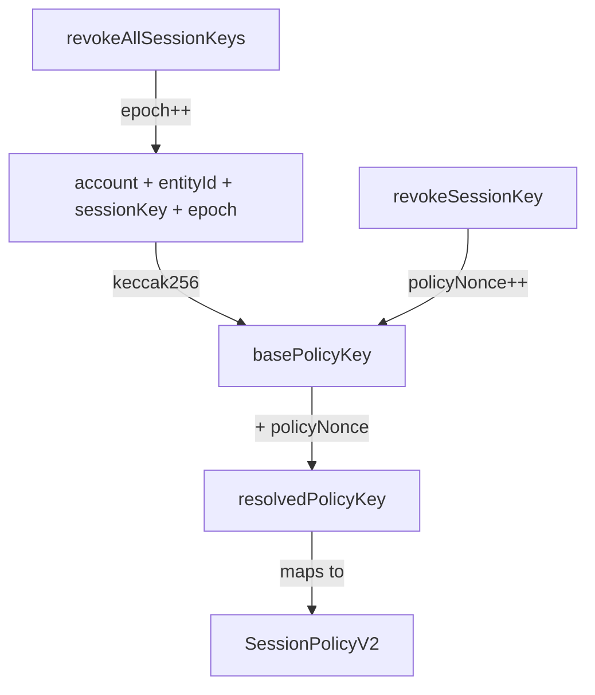

## Cryptographic Scheme

### Two-Layer Signature Model

The architecture uses a two-layer signature model. The outer layer is ERC-8128 (handled by the offchain gateway). The inner layer is EIP-712 (handled by the onchain modules).

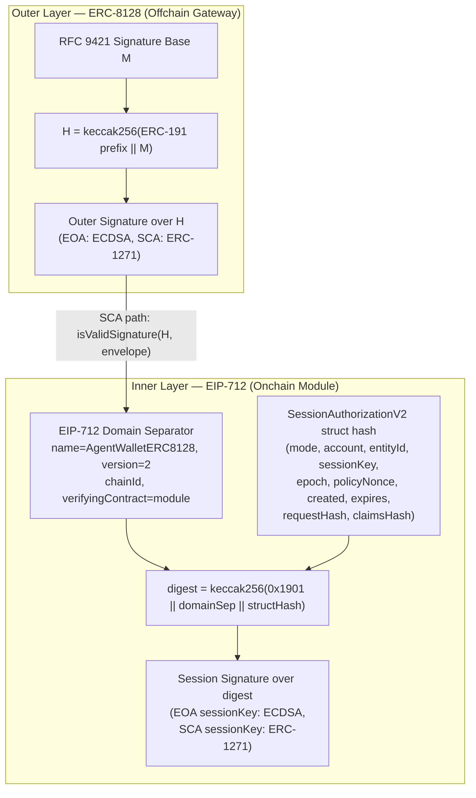

### EIP-712 Domain

```
name            = "AgentWalletERC8128"
version         = "2"
chainId         = block.chainid
verifyingContract = module address
```

The `verifyingContract` is the module address (gateway or AA), not the account address. This prevents cross-module replay: a session signature created for the gateway module cannot be accepted by the AA module, and vice versa.

### EIP-712 Typed Struct

```
SessionAuthorizationV2(
    uint8 mode,
    address account,
    uint32 entityId,
    address sessionKey,
    uint64 epoch,
    uint64 policyNonce,
    uint48 created,
    uint48 expires,
    bytes32 requestHash,
    bytes32 claimsHash
)
```

### Mandatory Bindings

The inner signature binds:
- `mode` — prevents gateway ↔ AA replay
- `account` — prevents cross-account replay
- `entityId` — prevents cross-entity replay
- `verifyingContract` (via domain) — prevents cross-module replay
- `chainId` (via domain) — prevents cross-chain replay
- `requestHash` — binds to the specific outer request (`H` for gateway, `userOpHash` for AA)
- `claimsHash` — binds to the exact claims payload, preventing claim tampering

## Validation Flows

### Gateway Validation (ERC-1271 Path)

The gateway module handles `validateSignature` calls from the account when an offchain ERC-8128 verifier calls `isValidSignature(H, sig)`.

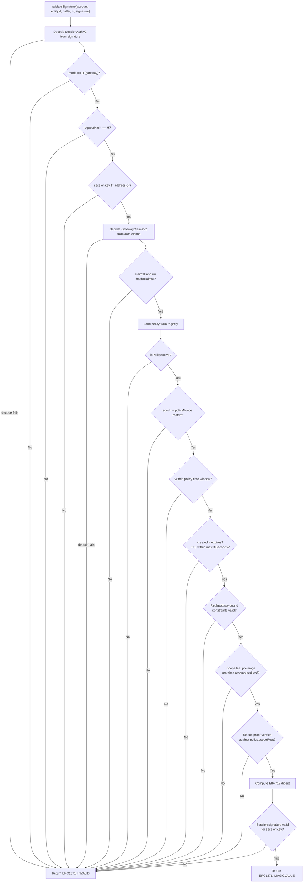

### Gateway Claims Constraints

The gateway module enforces these constraints on `GatewayClaimsV2`:

| Constraint | Rule |
|---|---|
| Non-replayable nonce binding | If `!isReplayable`, then `nonceHash != bytes32(0)` |
| Replayable permission | If `isReplayable`, then `allowReplayable` must be true |
| Class-bound permission | If `isClassBound`, then `allowClassBound` must be true |
| Read-only enforcement | If `isReplayable` or `isClassBound`, then `isReadOnly` must be true |
| Scope leaf integrity | Recomputed leaf from preimage fields must match `scopeLeaf` |
| Scope membership | `scopeLeaf` must verify against `policy.scopeRoot` via Merkle proof |

### Scope Leaf Construction (Gateway)

```
scopeLeaf = keccak256(abi.encode(
    "AW_ERC8128_SCOPE_LEAF_V2",
    methodBit,
    authorityHash,
    pathPrefixHash,
    isReadOnly,
    allowReplayable,
    allowClassBound,
    maxBodyBytes
))
```

### AA Validation (ERC-4337 Path)

The AA module handles `validateUserOp` calls from the account during ERC-4337 UserOperation validation.

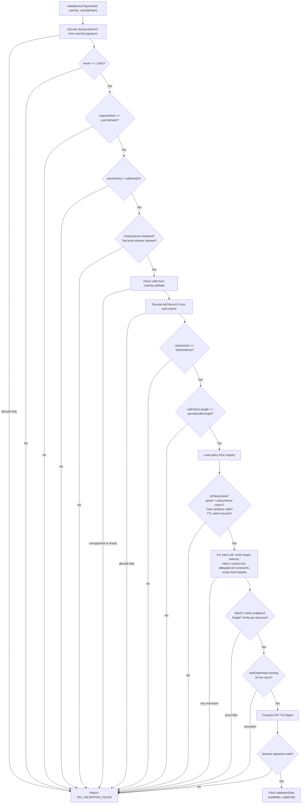

### Supported Execution Selectors (AA)

The AA module parses calls from three execution selectors:

| Selector | Signature | Behavior |
|---|---|---|
| `execute` | `execute(address,uint256,bytes)` | Single call, no delegatecall |
| `execute` (with operation) | `execute(address,uint256,bytes,uint8)` | Single call, operation 0=CALL, 1=DELEGATECALL. Delegatecall with value > 0 is rejected. |
| `executeBatch` | `executeBatch((address,uint256,bytes)[])` | Batch calls, no delegatecall. Uses Merkle multiproof for scope verification. |

### Scope Leaf Construction (AA)

```
scopeLeaf = keccak256(abi.encode(
    "AW_ERC8128_AA_SCOPE_LEAF_V2",
    target,
    selector,
    valueLimit,
    allowDelegateCall
))
```

### AA Install Presets

The AA module requires an install-time preset configuration before it will accept any `validateUserOp` calls. This provides secure defaults and prevents unconstrained session validation.

```solidity
struct InstallPresetConfig {
    address account;
    uint32 entityId;
    bytes4[] allowedSelectors;    // top-level selectors the module will accept
    bool defaultAllowDelegateCall;
    uint32 minTtlSeconds;         // minimum session TTL
    uint32 maxTtlSeconds;         // maximum session TTL (0 = no upper bound)
}
```

The preset is installed by the account itself (`msg.sender == config.account`) and enforces:
- only listed top-level selectors are accepted
- TTL must fall within `[minTtlSeconds, maxTtlSeconds]`
- delegatecall is blocked unless explicitly allowed per-claim or via `defaultAllowDelegateCall`

## Policy Registry

### Overview

`ERC8128PolicyRegistry` is the single source of truth for all session policy state. Both validation modules read from it. All policy mutations (set, revoke, rotate, pause) are performed through the registry by the account owner or authorized guardians.

### Authorization Model

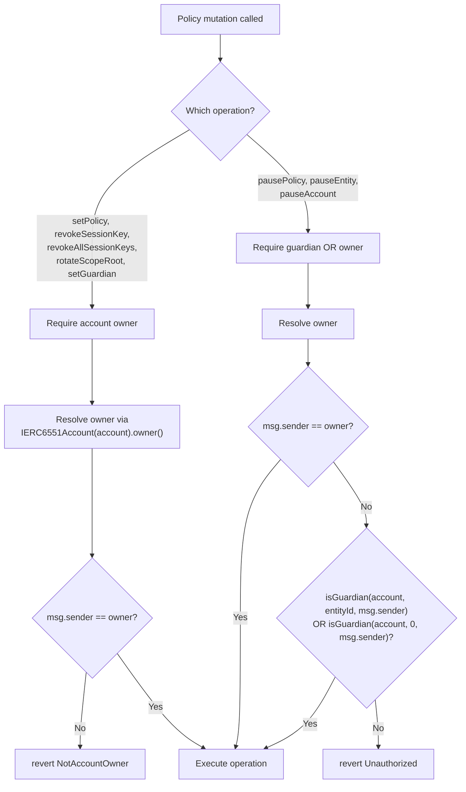

### Revocation Model

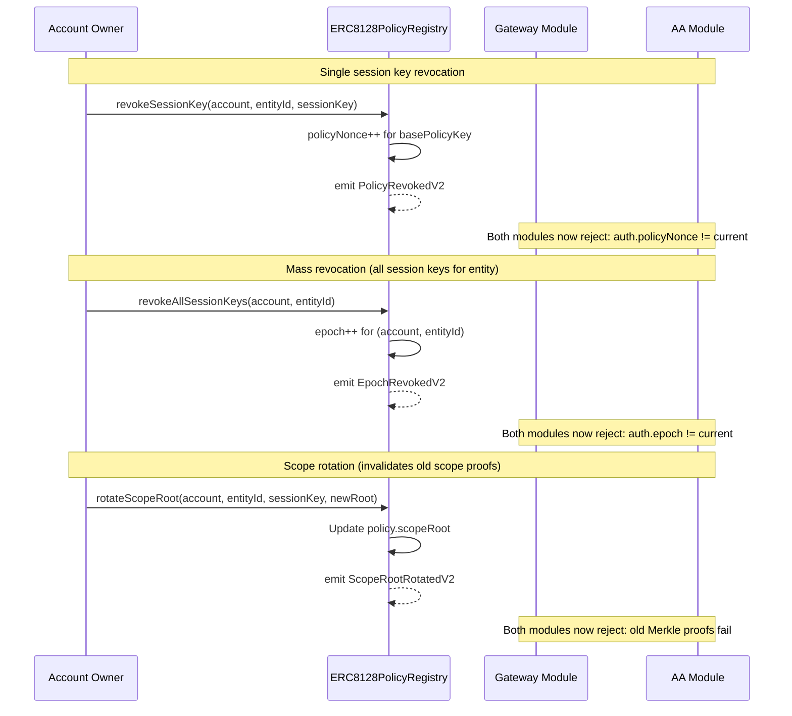

### Guardian Emergency Controls

Guardians provide an emergency pause mechanism that does not require the account owner's private key. This is useful for incident response when a session key may be compromised.

| Function | Scope | Authorization |
|---|---|---|
| `pausePolicy(account, entityId, sessionKey)` | Single session key | Guardian for entityId or entity 0, or owner |
| `pauseEntity(account, entityId)` | All session keys for entity | Guardian for entityId or entity 0, or owner |
| `pauseAccount(account)` | All session keys for account | Guardian for entity 0, or owner |

Guardian assignment is entity-scoped. A guardian assigned to `entityId = 0` has cross-entity pause authority for that account.

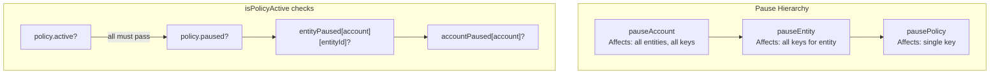

### Events

| Event | Parameters | Emitted When |
|---|---|---|
| `PolicySetV2` | account, entityId, sessionKey, policyNonce, validAfter, validUntil, maxTtlSeconds, scopeRoot, maxCallsPerPeriod, maxValuePerPeriod, periodSeconds | New policy created |
| `PolicyRevokedV2` | account, entityId, sessionKey, policyNonce | Session key revoked (policyNonce incremented) |
| `EpochRevokedV2` | account, entityId, epoch | All session keys revoked (epoch incremented) |
| `ScopeRootRotatedV2` | account, entityId, sessionKey, policyNonce, scopeRoot | Scope root updated |
| `GuardianPauseSetV2` | account, entityId, sessionKey, paused | Pause state changed |

## Shared Core Library

`ERC8128CoreLib` provides deterministic, pure/view helpers used by both modules. This eliminates logic duplication and ensures both validation paths compute identical digests, keys, and leaves.

### Key Functions

| Function | Purpose |
|---|---|
| `domainSeparator(verifyingContract)` | EIP-712 domain separator for current chain |
| `domainSeparatorForChain(chainId, verifyingContract)` | EIP-712 domain separator for arbitrary chain |
| `sessionAuthorizationHash(...)` | EIP-712 struct hash for `SessionAuthorizationV2` |
| `computeDigest(domainSep, structHash)` | Final EIP-712 digest: `keccak256(0x1901 \|\| domainSep \|\| structHash)` |
| `basePolicyKey(account, entityId, sessionKey, epoch)` | First-level policy key |
| `resolvedPolicyKey(baseKey, policyNonce)` | Second-level policy key |
| `computeGatewayScopeLeaf(...)` | Tagged scope leaf for gateway claims |
| `computeAAScopeLeaf(...)` | Tagged scope leaf for AA claims |
| `computeGatewayClaimsHash(claims)` | Hash commitment for gateway claims |
| `computeAAClaimsHash(claims)` | Hash commitment for AA claims |
| `isValidSessionSigner(sessionKey, digest, sig)` | Verify session signature (EOA via ECDSA recovery, SCA via ERC-1271) |
| `packValidationData(aggregator, validUntil, validAfter)` | Pack ERC-4337 validation data |
| `serializeDomain(verifyingContract)` / `parseDomain(encoded)` | EIP-712 domain string round-trip |

### Session Signer Verification

The library supports both EOA and SCA session keys:

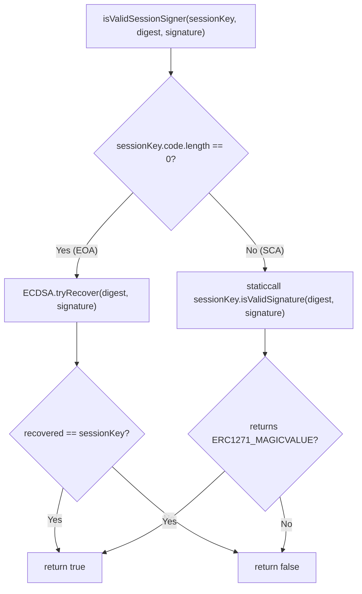

## Security Considerations

### Cross-Module Replay Prevention

A session signature is bound to a specific module via the EIP-712 `verifyingContract` field. A signature created for the gateway module produces a different digest than one created for the AA module, even with identical parameters. This prevents:

- A gateway session envelope from being accepted by the AA module
- An AA session envelope from being accepted by the gateway module
- A session envelope signed against one deployment from being accepted by another

### Cross-Mode Replay Prevention

The `mode` field (0 = gateway, 1 = AA) is included in the EIP-712 struct hash. Each module checks that the mode matches its expected value before proceeding with validation. A gateway envelope with `mode = 0` is rejected by the AA module (which expects `mode = 1`), and vice versa.

### Claims Hash Binding

The `claimsHash` field in `SessionAuthV2` is a `keccak256` commitment to the ABI-encoded claims payload. The session signature covers `claimsHash` via the EIP-712 struct. If any field in the claims is tampered with after signing, the recomputed hash will not match `claimsHash`, and validation fails before the session signature is even checked.

### Request Hash Binding

The `requestHash` field binds the session envelope to a specific outer request:
- For gateway: `requestHash` must equal `H` (the ERC-8128 hash passed to `isValidSignature`)
- For AA: `requestHash` must equal `userOpHash` (the ERC-4337 UserOperation hash)

This prevents a session envelope from being reused across different requests.

### Scope Leaf Integrity

Scope leaves are recomputed from their preimage fields and compared against the claimed `scopeLeaf`. This prevents an attacker from substituting a valid Merkle proof for a different leaf. The tagged prefix (`AW_ERC8128_SCOPE_LEAF_V2` / `AW_ERC8128_AA_SCOPE_LEAF_V2`) prevents cross-domain leaf collisions between gateway and AA scope trees.

### Trust Assumptions

1. The offchain gateway is trusted to correctly implement ERC-8128 outer signature verification (RFC 9421 parsing, ERC-191 hashing, replay store).
2. The `IERC6551Account.owner()` implementation is trusted to return the correct owner for authorization checks in the registry.
3. The ERC-4337 EntryPoint is trusted to correctly invoke `validateUserOp` and enforce the returned validation data.
4. OpenZeppelin's `MerkleProof` and `ECDSA` libraries are trusted for cryptographic correctness.

### Attack Surface

| Vector | Mitigation |
|---|---|
| Session key compromise | Revoke via `revokeSessionKey` or `pausePolicy`. Guardian can pause without owner key. |
| Mass session key compromise | `revokeAllSessionKeys` increments epoch, invalidating all keys for the entity. |
| Scope escalation | Merkle proof verification against `scopeRoot`. Leaf preimage recomputation prevents substitution. |
| Cross-module replay | EIP-712 `verifyingContract` binding to module address. |
| Cross-mode replay | `mode` field in EIP-712 struct hash + module-level mode check. |
| Cross-chain replay | EIP-712 `chainId` binding. |
| Claims tampering | `claimsHash` commitment in signed struct. |
| Delegatecall abuse (AA) | Per-claim `allowDelegateCall` flag + install preset `defaultAllowDelegateCall`. Delegatecall with value > 0 rejected. |
| Unbounded session TTL | `maxTtlSeconds` in policy + `minTtlSeconds`/`maxTtlSeconds` in AA install preset. |
| Stale policy after rotation | Scope root rotation invalidates old proofs. Epoch/nonce rotation invalidates old signatures. |

## Interaction with Other Standards

### ERC-8128 (Signed HTTP Requests with Ethereum)

This architecture is the SCA verification backend for ERC-8128. The offchain gateway handles all ERC-8128 concerns (RFC 9421 parsing, signature base construction, ERC-191 hashing, replay store, nonce enforcement). When the `keyid` in the ERC-8128 signature resolves to an SCA, the gateway calls `isValidSignature(H, sig)` on the account, which delegates to the gateway validation module.

### ERC-6900 (Modular Smart Contract Accounts)

Both validation modules implement `IERC6900ValidationModule` and are installed into the account's module registry. They participate in the ERC-6900 validation flow:
- Gateway module: `validateSignature` (ERC-1271 path)
- AA module: `validateUserOp` (ERC-4337 path)

Neither module implements `validateRuntime` (both revert).

### ERC-6551 (Token Bound Accounts)

The policy registry uses `IERC6551Account(account).owner()` to authorize policy mutations. This means the registry works with any account that implements the ERC-6551 `owner()` interface, including `ERC721BoundMSCA` and `ResolverBoundMSCA`.

### ERC-4337 (Account Abstraction)

The AA module returns packed validation data compatible with the ERC-4337 EntryPoint:
- `validAfter` = max(auth.created, policy.validAfter)
- `validUntil` = min(auth.expires, policy.validUntil) (or auth.expires if policy.validUntil == 0)
- `aggregator` = address(0) (no aggregator)

### ERC-1271 (Standard Signature Validation)

The gateway module returns `0x1626ba7e` (ERC-1271 magic value) on success and `0xffffffff` on failure. The account's ERC-1271 implementation delegates to the module via the ERC-6900 validation flow.

### ERC-8004 (Agent Identity Registry)

ERC-8004 agent identity and ERC-8128 HTTP authentication are complementary. An API gateway can resolve which agent identity is associated with a wallet making ERC-8128 authenticated requests by calling `ERC8004IdentityAdapter.getAgentId(account)` after verifying the ERC-8128 signature.

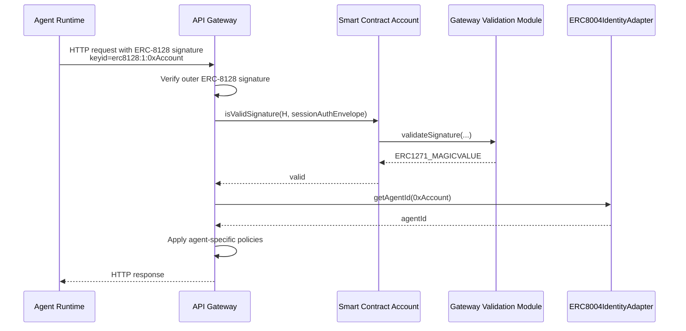

## Testing Strategy

### Test Organization

| Test File | Focus |
|---|---|
| `test/core/ERC8128PolicyRegistry.t.sol` | Policy storage, authorization, revocation, guardian controls |
| `test/libraries/ERC8128CoreLib.t.sol` | Digest computation, key derivation, scope leaves, signer verification |
| `test/modules/ERC8128GatewayValidationModuleV2.t.sol` | Gateway validation happy path and tamper rejection |
| `test/modules/ERC8128AAValidationModuleV2.t.sol` | AA validation, call parsing, multiproof, install presets |
| `test/modules/ERC8128V2CrossCutting.t.sol` | Cross-module revocation, scope rotation, replay prevention, claims/request hash binding |
| `test/modules/ERC8128V2UnitConformance.t.sol` | Interface conformance, edge cases, event emission |
| `test/gateway/ERC8128GatewayConformance.t.sol` | Gateway parity vectors (created/expires/nonce/body checks) |

### Property Tests (Fuzz)

| Property | Description |
|---|---|
| P1: Policy storage round-trip | Any valid policy written to the registry can be read back with identical fields. |
| P2: Non-owner authorization rejection | No non-owner caller can perform any policy mutation. |
| P3: Invalid time window rejection | `validUntil > 0 && validUntil <= validAfter` always reverts. |
| P4: Session key revocation invalidates both modules | After `revokeSessionKey`, both gateway and AA reject previously valid envelopes. |
| P5: Epoch revocation invalidates all session keys | After `revokeAllSessionKeys`, all session keys for the entity are rejected by both modules. |
| P6: Scope root rotation updates active policy | After `rotateScopeRoot`, old proofs fail and new proofs succeed on both modules. |
| P7: Guardian pause enforcement | Guardians can pause at policy/entity/account level; outsiders cannot. |
| P8: Guardian role management round-trip | Guardian assignment and revocation correctly gates pause authority. |
| P9: EIP-712 digest computation determinism | Domain separator, struct hash, and final digest match manual computation for all inputs. |
| P10: EIP-712 domain serialization round-trip | `serialize → parse → serialize` produces identical output. |
| P11: Scope leaf and claims hash determinism | All leaf and hash computations match manual `keccak256(abi.encode(...))` for all inputs. |
| P12: Valid gateway session signature acceptance | A correctly constructed gateway envelope is accepted. |
| P13: Gateway validation rejection on tampered fields | Tampering any field (mode, requestHash, epoch, policyNonce, nonce, replay flags, proof, signer, callHash) causes rejection. |
| P14: Valid AA session signature acceptance | A correctly constructed AA envelope is accepted with correct validationData. |
| P15: AA claim constraint enforcement | Mismatched cardinality, exceeded value limits, unauthorized delegatecall, and wrong targets are rejected. |
| P16: AA multiproof verification | Valid batch multiproofs are accepted; invalid multiproofs are rejected. |
| P17: Call parsing correctness | `execute`, `execute(…,uint8)`, and `executeBatch` are parsed correctly; unsupported selectors return `supported = false`. |
| P18: Cross-module and cross-mode replay prevention | Gateway envelopes are rejected by AA; AA envelopes signed with wrong domain are rejected. |
| P19: Install preset enforcement | Without preset: rejected. Wrong selector preset: rejected. Correct preset: accepted. After uninstall: rejected. |
| P20: Claims hash binding | Tampering claims payload (without re-signing) causes rejection on both modules. |
| P21: Request hash binding | Presenting a valid envelope against a different request/userOp hash causes rejection. |

### Gateway Conformance Vectors

The gateway conformance test suite (`ERC8128GatewayConformance.t.sol`) validates parity between offchain gateway parsing and onchain session envelope fields:

| Vector | Validates |
|---|---|
| Created mismatch | Reject when `Signature-Input.created != SessionAuth.created` |
| Expires mismatch | Reject when `Signature-Input.expires != SessionAuth.expires` |
| Nonce hash mismatch | Reject non-replayable request when parsed nonce hash differs |
| Body bytes exceeded | Reject when request body length exceeds `maxBodyBytes` |
| Request hash mismatch | Reject when outer `H` differs from `SessionAuth.requestHash` |
| Matching inputs | Accept when all fields match and ERC-1271 returns magic value |

## Deployment

### Deployment Order

1. Deploy `ERC8128PolicyRegistry`.
2. Deploy `ERC8128GatewayValidationModuleV2(registryAddress)`.
3. Deploy `ERC8128AAValidationModuleV2(registryAddress)`.
4. Install modules in target accounts via ERC-6900 module installation.
5. For AA module: call `onInstall` with `InstallPresetConfig` from the account.
6. Set policies via `registry.setPolicy(...)` from the account owner.
7. Optionally assign guardians via `registry.setGuardian(...)`.
8. Update offchain gateway to issue `SessionAuthV2` envelopes and verify via ERC-1271.

### Constructor Validation

Both modules revert with `InvalidRegistry(address(0))` if constructed with a zero-address registry. This prevents misconfiguration.

## Open Questions

1. Should AA claim matching be strict order or canonical sorted matching?
2. Should batch semantics permit extra claims not used by the current request?
3. Should guardian pauses be global fail-closed for both gateway and AA by default?
4. Should per-period rate limits be enforced onchain for AA only, or both paths via gateway parity telemetry?
