# SIWA (Sign In With Agent) Integration Design

Status: Draft

## Summary

This document describes the `SIWAValidationModule` in Agent Wallet Core. The module implements SIWA (Sign In With Agent) verification at the ERC-1271 boundary so AI agents can prove ERC-8004 identity ownership to relying parties using onchain account-backed signatures.

SIWA is the primary gateway authentication surface in this design. ERC-8128 policy data and ERC-6900 account plumbing are supporting components used to enforce revocation, pause, and session controls after SIWA signer verification succeeds.

Core outcomes:
- SIWA-native gateway authentication via `SIWAValidationModule`
- cryptographic proof of agent identity ownership via SIWA challenge-response
- shared policy enforcement across SIWA gateway auth and AA session delegation
- unified policy registry shared between gateway and AA validation modules
- private key isolation via keyring proxy architecture
- revocable session delegation with policy-enforced time windows and Merkle-scoped AA permissions

## Scope

In scope:
- `SIWAValidationModule` for ERC-1271 gateway path
- SIWA authentication protocol and message structure
- `ERC8128AAValidationModule` for ERC-4337 AA path
- `ERC8128PolicyRegistry` shared policy storage
- SIWA claims hashing and signer verification
- integration with ERC-6551 ownership and ERC-8004 identity
- session policy lifecycle (creation, validation, revocation, pause)

Out of scope:
- SIWA SDK implementation (see github.com/builders-garden/siwa)
- keyring proxy implementation details
- API gateway/server implementation
- ERC-8004 registry implementation
- offchain receipt generation and verification
- 2FA approval flows


## Design Goals

1. SIWA-first gateway validation: `SIWAValidationModule` is the canonical ERC-1271 authentication path.
2. Cryptographic proof: agents prove identity ownership without revealing private keys.
3. Shared authorization state: SIWA gateway and AA modules enforce the same registry-controlled revocation/pause model.
4. Scoped delegation: gateway uses signer policy windows, while AA uses Merkle-scoped execution permissions.
5. Revocable sessions: account owners can pause, revoke, or update policies at any time.
6. Private key isolation: signing delegated to separate keyring proxy process.

## Non-Goals

1. Implementing the SIWA SDK or client libraries (handled by @buildersgarden/siwa package).
2. Providing API gateway or relying party server implementation.
3. Managing agent metadata beyond what's stored in ERC-8004 registry.
4. Enforcing SIWA authentication as a precondition for all account operations.
5. Implementing keyring proxy or 2FA approval systems.

## Architecture

### System Context

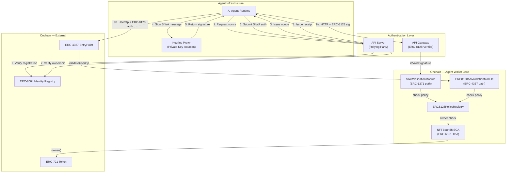
```mermaid
graph TB
    subgraph "Agent Infrastructure"
        Agent["AI Agent Runtime"]
        Keyring["Keyring Proxy<br/>(Private Key Isolation)"]
    end

    subgraph "Authentication Layer"
        Server["API Server<br/>(Relying Party)"]
        Gateway["API Gateway<br/>(ERC-8128 Verifier)"]
    end

    subgraph "Onchain — Agent Wallet Core"
        TBA["NFTBoundMSCA<br/>(ERC-6551 TBA)"]
        SIWA["SIWAValidationModule<br/>(ERC-1271 path)"]
        AA["ERC8128AAValidationModule<br/>(ERC-4337 path)"]
        PolicyReg["ERC8128PolicyRegistry"]
    end

    subgraph "Onchain — External"
        Registry8004["ERC-8004 Identity Registry"]
        EntryPoint["ERC-4337 EntryPoint"]
        NFT["ERC-721 Token"]
    end

    Agent -->|"1. Request nonce"| Server
    Server -->|"2. Verify registration"| Registry8004
    Server -->|"3. Issue nonce"| Agent
    Agent -->|"4. Sign SIWA message"| Keyring
    Keyring -->|"5. Return signature"| Agent
    Agent -->|"6. Submit SIWA auth"| Server
    Server -->|"7. Verify ownership"| Registry8004
    Server -->|"8. Issue receipt"| Agent
    
    Agent -->|"9a. HTTP + ERC-8128 sig"| Gateway
    Gateway -->|"isValidSignature"| SIWA
    SIWA -->|"check policy"| PolicyReg
    
    Agent -->|"9b. UserOp + ERC-8128 auth"| EntryPoint
    EntryPoint -->|"validateUserOp"| AA
    AA -->|"check policy"| PolicyReg
    
    TBA -->|"owner()"| NFT
    PolicyReg -->|"owner check"| TBA
```

### Component Architecture

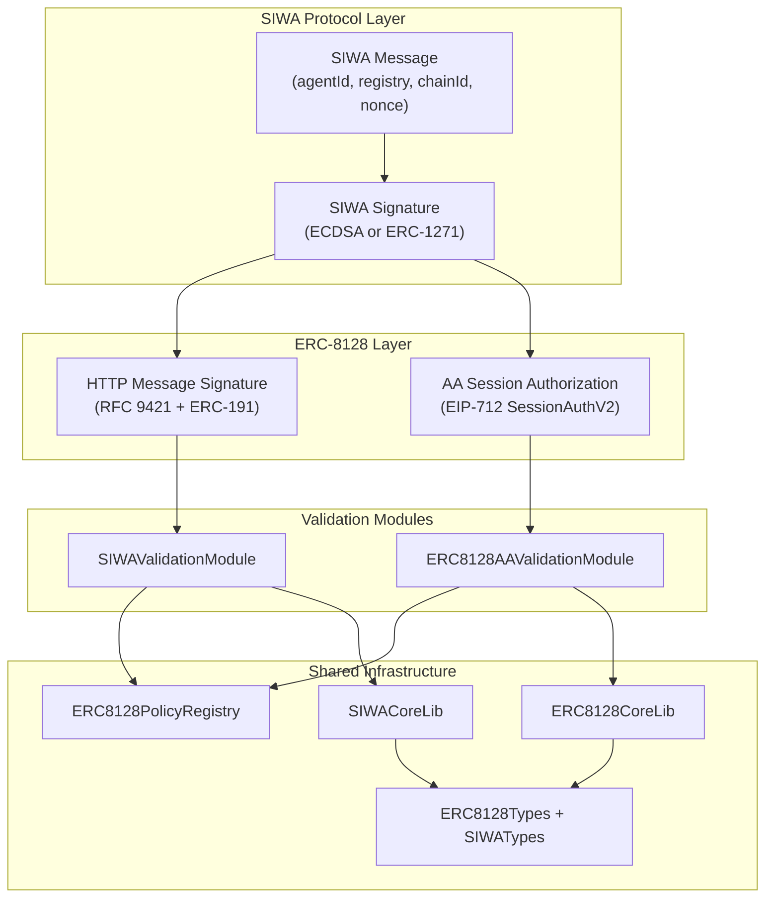
```mermaid
graph TB
    subgraph "SIWA Protocol Layer"
        SIWAMsg["SIWA Message<br/>(agentId, registry, chainId, nonce)"]
        SIWASig["SIWA Signature<br/>(ECDSA or ERC-1271)"]
    end

    subgraph "ERC-8128 Layer"
        HTTPSig["HTTP Message Signature<br/>(RFC 9421 + ERC-191)"]
        AASig["AA Session Authorization<br/>(EIP-712 SessionAuthV2)"]
    end

    subgraph "Validation Modules"
        SIWA["SIWAValidationModule"]
        AA["ERC8128AAValidationModule"]
    end

    subgraph "Shared Infrastructure"
        PolicyReg["ERC8128PolicyRegistry"]
        CoreLib["ERC8128CoreLib"]
        SIWALib["SIWACoreLib"]
        Types["ERC8128Types + SIWATypes"]
    end

    SIWAMsg --> SIWASig
    SIWASig --> HTTPSig
    SIWASig --> AASig
    
    HTTPSig --> SIWA
    AASig --> AA
    
    SIWA --> PolicyReg
    SIWA --> SIWALib
    AA --> PolicyReg
    AA --> CoreLib
    
    CoreLib --> Types
    SIWALib --> Types
```

### Contract Dependency Graph

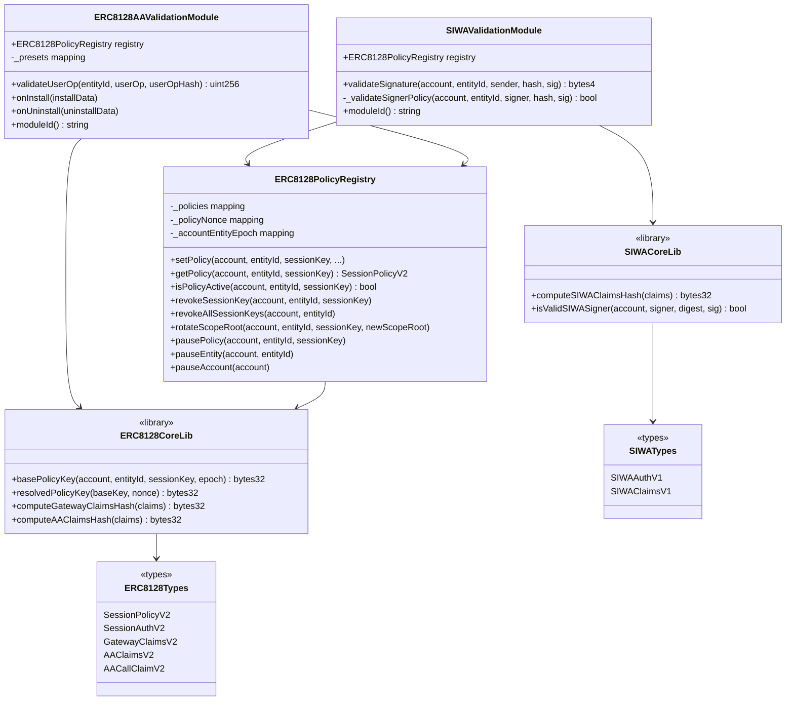
```mermaid
classDiagram
    class SIWAValidationModule {
        +ERC8128PolicyRegistry registry
        +validateSignature(account, entityId, sender, hash, sig) bytes4
        -_validateSignerPolicy(account, entityId, signer, hash, sig) bool
        +moduleId() string
    }

    class ERC8128AAValidationModule {
        +ERC8128PolicyRegistry registry
        +validateUserOp(entityId, userOp, userOpHash) uint256
        +onInstall(installData)
        +onUninstall(uninstallData)
        -_presets mapping
        +moduleId() string
    }

    class ERC8128PolicyRegistry {
        -_policies mapping
        -_policyNonce mapping
        -_accountEntityEpoch mapping
        +setPolicy(account, entityId, sessionKey, ...)
        +getPolicy(account, entityId, sessionKey) SessionPolicyV2
        +isPolicyActive(account, entityId, sessionKey) bool
        +revokeSessionKey(account, entityId, sessionKey)
        +revokeAllSessionKeys(account, entityId)
        +rotateScopeRoot(account, entityId, sessionKey, newScopeRoot)
        +pausePolicy(account, entityId, sessionKey)
        +pauseEntity(account, entityId)
        +pauseAccount(account)
    }

    class SIWACoreLib {
        <<library>>
        +computeSIWAClaimsHash(claims) bytes32
        +isValidSIWASigner(account, signer, digest, sig) bool
    }

    class ERC8128CoreLib {
        <<library>>
        +basePolicyKey(account, entityId, sessionKey, epoch) bytes32
        +resolvedPolicyKey(baseKey, nonce) bytes32
        +computeGatewayClaimsHash(claims) bytes32
        +computeAAClaimsHash(claims) bytes32
    }

    class SIWATypes {
        <<types>>
        SIWAAuthV1
        SIWAClaimsV1
    }

    class ERC8128Types {
        <<types>>
        SessionPolicyV2
        SessionAuthV2
        GatewayClaimsV2
        AAClaimsV2
        AACallClaimV2
    }

    SIWAValidationModule --> ERC8128PolicyRegistry
    SIWAValidationModule --> SIWACoreLib
    ERC8128AAValidationModule --> ERC8128PolicyRegistry
    ERC8128AAValidationModule --> ERC8128CoreLib
    SIWACoreLib --> SIWATypes
    ERC8128CoreLib --> ERC8128Types
    ERC8128PolicyRegistry --> ERC8128CoreLib
```

## SIWA Authentication Protocol

### SIWA Message Structure

SIWA authentication is built on a structured claims object that proves agent identity ownership:

```solidity
struct SIWAClaimsV1 {
    uint256 agentId;           // ERC-8004 identity NFT token ID
    address registryAddress;   // ERC-8004 Identity Registry contract
    uint256 registryChainId;   // Chain where the registry is deployed
}
```

The complete SIWA authentication envelope includes:

```solidity
struct SIWAAuthV1 {
    address signer;            // Address that signed the message
    uint48 created;            // Timestamp when signature was created
    uint48 expires;            // Expiration timestamp
    bytes32 requestHash;       // Hash of the HTTP request (for binding)
    bytes32 claimsHash;        // keccak256(abi.encode(SIWAClaimsV1))
    bytes signature;           // ECDSA signature or ERC-1271 calldata
    bytes claims;              // ABI-encoded SIWAClaimsV1
}
```

This envelope is part of SIWA protocol compatibility and vector fixtures.  
Current onchain gateway validation in this repository accepts standard ERC-1271 `(hash, signature)` inputs and does not decode `SIWAAuthV1` onchain.

### SIWA Authentication Flow

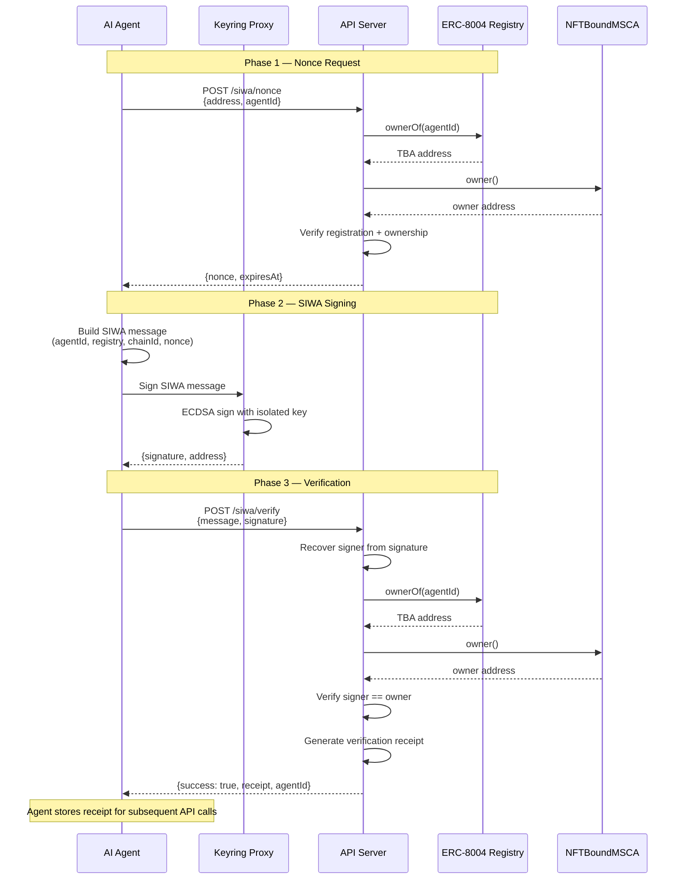
```mermaid
sequenceDiagram
    participant Agent as AI Agent
    participant Keyring as Keyring Proxy
    participant Server as API Server
    participant Registry as ERC-8004 Registry
    participant TBA as NFTBoundMSCA

    Note over Agent,Registry: Phase 1 — Nonce Request
    Agent->>Server: POST /siwa/nonce<br/>{address, agentId}
    Server->>Registry: ownerOf(agentId)
    Registry-->>Server: TBA address
    Server->>TBA: owner()
    TBA-->>Server: owner address
    Server->>Server: Verify registration + ownership
    Server-->>Agent: {nonce, expiresAt}

    Note over Agent,Registry: Phase 2 — SIWA Signing
    Agent->>Agent: Build SIWA message<br/>(agentId, registry, chainId, nonce)
    Agent->>Keyring: Sign SIWA message
    Keyring->>Keyring: ECDSA sign with isolated key
    Keyring-->>Agent: {signature, address}

    Note over Agent,Registry: Phase 3 — Verification
    Agent->>Server: POST /siwa/verify<br/>{message, signature}
    Server->>Server: Recover signer from signature
    Server->>Registry: ownerOf(agentId)
    Registry-->>Server: TBA address
    Server->>TBA: owner()
    TBA-->>Server: owner address
    Server->>Server: Verify signer == owner
    Server->>Server: Generate verification receipt
    Server-->>Agent: {success: true, receipt, agentId}

    Note over Agent: Agent stores receipt for subsequent API calls
```

### SIWA Signer Verification

The `SIWACoreLib.isValidSIWASigner` function handles three signer types:

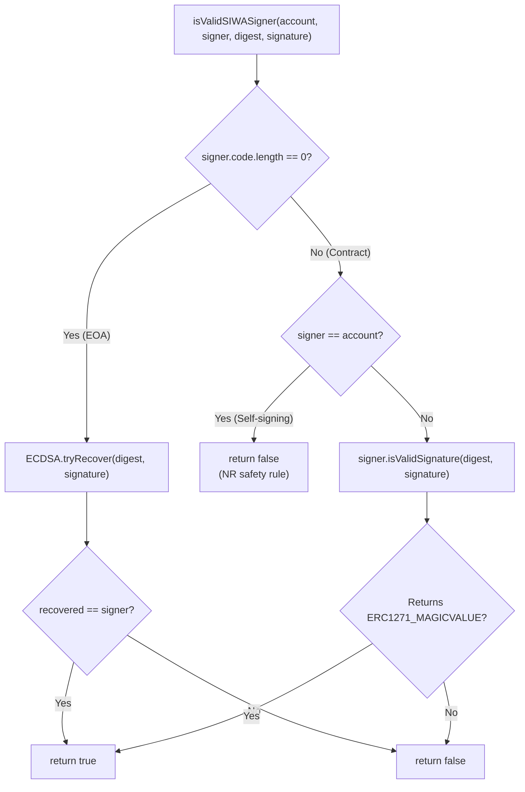
```mermaid
flowchart TD
    A["isValidSIWASigner(account, signer, digest, signature)"] --> B{"signer.code.length == 0?"}
    
    B -->|"Yes (EOA)"| C["ECDSA.tryRecover(digest, signature)"]
    C --> D{"recovered == signer?"}
    D -->|Yes| E["return true"]
    D -->|No| F["return false"]
    
    B -->|"No (Contract)"| G{"signer == account?"}
    G -->|"Yes (Self-signing)"| H["return false<br/>(NR safety rule)"]
    G -->|"No"| I["signer.isValidSignature(digest, signature)"]
    I --> J{"Returns ERC1271_MAGICVALUE?"}
    J -->|Yes| E
    J -->|No| F
```

Key security property: **Non-Recursive (NR) signer safety** — the account cannot sign for itself, preventing circular validation.

## SIWA Module Integration

The core integration target is the SIWA gateway module. Agent Wallet Core also includes a companion AA module that shares policy state, but SIWA remains the external authentication boundary.

### SIWA Gateway Path (Primary)

This primary path validates SIWA-shaped API authentication requests through ERC-1271 signature validation.

#### SIWAValidationModule

```solidity
contract SIWAValidationModule is IERC6900ValidationModule {
    ERC8128PolicyRegistry public immutable registry;
    
    function validateSignature(
        address account,
        uint32 entityId,
        address sender,
        bytes32 hash,
        bytes calldata signature
    ) external view returns (bytes4);
}
```

**Module Properties**:
- Module ID: `agent.wallet.siwa-validation.1.0.0`
- Validation flags: `isSignatureValidation` (0x02) only
- Rejects: `validateUserOp` and `validateRuntime` calls
- Policy source: External `ERC8128PolicyRegistry`
- SIWA boundary contract: server computes SIWA-bound request hash, module verifies signer + policy authorization

#### Gateway Validation Flow

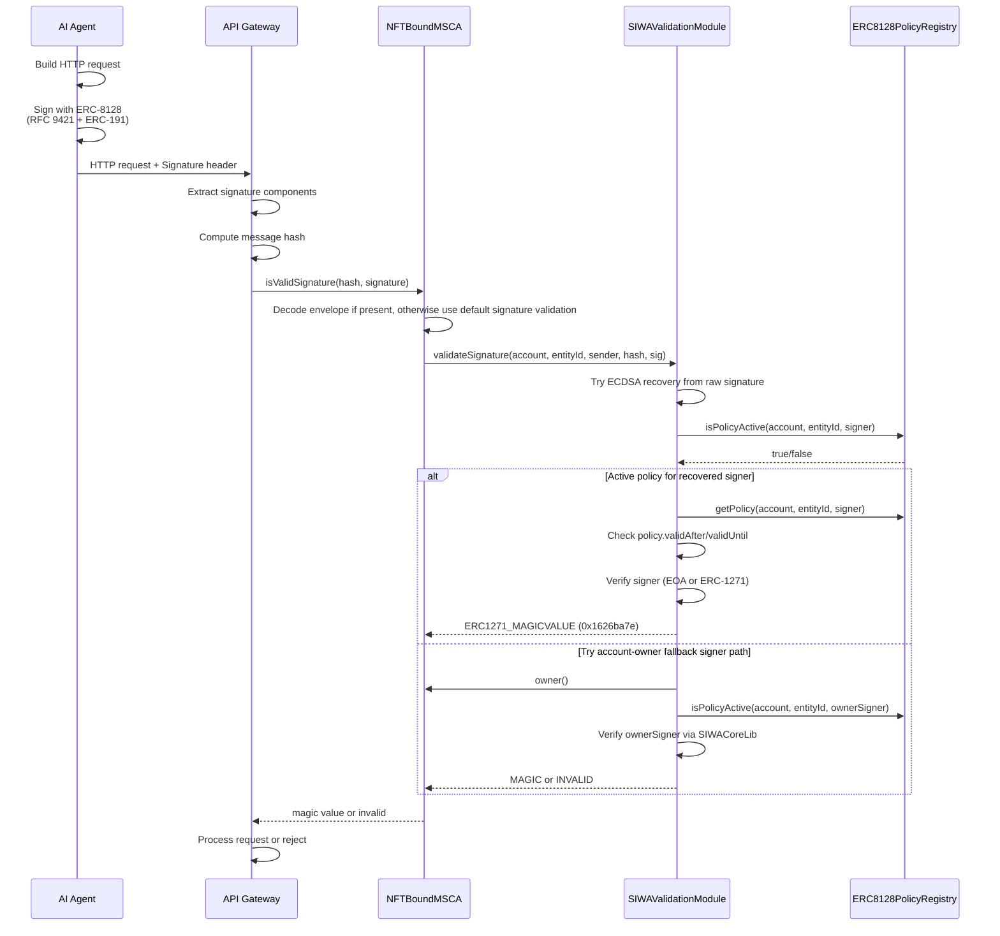
```mermaid
sequenceDiagram
    participant Agent as AI Agent
    participant Gateway as API Gateway
    participant TBA as NFTBoundMSCA
    participant SIWA as SIWAValidationModule
    participant Registry as ERC8128PolicyRegistry

    Agent->>Agent: Build HTTP request
    Agent->>Agent: Sign with ERC-8128<br/>(RFC 9421 + ERC-191)
    Agent->>Gateway: HTTP request + Signature header

    Gateway->>Gateway: Extract signature components
    Gateway->>Gateway: Compute message hash
    Gateway->>TBA: isValidSignature(hash, signature)
    
    TBA->>TBA: Decode envelope if present, otherwise use default signature validation
    TBA->>SIWA: validateSignature(account, entityId, sender, hash, sig)
    
    SIWA->>SIWA: Try ECDSA recovery from raw signature
    SIWA->>Registry: isPolicyActive(account, entityId, signer)
    Registry-->>SIWA: true/false
    
    alt Active policy for recovered signer
        SIWA->>Registry: getPolicy(account, entityId, signer)
        SIWA->>SIWA: Check policy.validAfter/validUntil
        SIWA->>SIWA: Verify signer (EOA or ERC-1271)
        SIWA-->>TBA: ERC1271_MAGICVALUE (0x1626ba7e)
    else Try account-owner fallback signer path
        SIWA->>TBA: owner()
        SIWA->>Registry: isPolicyActive(account, entityId, ownerSigner)
        SIWA->>SIWA: Verify ownerSigner via SIWACoreLib
        SIWA-->>TBA: MAGIC or INVALID
    end
    
    TBA-->>Gateway: magic value or invalid
    Gateway->>Gateway: Process request or reject
```

#### Gateway Claims Structure (Reserved for Future Onchain Enforcement)

```solidity
struct GatewayClaimsV2 {
    uint16 methodBit;              // HTTP method as bit flag
    bytes32 authorityHash;         // keccak256(authority)
    bytes32 pathPrefixHash;        // keccak256(path prefix)
    bool isReadOnly;               // GET/HEAD only
    bool allowReplayable;          // Allow replayable requests
    bool allowClassBound;          // Allow class-bound requests
    uint32 maxBodyBytes;           // Max request body size
    bool isReplayable;             // This request is replayable
    bool isClassBound;             // This request is class-bound
    bytes32 nonceHash;             // keccak256(nonce) for non-replayable
    bytes32 scopeLeaf;             // Merkle leaf for this claim
    bytes32[] scopeProof;          // Merkle proof against policy.scopeRoot
}
```

`GatewayClaimsV2` is still defined in shared types/libs for compatibility tooling, but is not decoded by the current `SIWAValidationModule` validation path.

### AA Companion Path (ERC-4337)

The AA path is a companion execution path for onchain session operations. It is not the SIWA gateway authentication boundary.

#### ERC8128AAValidationModule

```solidity
contract ERC8128AAValidationModule is IERC6900ValidationModule {
    ERC8128PolicyRegistry public immutable registry;
    
    mapping(address => mapping(uint32 => InstallPreset)) private _presets;
    
    function validateUserOp(
        uint32 entityId,
        PackedUserOperation calldata userOp,
        bytes32 userOpHash
    ) external returns (uint256 validationData);
    
    function onInstall(bytes calldata installData) external;
}
```

**Module Properties**:
- Module ID: `agent.wallet.erc8128-aa-validation.1.0.0`
- Validation flags: `isUserOpValidation` (0x01) only
- Rejects: `validateSignature` and `validateRuntime` calls
- Policy source: External `ERC8128PolicyRegistry`
- Install presets: Per-account default selectors and TTL

#### AA Validation Flow

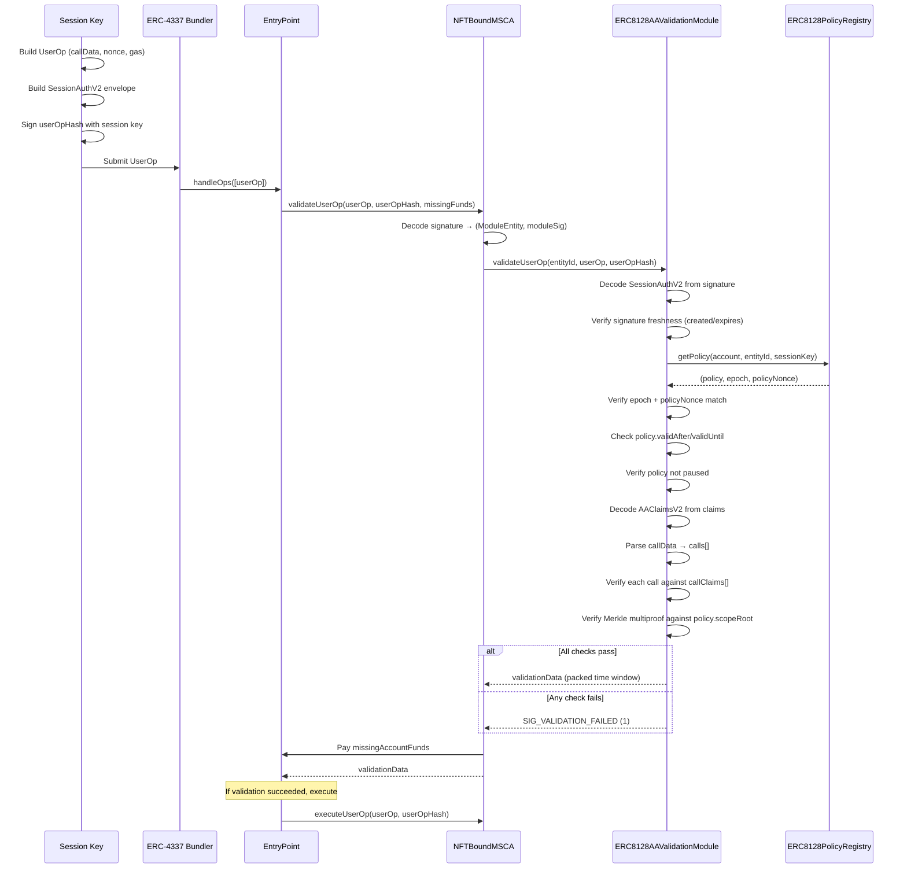
```mermaid
sequenceDiagram
    participant SessionKey as Session Key
    participant Bundler as ERC-4337 Bundler
    participant EP as EntryPoint
    participant TBA as NFTBoundMSCA
    participant AA as ERC8128AAValidationModule
    participant Registry as ERC8128PolicyRegistry

    SessionKey->>SessionKey: Build UserOp (callData, nonce, gas)
    SessionKey->>SessionKey: Build SessionAuthV2 envelope
    SessionKey->>SessionKey: Sign userOpHash with session key
    SessionKey->>Bundler: Submit UserOp

    Bundler->>EP: handleOps([userOp])
    EP->>TBA: validateUserOp(userOp, userOpHash, missingFunds)
    
    TBA->>TBA: Decode signature → (ModuleEntity, moduleSig)
    TBA->>AA: validateUserOp(entityId, userOp, userOpHash)
    
    AA->>AA: Decode SessionAuthV2 from signature
    AA->>AA: Verify signature freshness (created/expires)
    AA->>Registry: getPolicy(account, entityId, sessionKey)
    Registry-->>AA: (policy, epoch, policyNonce)
    
    AA->>AA: Verify epoch + policyNonce match
    AA->>AA: Check policy.validAfter/validUntil
    AA->>AA: Verify policy not paused
    
    AA->>AA: Decode AAClaimsV2 from claims
    AA->>AA: Parse callData → calls[]
    AA->>AA: Verify each call against callClaims[]
    AA->>AA: Verify Merkle multiproof against policy.scopeRoot
    
    alt All checks pass
        AA-->>TBA: validationData (packed time window)
    else Any check fails
        AA-->>TBA: SIG_VALIDATION_FAILED (1)
    end
    
    TBA->>EP: Pay missingAccountFunds
    TBA-->>EP: validationData
    
    Note over EP: If validation succeeded, execute
    EP->>TBA: executeUserOp(userOp, userOpHash)
```

#### AA Claims Structure

```solidity
struct AACallClaimV2 {
    address target;                // Target contract address
    bytes4 selector;               // Function selector
    uint256 valueLimit;            // Max ETH value for this call
    bool allowDelegateCall;        // Allow DELEGATECALL operation
    bytes32 scopeLeaf;             // Merkle leaf for this claim
    bytes32[] scopeProof;          // Merkle proof
}

struct AAClaimsV2 {
    AACallClaimV2[] callClaims;    // Per-call permissions
    bytes32[] multiproof;          // Merkle multiproof for batch
    bool[] proofFlags;             // Multiproof flags
    bytes32 leafOrderHash;         // Hash of leaf order for verification
}

struct SessionAuthV2 {
    uint8 mode;                    // Auth mode (0 = standard)
    address sessionKey;            // Session key address
    uint64 epoch;                  // Policy epoch
    uint64 policyNonce;            // Policy version nonce
    uint48 created;                // Signature creation time
    uint48 expires;                // Signature expiration time
    bytes32 requestHash;           // UserOp hash binding
    bytes32 claimsHash;            // keccak256(abi.encode(AAClaimsV2))
    bytes sessionSignature;        // Session key signature
    bytes claims;                  // ABI-encoded AAClaimsV2
}
```

## Shared Policy Registry (Used by SIWA Module)

The unified policy registry is shared between both validation modules, providing consistent session management across gateway and AA paths.

### Policy Data Model

```solidity
struct SessionPolicyV2 {
    bool active;                   // Policy is active
    uint48 validAfter;             // Earliest valid timestamp
    uint48 validUntil;             // Latest valid timestamp (0 = no limit)
    uint32 maxTtlSeconds;          // Max TTL for individual signatures
    bytes32 scopeRoot;             // Merkle root of allowed operations
    uint64 maxCallsPerPeriod;      // Rate limit: max calls
    uint128 maxValuePerPeriod;     // Rate limit: max ETH value
    uint48 periodSeconds;          // Rate limit period duration
    bool paused;                   // Emergency pause flag
}
```

### Policy Key Derivation

Policies are stored using a hierarchical key structure:

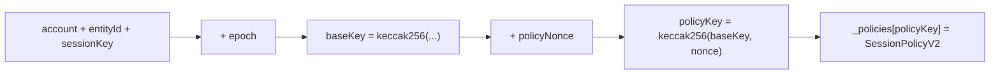
```mermaid
flowchart LR
    A["account + entityId + sessionKey"] --> B["+ epoch"]
    B --> C["baseKey = keccak256(...)"]
    C --> D["+ policyNonce"]
    D --> E["policyKey = keccak256(baseKey, nonce)"]
    E --> F["_policies[policyKey] = SessionPolicyV2"]
```

This allows:
- **Epoch-based bulk revocation**: Increment epoch to invalidate all policies for an entity
- **Nonce-based updates**: Increment policyNonce to update a specific session key's policy
- **Efficient lookups**: Deterministic key computation without iteration

### Registry Operations

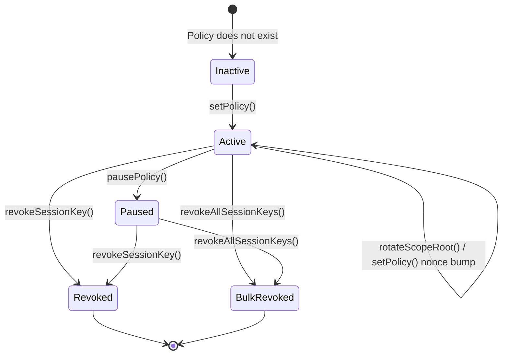
```mermaid
stateDiagram-v2
    [*] --> Inactive: Policy does not exist
    Inactive --> Active: setPolicy()
    Active --> Active: setPolicy() with new nonce
    Active --> Paused: pausePolicy()
    Active --> Revoked: revokeSessionKey()
    Paused --> Revoked: revokeSessionKey()
    Active --> BulkRevoked: revokeAllSessionKeys()
    Paused --> BulkRevoked: revokeAllSessionKeys()
    Active --> Active: rotateScopeRoot() / setPolicy() nonce bump
    Revoked --> [*]
    BulkRevoked --> [*]
```

### Authorization Model

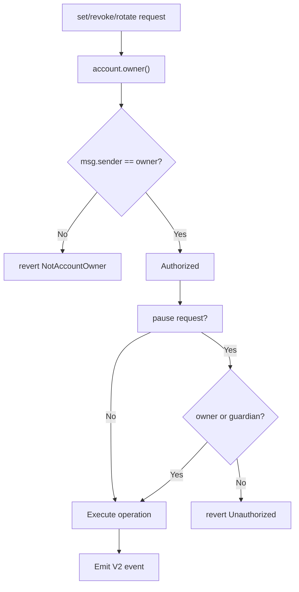
```mermaid
flowchart TD
    A["set/revoke/rotate request"] --> B["account.owner()"]
    B --> C{"msg.sender == owner?"}
    C -->|No| D["revert NotAccountOwner"]
    C -->|Yes| E["Authorized"]
    
    E --> F["pause request?"]
    F -->|No| G["Execute operation"]
    F -->|Yes| H{"owner or guardian?"}
    H -->|No| I["revert Unauthorized"]
    H -->|Yes| G["Execute operation"]
    G --> J["Emit V2 event"]
```

Only the ERC-6551 owner can set/revoke/rotate policies; owner or configured guardian can pause. This ensures that:
- Account owners control session delegation
- Transferring the bound NFT transfers policy control
- Guardian pause can provide emergency controls without full mutation rights

### Registry Interface

```solidity
contract ERC8128PolicyRegistry {
    // Policy Management
    function setPolicy(
        address account,
        uint32 entityId,
        address sessionKey,
        uint48 validAfter,
        uint48 validUntil,
        uint32 maxTtlSeconds,
        bytes32 scopeRoot,
        uint64 maxCallsPerPeriod,
        uint128 maxValuePerPeriod,
        uint48 periodSeconds
    ) external;
    
    function revokeSessionKey(
        address account,
        uint32 entityId,
        address sessionKey
    ) external;
    
    function revokeAllSessionKeys(address account, uint32 entityId) external;
    
    function pausePolicy(
        address account,
        uint32 entityId,
        address sessionKey
    ) external;
    
    function pauseEntity(address account, uint32 entityId) external;
    function pauseAccount(address account) external;
    
    function rotateScopeRoot(address account, uint32 entityId, address sessionKey, bytes32 newScopeRoot) external;
    function setGuardian(address account, uint32 entityId, address guardian, bool enabled) external;
    
    // Queries
    function getPolicy(
        address account,
        uint32 entityId,
        address sessionKey
    ) external view returns (
        SessionPolicyV2 memory policy,
        uint64 epoch,
        uint64 policyNonce
    );
    
    function isPolicyActive(
        address account,
        uint32 entityId,
        address sessionKey
    ) external view returns (bool);
    
    function getEpoch(
        address account,
        uint32 entityId
    ) external view returns (uint64);

    function isGuardian(address account, uint32 entityId, address guardian) external view returns (bool);
}
```

## Integration with ERC-6551 and ERC-8004

### ERC-6551 Token Bound Accounts

SIWA authentication is built on top of ERC-6551 ownership resolution:

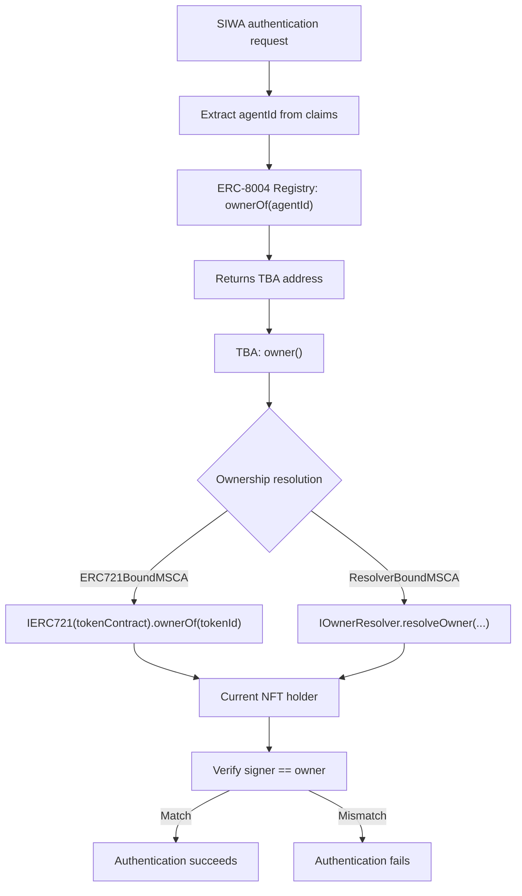
```mermaid
flowchart TD
    A["SIWA authentication request"] --> B["Extract agentId from claims"]
    B --> C["ERC-8004 Registry: ownerOf(agentId)"]
    C --> D["Returns TBA address"]
    D --> E["TBA: owner()"]
    E --> F{"Ownership resolution"}
    
    F -->|"ERC721BoundMSCA"| G["IERC721(tokenContract).ownerOf(tokenId)"]
    F -->|"ResolverBoundMSCA"| H["IOwnerResolver.resolveOwner(...)"]
    
    G --> I["Current NFT holder"]
    H --> I
    
    I --> J["Verify signer == owner"]
    J -->|"Match"| K["Authentication succeeds"]
    J -->|"Mismatch"| L["Authentication fails"]
```

**Key properties**:
- Ownership is resolved live, never cached
- Transferring the bound NFT immediately transfers authentication authority
- No stored owner state in validation modules
- Works with both `ERC721BoundMSCA` and `ResolverBoundMSCA` account types

### ERC-8004 Agent Identity

The `ERC8004IdentityAdapter` provides the bridge between TBAs and agent identities:

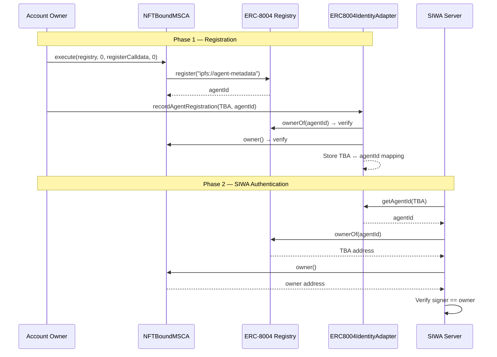
```mermaid
sequenceDiagram
    participant Owner as Account Owner
    participant TBA as NFTBoundMSCA
    participant Registry as ERC-8004 Registry
    participant Adapter as ERC8004IdentityAdapter
    participant Server as SIWA Server

    Note over Owner,Adapter: Phase 1 — Registration
    Owner->>TBA: execute(registry, 0, registerCalldata, 0)
    TBA->>Registry: register("ipfs://agent-metadata")
    Registry-->>TBA: agentId
    Owner->>Adapter: recordAgentRegistration(TBA, agentId)
    Adapter->>Registry: ownerOf(agentId) → verify
    Adapter->>TBA: owner() → verify
    Adapter-->>Adapter: Store TBA ↔ agentId mapping

    Note over Owner,Server: Phase 2 — SIWA Authentication
    Server->>Adapter: getAgentId(TBA)
    Adapter-->>Server: agentId
    Server->>Registry: ownerOf(agentId)
    Registry-->>Server: TBA address
    Server->>TBA: owner()
    TBA-->>Server: owner address
    Server->>Server: Verify signer == owner
```

**Integration points**:
- `SIWAClaimsV1` includes `agentId`, `registryAddress`, `registryChainId`
- SIWA servers verify `registry.ownerOf(agentId) == TBA`
- API gateways can use `adapter.getAgentId(account)` to resolve agent identity
- Agent metadata (endpoints, trust model, services) stored in ERC-8004 registry

## Complete Agent Lifecycle

### Phase 1: Setup and Registration

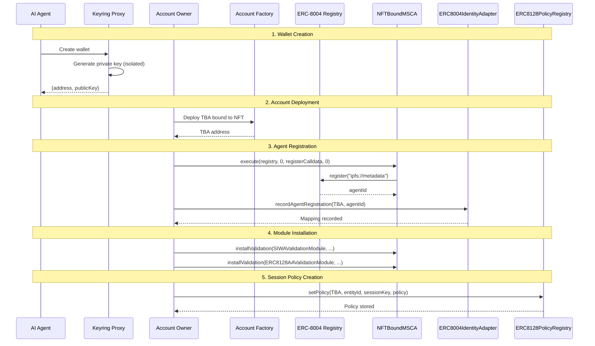
```mermaid
sequenceDiagram
    participant Agent as AI Agent
    participant Keyring as Keyring Proxy
    participant Owner as Account Owner
    participant Factory as Account Factory
    participant Registry8004 as ERC-8004 Registry
    participant TBA as NFTBoundMSCA
    participant Adapter as ERC8004IdentityAdapter
    participant PolicyReg as ERC8128PolicyRegistry

    Note over Agent,PolicyReg: 1. Wallet Creation
    Agent->>Keyring: Create wallet
    Keyring->>Keyring: Generate private key (isolated)
    Keyring-->>Agent: {address, publicKey}

    Note over Agent,PolicyReg: 2. Account Deployment
    Owner->>Factory: Deploy TBA bound to NFT
    Factory-->>Owner: TBA address

    Note over Agent,PolicyReg: 3. Agent Registration
    Owner->>TBA: execute(registry, 0, registerCalldata, 0)
    TBA->>Registry8004: register("ipfs://metadata")
    Registry8004-->>TBA: agentId
    Owner->>Adapter: recordAgentRegistration(TBA, agentId)
    Adapter-->>Owner: Mapping recorded

    Note over Agent,PolicyReg: 4. Module Installation
    Owner->>TBA: installValidation(SIWAValidationModule, ...)
    Owner->>TBA: installValidation(ERC8128AAValidationModule, ...)

    Note over Agent,PolicyReg: 5. Session Policy Creation
    Owner->>PolicyReg: setPolicy(TBA, entityId, sessionKey, policy)
    PolicyReg-->>Owner: Policy stored
```

### Phase 2: SIWA Authentication

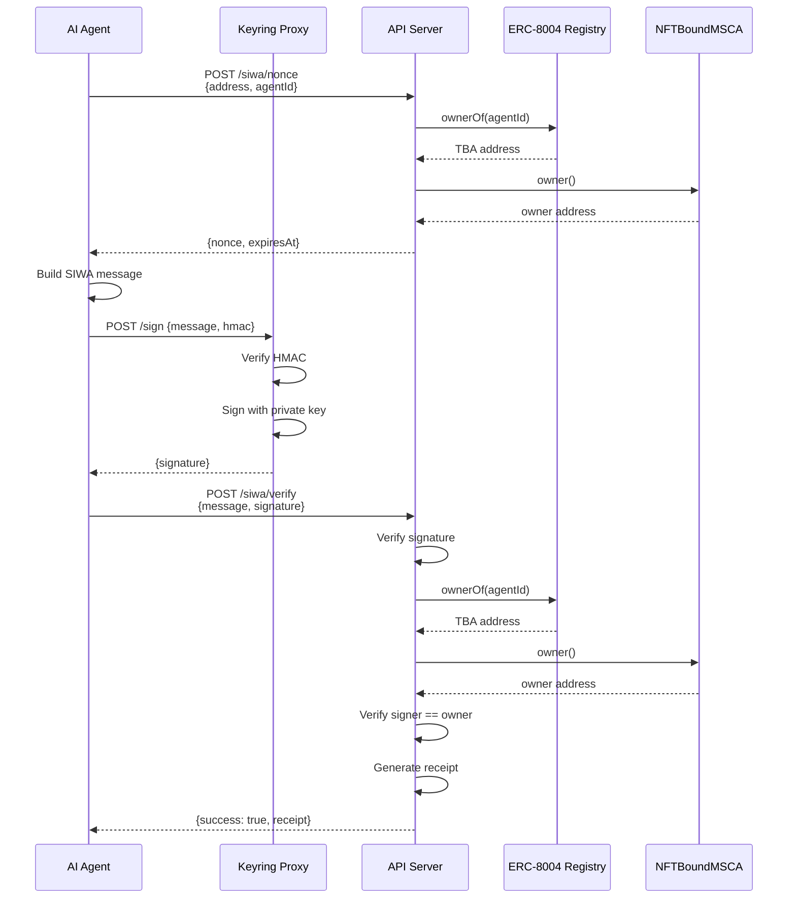
```mermaid
sequenceDiagram
    participant Agent as AI Agent
    participant Keyring as Keyring Proxy
    participant Server as API Server
    participant Registry as ERC-8004 Registry
    participant TBA as NFTBoundMSCA

    Agent->>Server: POST /siwa/nonce<br/>{address, agentId}
    Server->>Registry: ownerOf(agentId)
    Registry-->>Server: TBA address
    Server->>TBA: owner()
    TBA-->>Server: owner address
    Server-->>Agent: {nonce, expiresAt}

    Agent->>Agent: Build SIWA message
    Agent->>Keyring: POST /sign {message, hmac}
    Keyring->>Keyring: Verify HMAC
    Keyring->>Keyring: Sign with private key
    Keyring-->>Agent: {signature}

    Agent->>Server: POST /siwa/verify<br/>{message, signature}
    Server->>Server: Verify signature
    Server->>Registry: ownerOf(agentId)
    Registry-->>Server: TBA address
    Server->>TBA: owner()
    TBA-->>Server: owner address
    Server->>Server: Verify signer == owner
    Server->>Server: Generate receipt
    Server-->>Agent: {success: true, receipt}
```

### Phase 3: Ongoing Operations

#### Gateway Path (HTTP API)

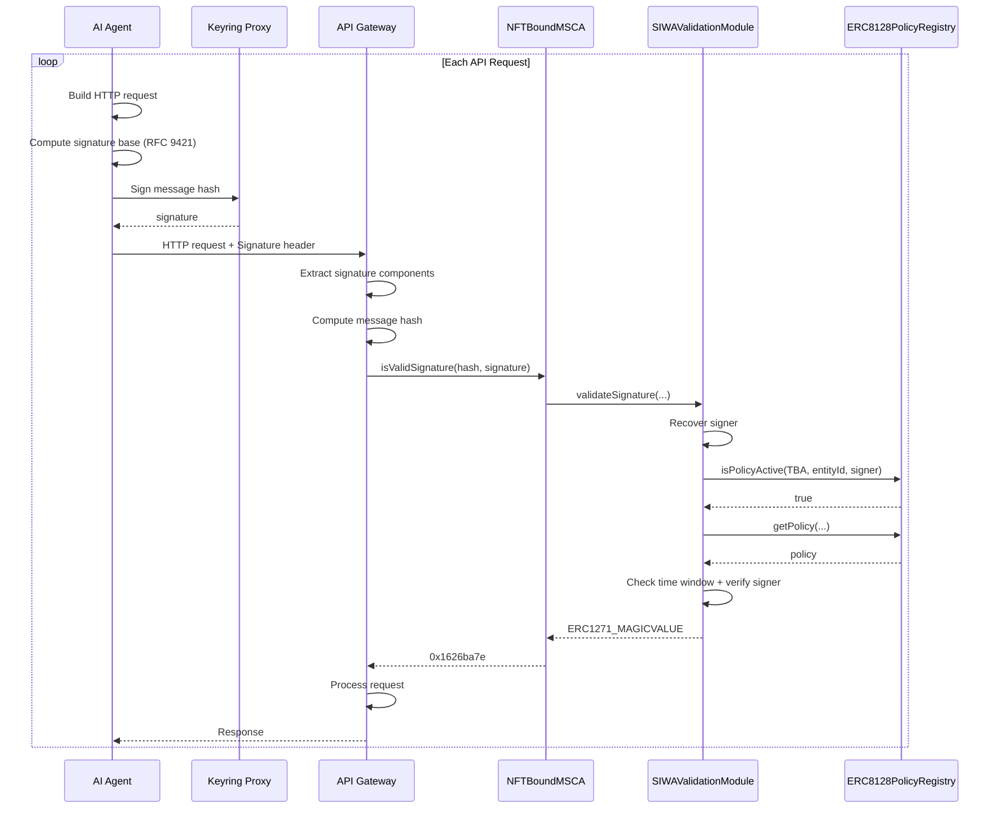
```mermaid
sequenceDiagram
    participant Agent as AI Agent
    participant Keyring as Keyring Proxy
    participant Gateway as API Gateway
    participant TBA as NFTBoundMSCA
    participant SIWA as SIWAValidationModule
    participant PolicyReg as ERC8128PolicyRegistry

    loop Each API Request
        Agent->>Agent: Build HTTP request
        Agent->>Agent: Compute signature base (RFC 9421)
        Agent->>Keyring: Sign message hash
        Keyring-->>Agent: signature
        Agent->>Gateway: HTTP request + Signature header

        Gateway->>Gateway: Extract signature components
        Gateway->>Gateway: Compute message hash
        Gateway->>TBA: isValidSignature(hash, signature)
        TBA->>SIWA: validateSignature(...)
        SIWA->>SIWA: Recover signer
        SIWA->>PolicyReg: isPolicyActive(TBA, entityId, signer)
        PolicyReg-->>SIWA: true
        SIWA->>PolicyReg: getPolicy(...)
        PolicyReg-->>SIWA: policy
        SIWA->>SIWA: Check time window + verify signer
        SIWA-->>TBA: ERC1271_MAGICVALUE
        TBA-->>Gateway: 0x1626ba7e
        Gateway->>Gateway: Process request
        Gateway-->>Agent: Response
    end
```

#### AA Path (Onchain Execution)

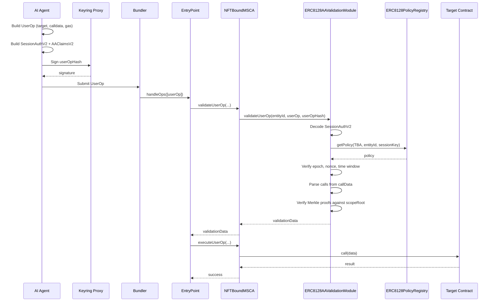
```mermaid
sequenceDiagram
    participant Agent as AI Agent
    participant Keyring as Keyring Proxy
    participant Bundler as Bundler
    participant EP as EntryPoint
    participant TBA as NFTBoundMSCA
    participant AA as ERC8128AAValidationModule
    participant PolicyReg as ERC8128PolicyRegistry
    participant Target as Target Contract

    Agent->>Agent: Build UserOp (target, calldata, gas)
    Agent->>Agent: Build SessionAuthV2 + AAClaimsV2
    Agent->>Keyring: Sign userOpHash
    Keyring-->>Agent: signature
    Agent->>Bundler: Submit UserOp

    Bundler->>EP: handleOps([userOp])
    EP->>TBA: validateUserOp(...)
    TBA->>AA: validateUserOp(entityId, userOp, userOpHash)
    AA->>AA: Decode SessionAuthV2
    AA->>PolicyReg: getPolicy(TBA, entityId, sessionKey)
    PolicyReg-->>AA: policy
    AA->>AA: Verify epoch, nonce, time window
    AA->>AA: Parse calls from callData
    AA->>AA: Verify Merkle proofs against scopeRoot
    AA-->>TBA: validationData
    TBA-->>EP: validationData

    EP->>TBA: executeUserOp(...)
    TBA->>Target: call(data)
    Target-->>TBA: result
    TBA-->>EP: success
```

## Security Architecture

### Private Key Isolation

The keyring proxy architecture ensures the agent's private key never enters the agent process:

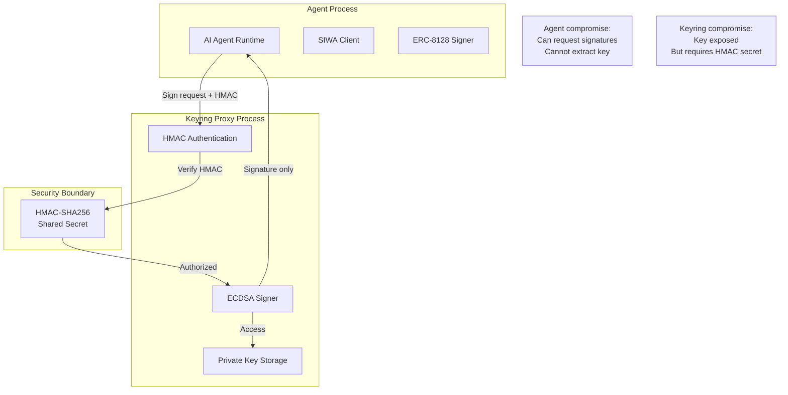
```mermaid
graph TB
    subgraph "Agent Process"
        Agent["AI Agent Runtime"]
        SIWA["SIWA Client"]
        ERC8128["ERC-8128 Signer"]
    end

    subgraph "Keyring Proxy Process"
        Auth["HMAC Authentication"]
        KeyStore["Private Key Storage"]
        Signer["ECDSA Signer"]
    end

    subgraph "Security Boundary"
        HMAC["HMAC-SHA256<br/>Shared Secret"]
    end

    Agent -->|"Sign request + HMAC"| Auth
    Auth -->|"Verify HMAC"| HMAC
    HMAC -->|"Authorized"| Signer
    Signer -->|"Access"| KeyStore
    Signer -->|"Signature only"| Agent
    
    Note1["Agent compromise:<br/>Can request signatures<br/>Cannot extract key"]
    Note2["Keyring compromise:<br/>Key exposed<br/>But requires HMAC secret"]
```

**Security properties**:
- Agent process can only request signatures, not extract keys
- HMAC authentication prevents unauthorized signing requests
- Optional 2FA approval for sensitive operations
- Key rotation without agent process restart

### Trust Boundaries

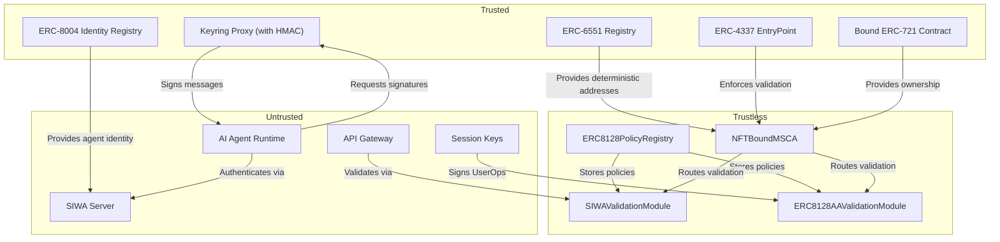
```mermaid
graph TB
    subgraph "Trusted"
        T1["ERC-6551 Registry"]
        T2["ERC-8004 Identity Registry"]
        T3["ERC-4337 EntryPoint"]
        T4["Bound ERC-721 Contract"]
        T5["Keyring Proxy (with HMAC)"]
    end

    subgraph "Trustless"
        U1["ERC8128PolicyRegistry"]
        U2["SIWAValidationModule"]
        U3["ERC8128AAValidationModule"]
        U4["NFTBoundMSCA"]
    end

    subgraph "Untrusted"
        N1["AI Agent Runtime"]
        N2["API Gateway"]
        N3["SIWA Server"]
        N4["Session Keys"]
    end

    T1 -->|"Provides deterministic addresses"| U4
    T2 -->|"Provides agent identity"| N3
    T3 -->|"Enforces validation"| U4
    T4 -->|"Provides ownership"| U4
    T5 -->|"Signs messages"| N1
    
    U1 -->|"Stores policies"| U2
    U1 -->|"Stores policies"| U3
    U4 -->|"Routes validation"| U2
    U4 -->|"Routes validation"| U3
    
    N1 -->|"Requests signatures"| T5
    N1 -->|"Authenticates via"| N3
    N2 -->|"Validates via"| U2
    N4 -->|"Signs UserOps"| U3
```

### Attack Surface Analysis

| Vector | Mitigation |
|--------|-----------|
| **Private key extraction** | Keyring proxy isolation + HMAC authentication |
| **SIWA replay attack** | Nonce-based challenge-response + expiration timestamps |
| **Session key compromise** | Scoped permissions via Merkle proofs + revocable policies |
| **Policy manipulation** | Owner-only authorization via ERC-6551 ownership |
| **NFT transfer attack** | By design — transferring NFT transfers control |
| **Malicious ERC-721 contract** | Trust assumption — use audited token contracts |
| **Circular validation** | NR signer safety rule prevents account self-signing |
| **Signature malleability** | ECDSA signature verification with strict encoding |
| **Time-based attacks** | Validation data intersection enforces strictest time window |
| **Merkle proof forgery** | Cryptographic security of Merkle tree verification |
| **Policy bypass** | All validation flows through registry checks |
| **Module self-modification** | ERC-6900 prevents modules from installing/uninstalling themselves |

## Data Structures Reference

### SIWA Types

```solidity
// SIWA authentication envelope
struct SIWAAuthV1 {
    address signer;            // Address that signed the message
    uint48 created;            // Timestamp when signature was created
    uint48 expires;            // Expiration timestamp
    bytes32 requestHash;       // Hash of the HTTP request (for binding)
    bytes32 claimsHash;        // keccak256(abi.encode(SIWAClaimsV1))
    bytes signature;           // ECDSA signature or ERC-1271 calldata
    bytes claims;              // ABI-encoded SIWAClaimsV1
}

// SIWA identity claims
struct SIWAClaimsV1 {
    uint256 agentId;           // ERC-8004 identity NFT token ID
    address registryAddress;   // ERC-8004 Identity Registry contract
    uint256 registryChainId;   // Chain where the registry is deployed
}
```

### ERC-8128 Types

```solidity
// Session policy stored in registry
struct SessionPolicyV2 {
    bool active;                   // Policy is active
    uint48 validAfter;             // Earliest valid timestamp
    uint48 validUntil;             // Latest valid timestamp (0 = no limit)
    uint32 maxTtlSeconds;          // Max TTL for individual signatures
    bytes32 scopeRoot;             // Merkle root of allowed operations
    uint64 maxCallsPerPeriod;      // Rate limit: max calls
    uint128 maxValuePerPeriod;     // Rate limit: max ETH value
    uint48 periodSeconds;          // Rate limit period duration
    bool paused;                   // Emergency pause flag
}

// Session authorization envelope for AA path
struct SessionAuthV2 {
    uint8 mode;                    // Auth mode (0 = standard)
    address sessionKey;            // Session key address
    uint64 epoch;                  // Policy epoch
    uint64 policyNonce;            // Policy version nonce
    uint48 created;                // Signature creation time
    uint48 expires;                // Signature expiration time
    bytes32 requestHash;           // UserOp hash binding
    bytes32 claimsHash;            // keccak256(abi.encode(AAClaimsV2))
    bytes sessionSignature;        // Session key signature
    bytes claims;                  // ABI-encoded AAClaimsV2
}

// Gateway claims for HTTP path
// Note: reserved type for compatibility tooling; not decoded by current SIWAValidationModule.
struct GatewayClaimsV2 {
    uint16 methodBit;              // HTTP method as bit flag
    bytes32 authorityHash;         // keccak256(authority)
    bytes32 pathPrefixHash;        // keccak256(path prefix)
    bool isReadOnly;               // GET/HEAD only
    bool allowReplayable;          // Allow replayable requests
    bool allowClassBound;          // Allow class-bound requests
    uint32 maxBodyBytes;           // Max request body size
    bool isReplayable;             // This request is replayable
    bool isClassBound;             // This request is class-bound
    bytes32 nonceHash;             // keccak256(nonce) for non-replayable
    bytes32 scopeLeaf;             // Merkle leaf for this claim
    bytes32[] scopeProof;          // Merkle proof against policy.scopeRoot
}

// AA call claim for onchain execution
struct AACallClaimV2 {
    address target;                // Target contract address
    bytes4 selector;               // Function selector
    uint256 valueLimit;            // Max ETH value for this call
    bool allowDelegateCall;        // Allow DELEGATECALL operation
    bytes32 scopeLeaf;             // Merkle leaf for this claim
    bytes32[] scopeProof;          // Merkle proof
}

// AA claims for batch execution
struct AAClaimsV2 {
    AACallClaimV2[] callClaims;    // Per-call permissions
    bytes32[] multiproof;          // Merkle multiproof for batch
    bool[] proofFlags;             // Multiproof flags
    bytes32 leafOrderHash;         // Hash of leaf order for verification
}

// Parsed call structure
struct ParsedCall {
    address target;                // Target address
    uint256 value;                 // ETH value
    bytes data;                    // Calldata
    bytes4 selector;               // Extracted selector
    bool isDelegateCall;           // Is DELEGATECALL
}
```

## Error Taxonomy

### SIWAValidationModule Errors

| Error | Condition | Severity |
|-------|-----------|----------|
| `InvalidRegistry(address)` | Constructor: registry address is zero | Fatal (deploy-time) |
| `RuntimeValidationNotSupported()` | `validateRuntime` called on signature-only module | Type mismatch |

### ERC8128AAValidationModule Errors

| Error | Condition | Severity |
|-------|-----------|----------|
| `InvalidRegistry(address)` | Constructor: registry address is zero | Fatal (deploy-time) |
| `RuntimeValidationNotSupported()` | `validateRuntime` called on UserOp-only module | Type mismatch |
| `InvalidInstallScope(address,address)` | Install/uninstall account in payload does not match caller | Authorization |
| `InvalidInstallTtlWindow(uint32,uint32)` | Install preset max TTL is below min TTL | Input validation |

Note: most invalid AA signature/policy/call paths return `SIG_VALIDATION_FAILED` instead of reverting.

### ERC8128PolicyRegistry Errors

| Error | Condition | Severity |
|-------|-----------|----------|
| `NotAccountOwner(address,address,address)` | Caller is not the ERC-6551 account owner | Authorization |
| `InvalidSessionKey(address)` | Session key is zero address | Input validation |
| `InvalidPolicyWindow(uint48,uint48)` | `validUntil` is set and not greater than `validAfter` | Input validation |
| `PolicyNotActive(address,uint32,address)` | Rotate/pause requested for missing/inactive policy | State validation |
| `Unauthorized(address)` | Caller is not owner/guardian for pause operations | Authorization |

### SIWACoreLib Errors

No custom errors — uses OpenZeppelin ECDSA error handling:
- `ECDSAInvalidSignature()` — Signature is invalid
- `ECDSAInvalidSignatureLength(uint256)` — Signature length is not 65 bytes
- `ECDSAInvalidSignatureS(bytes32)` — Signature S value is invalid

## Events

### SIWAValidationModule Events

No custom events — relies on ERC-6900 account events for module lifecycle.

### ERC8128AAValidationModule Events

No custom events — relies on ERC-6900 account events for module lifecycle.

### ERC8128PolicyRegistry Events

| Event | Parameters | Emitted When |
|-------|------------|--------------|
| `PolicySetV2` | `account`, `entityId`, `sessionKey`, `policyNonce`, policy fields | Policy created or updated |
| `PolicyRevokedV2` | `account`, `entityId`, `sessionKey`, `policyNonce` | Session key revoked (nonce bumped) |
| `EpochRevokedV2` | `account`, `entityId`, `epoch` | Bulk revocation by epoch increment |
| `ScopeRootRotatedV2` | `account`, `entityId`, `sessionKey`, `policyNonce`, `scopeRoot` | Scope root rotated on active policy |
| `GuardianPauseSetV2` | `account`, `entityId`, `sessionKey`, `paused` | Policy/entity/account pause toggled on |

## Testing Strategy

### Unit Tests

The test suite covers SIWA and ERC-8128 integration across multiple dimensions:

| Test Suite | Coverage |
|------------|----------|
| `test/modules/SIWAValidationModule.t.sol` | Gateway validation: raw signature recovery, owner fallback signer path, policy checks, pause/time enforcement, NR signer safety, type enforcement (rejects UserOp/runtime) |
| `test/modules/ERC8128AAValidationModule.t.sol` | AA validation: SessionAuthV2 decoding, Merkle proof verification, install presets, call parsing, epoch/nonce matching, type enforcement |
| `test/siwa/SIWATypesAndCoreLib.t.sol` | SIWA claims hashing, signer verification (EOA/SCA/NR), library functions |
| `test/siwa/SIWACompatVectors.t.sol` | SIWA canonical test vectors, positive/negative cases, pause state enforcement |
| `test/core/ERC8128PolicyRegistry.t.sol` | Policy CRUD operations, owner/guardian authorization checks, epoch/nonce management, pause and bulk revocation |

### Integration Coverage

End-to-end behavior is covered through module + vector suites, including:
- gateway signature acceptance/rejection over live registry policy state
- AA `validateUserOp` session authorization and scope proof checks
- revocation and pause propagation into both paths
- deterministic SIWA compatibility vectors

### Fuzz Tests

| Test | Property |
|------|----------|
| `testFuzz_SIWASignerVerification` | Signer verification correct for random EOA/SCA addresses |
| `testFuzz_PolicyKeyDerivation` | Policy keys deterministic and collision-free |
| `testFuzz_MerkleProofVerification` | Merkle proof verification correct for random trees |
| `testFuzz_TimeWindowEnforcement` | Validation enforces policy and auth time windows |
| `testFuzz_SessionAuthDecoding` | SessionAuthV2 decoding handles malformed inputs gracefully |

### Security Tests

| Test | Attack Vector |
|------|---------------|
| `test_RevertWhen_AccountSelfSigns` | NR signer safety: account cannot sign for itself |
| `test_RevertWhen_UnauthorizedPolicyMutation` | Only owner can mutate policies |
| `test_RevertWhen_ExpiredSignature` | Expired signatures rejected |
| `test_RevertWhen_InvalidMerkleProof` | Forged Merkle proofs rejected |
| `test_RevertWhen_PolicyPaused` | Paused policies fail validation |
| `test_RevertWhen_EpochMismatch` | Old session auth rejected after epoch revocation |
| `test_RevertWhen_ExceedsRateLimit` | Rate limits enforced |
| `test_RevertWhen_WrongValidationType` | Type enforcement prevents cross-path attacks |

## Deployment

### Module Deployment

```solidity
// 1. Deploy shared policy registry
ERC8128PolicyRegistry registry = new ERC8128PolicyRegistry();

// 2. Deploy validation modules with registry reference
SIWAValidationModule siwaModule = new SIWAValidationModule(address(registry));
ERC8128AAValidationModule aaModule = new ERC8128AAValidationModule(address(registry));
```

### Account Setup

```solidity
// 1. Deploy or retrieve TBA
NFTBoundMSCA account = NFTBoundMSCA(payable(tbaAddress)); // deployed via ERC-6551 flow

// 2. Install SIWA validation module (gateway path)
ValidationConfig siwaConfig =
    ValidationConfigLib.pack(address(siwaModule), 1, false, true, false);
bytes4[] memory siwaSelectors = new bytes4[](1);
siwaSelectors[0] = IERC1271.isValidSignature.selector;
account.installValidation(siwaConfig, siwaSelectors, "", new bytes[](0));
account.setDefaultSignatureValidation(ModuleEntityLib.pack(address(siwaModule), 1));

// 3. Install AA validation module (ERC-4337 path)
ValidationConfig aaConfig =
    ValidationConfigLib.pack(address(aaModule), 2, false, false, true);
bytes4[] memory aaSelectors = new bytes4[](2);
aaSelectors[0] = IERC6900Account.execute.selector;
aaSelectors[1] = IERC6900Account.executeBatch.selector;

// Optional: Install preset for default permissions
ERC8128AAValidationModule.InstallPresetConfig memory preset = ERC8128AAValidationModule.InstallPresetConfig({
    account: address(account),
    entityId: 2,
    allowedSelectors: aaSelectors,
    defaultAllowDelegateCall: false,
    minTtlSeconds: 0,
    maxTtlSeconds: 3600
});
bytes memory installData = abi.encode(preset);
account.installValidation(aaConfig, aaSelectors, installData, new bytes[](0));

// 4. Create session policy
SessionPolicyV2 memory policy = SessionPolicyV2({
    active: true,
    validAfter: uint48(block.timestamp),
    validUntil: uint48(block.timestamp + 30 days),
    maxTtlSeconds: 3600,
    scopeRoot: computeMerkleRoot(allowedOperations),
    maxCallsPerPeriod: 100,
    maxValuePerPeriod: 1 ether,
    periodSeconds: 3600,
    paused: false
});
registry.setPolicy(
    address(account),
    1,
    sessionKeyAddress,
    policy.validAfter,
    policy.validUntil,
    policy.maxTtlSeconds,
    policy.scopeRoot,
    policy.maxCallsPerPeriod,
    policy.maxValuePerPeriod,
    policy.periodSeconds
);
```

### Deployment Checklist

1. ✅ Deploy `ERC8128PolicyRegistry` on target chain
2. ✅ Deploy `SIWAValidationModule` with registry address
3. ✅ Deploy `ERC8128AAValidationModule` with registry address
4. ✅ Verify module contracts on block explorer
5. ✅ Deploy or retrieve TBA (ERC-6551)
6. ✅ Install SIWA module with `isSignatureValidation` flag
7. ✅ Install AA module with `isUserOpValidation` flag
8. ✅ Create session policies for authorized session keys
9. ✅ Test SIWA authentication flow end-to-end
10. ✅ Test ERC-8128 HTTP signature validation
11. ✅ Test ERC-4337 UserOp execution with session key
12. ✅ Verify policy revocation and pause mechanisms

## Interaction with Other Standards

### ERC-6551 (Token Bound Accounts)

SIWA authentication is fundamentally built on ERC-6551 ownership:
- `SIWAValidationModule` calls `IERC6551Account(account).owner()` for fallback signer check
- Policy registry authorization checks `account.owner()` for mutation rights
- Transferring the bound NFT immediately transfers authentication authority
- No stored owner state — always resolved live

### ERC-6900 (Modular Smart Contract Accounts)

SIWA and ERC-8128 modules are ERC-6900 validation modules:
- Installed via `installValidation` with appropriate flags
- Participate in validation routing and hook flows
- Share account storage via ERC-7201 namespaced slots
- Can be uninstalled without breaking account functionality

### ERC-4337 (Account Abstraction)

The AA path integrates with ERC-4337 UserOp validation:
- `ERC8128AAValidationModule` implements `validateUserOp`
- Returns packed validation data (time window)
- Session keys can submit UserOps without owner signature
- Bundlers treat session-validated UserOps like owner-validated ones

### ERC-1271 (Signature Validation)

The SIWA module uses ERC-1271 for HTTP authentication:
- API gateways call `isValidSignature(hash, signature)` on the TBA
- TBA routes to `SIWAValidationModule.validateSignature`
- Returns `0x1626ba7e` (magic value) on success
- Enables smart contract accounts to authenticate HTTP requests

### ERC-8004 (Agent Identity)

SIWA proves ownership of ERC-8004 agent identities:
- `SIWAClaimsV1` includes `agentId`, `registryAddress`, `registryChainId`
- SIWA servers verify `registry.ownerOf(agentId) == TBA`
- `ERC8004IdentityAdapter` provides `account ↔ agentId` mapping
- Agent metadata stored in ERC-8004 registry

### ERC-6492 (Counterfactual Signatures)

Current SIWA module behavior for contract signers is ERC-1271 staticcall against a deployed signer contract:
- `SIWACoreLib.isValidSIWASigner` supports EOA and deployed ERC-1271 signers
- ERC-6492 wrapper handling is out of scope for this module and should be handled by signer infrastructure or offchain tooling

## Comparison: SIWA Gateway vs AA Companion Path

| Aspect | Gateway Path (SIWA) | AA Path (ERC8128AA) |
|--------|---------------------|---------------------|
| **Entry Point** | HTTP API Gateway | ERC-4337 Bundler |
| **Validation Method** | `isValidSignature` (ERC-1271) | `validateUserOp` (ERC-4337) |
| **Module** | `SIWAValidationModule` | `ERC8128AAValidationModule` |
| **Validation Flag** | `isSignatureValidation` (0x02) | `isUserOpValidation` (0x01) |
| **Signature Type** | Raw ECDSA or ERC-1271 | EIP-712 SessionAuthV2 |
| **Claims Structure** | None onchain (raw signature path) | `AAClaimsV2` |
| **Scope Proof** | Not enforced in current module | Merkle multiproof for batch |
| **Target** | HTTP endpoints (method, path, authority) | Onchain contracts (target, selector) |
| **Execution** | Offchain (API server) | Onchain (EVM) |
| **Gas Cost** | None (offchain validation) | Standard UserOp gas |
| **Replay Protection** | Server challenge/nonce + policy windows | UserOp nonce (EntryPoint) |
| **Rate Limiting** | Policy-based (calls/value per period) | Policy-based (calls/value per period) |
| **Revocation** | Immediate (next request fails) | Immediate (next UserOp fails) |
| **Use Case** | Agent API authentication | Delegated onchain execution |

## Performance Considerations

### Gas Costs

| Operation | Estimated Gas | Notes |
|-----------|---------------|-------|
| Deploy `ERC8128PolicyRegistry` | ~1,500,000 | One-time per chain |
| Deploy `SIWAValidationModule` | ~800,000 | One-time per chain |
| Deploy `ERC8128AAValidationModule` | ~1,200,000 | One-time per chain |
| Install SIWA module | ~150,000 | Per account |
| Install AA module (no preset) | ~150,000 | Per account |
| Install AA module (with preset) | ~200,000 | Per account |
| Set policy | ~100,000 | Per session key |
| Revoke session key | ~50,000 | Per session key |
| Pause policy/entity/account | ~30,000 | Emergency controls |
| Revoke all session keys (epoch) | ~50,000 | Bulk revocation |
| Gateway validation (cold) | ~80,000 | First call to policy |
| Gateway validation (warm) | ~30,000 | Subsequent calls |
| AA validation (cold) | ~120,000 | First UserOp with policy |
| AA validation (warm) | ~50,000 | Subsequent UserOps |

### Optimization Strategies

1. **Policy reuse**: Create one policy per session key, reuse across multiple requests/UserOps
2. **Merkle tree depth**: Keep scope trees shallow (depth 4-6) for cheaper proof verification
3. **Batch operations**: Use `executeBatch` with multiproof instead of multiple UserOps
4. **Warm storage**: Frequently-used policies benefit from warm SLOAD costs
5. **Install presets**: Set default selectors at install time to avoid per-UserOp checks

## Limitations and Constraints

### Current Limitations

1. **No cross-chain validation**: Policies are chain-specific, no cross-chain session delegation
2. **No policy migration**: Policies cannot be migrated between accounts or registries
3. **No partial revocation**: Cannot revoke individual operations within a policy scope
4. **No dynamic scope**: Merkle root is static, cannot add operations without policy update
5. **No policy inheritance**: Each session key requires its own policy, no hierarchical policies
6. **No rate limit rollover**: Unused quota does not carry over to next period

### Design Constraints

1. **Module immutability**: Validation modules have no upgrade mechanism (deploy new version)
2. **Registry immutability**: Policy registry has no admin functions or upgradeability
3. **Epoch monotonicity**: Epochs can only increment, never decrement or reset
4. **Policy nonce monotonicity**: Policy nonces can only increment, never decrement
5. **Time window strictness**: Validation data intersection always produces strictest window
6. **NR signer rule**: Account can never sign for itself, even if explicitly allowed

### Known Trade-offs

| Trade-off | Rationale |
|-----------|-----------|
| External registry vs module storage | Shared state enables dual-path integration, but adds external dependency |
| Merkle proofs vs allowlists | Merkle proofs scale better for large permission sets, but add verification cost |
| Epoch-based revocation vs individual | Bulk revocation is cheaper but less granular |
| Immutable modules | Simpler security model, but requires redeployment for upgrades |
| No policy migration | Prevents accidental or malicious policy transfers |
| Static scope roots | Simpler verification, but requires policy update to add operations |

## Future Considerations

### Potential Enhancements

1. **Cross-chain session delegation**: Enable policies to work across multiple chains with cross-chain ownership verification
2. **Policy templates**: Predefined policy templates for common use cases (read-only, limited execution, etc.)
3. **Dynamic scope updates**: Allow adding operations to scope without full policy replacement
4. **Hierarchical policies**: Parent policies that cascade permissions to child session keys
5. **Conditional policies**: Time-of-day restrictions, gas price limits, or other conditional logic
6. **Policy migration**: Safe transfer of policies between accounts or registries
7. **Partial revocation**: Revoke specific operations within a policy without full revocation
8. **Rate limit rollover**: Carry unused quota to next period with configurable limits
9. **Multi-signature policies**: Require multiple session keys to approve operations
10. **Delegated policy management**: Allow session keys to create sub-policies with reduced scope

### Research Directions

1. **Zero-knowledge proofs**: Replace Merkle proofs with ZK proofs for privacy-preserving scope verification
2. **Threshold signatures**: Distribute session key across multiple parties for enhanced security
3. **Homomorphic encryption**: Enable encrypted policy evaluation without revealing policy contents
4. **Formal verification**: Mathematically prove security properties of validation logic
5. **Gas optimization**: Further reduce validation costs through assembly optimization or precompiles
6. **Intent-based authorization**: Allow agents to express intents rather than explicit operations

### Integration Opportunities

1. **ERC-7579**: Modular smart account standard compatibility
2. **ERC-7582**: Modular account execution standard
3. **Account abstraction v2**: Integration with next-generation AA standards
4. **Decentralized identity**: Integration with DID standards and verifiable credentials
5. **Reputation systems**: Link session policies to agent reputation scores
6. **Insurance protocols**: Integrate with insurance for session key compromise
7. **Recovery mechanisms**: Social recovery or guardian-based session key recovery

## References

### Standards

- [EIP-4361: Sign In With Ethereum](https://eips.ethereum.org/EIPS/eip-4361)
- [ERC-6551: Non-fungible Token Bound Accounts](https://eips.ethereum.org/EIPS/eip-6551)
- [ERC-6900: Modular Smart Contract Accounts](https://eips.ethereum.org/EIPS/eip-6900)
- [ERC-4337: Account Abstraction](https://eips.ethereum.org/EIPS/eip-4337)
- [ERC-1271: Standard Signature Validation](https://eips.ethereum.org/EIPS/eip-1271)
- [ERC-8004: Trustless Agents](https://eips.ethereum.org/EIPS/eip-8004)
- [ERC-8128: Signed HTTP Requests](https://github.com/ethereum/ERCs/pull/8128) (Draft)
- [RFC 9421: HTTP Message Signatures](https://www.rfc-editor.org/rfc/rfc9421.html)

### Related Documentation

- [Agent Wallet Core Architecture](./Agent-Wallet-Core-Architecture.md)
- [ERC-6551 Token Bound Account Integration](./ERC6551-Token-Bound-Account-Integration-Design.md)
- [ERC-6900 Modular Account Integration](./ERC6900-Modular-Account-Integration-Design.md)
- [ERC-4337 Account Abstraction Integration](./ERC4337-Account-Abstraction-Integration-Design.md)
- [ERC-8004 Identity Integration](./ERC8004-Identity-Integration-Design.md)
- [ERC-6492 Counterfactual Signature Integration](./ERC6492-Counterfactual-Signature-Integration-Design.md)

### External Resources

- [SIWA SDK](https://github.com/builders-garden/siwa) — TypeScript implementation
- [SIWA Documentation](https://siwa.id/docs) — Protocol specification and guides
- [8004scan](https://www.8004scan.io/) — Agent identity explorer
- [Agent Wallet Core Repository](https://github.com/EqualFiLabs/agent-wallet-core)

## Appendix A: Example Policy Configurations

### Read-Only API Access

```solidity
SessionPolicyV2 memory readOnlyPolicy = SessionPolicyV2({
    active: true,
    validAfter: uint48(block.timestamp),
    validUntil: uint48(block.timestamp + 7 days),
    maxTtlSeconds: 3600,
    scopeRoot: computeMerkleRoot([
        keccak256(abi.encode("GET", "/api/v1/data")),
        keccak256(abi.encode("GET", "/api/v1/status"))
    ]),
    maxCallsPerPeriod: 1000,
    maxValuePerPeriod: 0, // No ETH transfers
    periodSeconds: 3600,
    paused: false
});
```

### Limited Onchain Execution

```solidity
SessionPolicyV2 memory limitedExecPolicy = SessionPolicyV2({
    active: true,
    validAfter: uint48(block.timestamp),
    validUntil: uint48(block.timestamp + 30 days),
    maxTtlSeconds: 7200,
    scopeRoot: computeMerkleRoot([
        keccak256(abi.encode(uniswapRouter, IUniswapV2Router.swapExactTokensForTokens.selector)),
        keccak256(abi.encode(erc20Token, IERC20.approve.selector))
    ]),
    maxCallsPerPeriod: 10,
    maxValuePerPeriod: 0.1 ether,
    periodSeconds: 86400, // 24 hours
    paused: false
});
```

### Emergency Response Policy

```solidity
SessionPolicyV2 memory emergencyPolicy = SessionPolicyV2({
    active: true,
    validAfter: uint48(block.timestamp),
    validUntil: 0, // No expiration
    maxTtlSeconds: 300, // 5 minute signatures
    scopeRoot: computeMerkleRoot([
        keccak256(abi.encode(account, NFTBoundMSCA.execute.selector))
    ]),
    maxCallsPerPeriod: 1,
    maxValuePerPeriod: 10 ether,
    periodSeconds: 3600,
    paused: true // Start paused, unpause only in emergency
});
```

## Appendix B: Merkle Tree Construction

### Scope Tree for Gateway Path

```typescript
// Define allowed operations
const operations = [
  { method: "GET", path: "/api/v1/data" },
  { method: "POST", path: "/api/v1/submit" },
  { method: "GET", path: "/api/v1/status" }
];

// Compute leaves
const leaves = operations.map(op => 
  keccak256(encodePacked(
    ["string", "string"],
    [op.method, op.path]
  ))
);

// Build Merkle tree
const tree = new MerkleTree(leaves, keccak256, { sortPairs: true });
const root = tree.getRoot();

// Generate proof for specific operation
const leaf = leaves[0]; // GET /api/v1/data
const proof = tree.getProof(leaf);
```

### Scope Tree for AA Path

```typescript
// Define allowed calls
const calls = [
  { target: uniswapRouter, selector: "0x38ed1739", valueLimit: parseEther("0.1") },
  { target: erc20Token, selector: "0x095ea7b3", valueLimit: 0 },
  { target: aavePool, selector: "0xe8eda9df", valueLimit: parseEther("1.0") }
];

// Compute leaves
const leaves = calls.map(call =>
  keccak256(encodePacked(
    ["address", "bytes4", "uint256", "bool"],
    [call.target, call.selector, call.valueLimit, false]
  ))
);

// Build Merkle tree
const tree = new MerkleTree(leaves, keccak256, { sortPairs: true });
const root = tree.getRoot();

// Generate multiproof for batch
const proofLeaves = [leaves[0], leaves[1]];
const multiproof = tree.getMultiProof(proofLeaves);
```

---

**Document Version**: 1.0.0  
**Last Updated**: 2026-02-13  
**Status**: Draft
